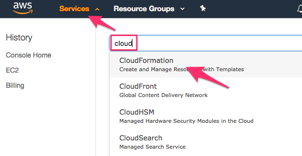
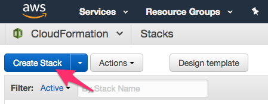
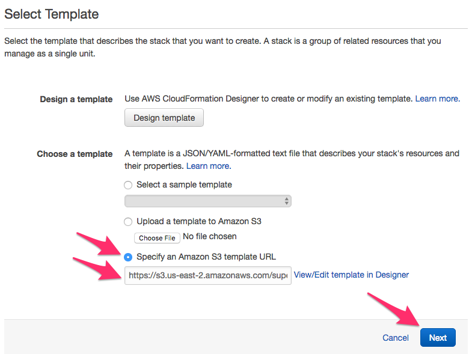
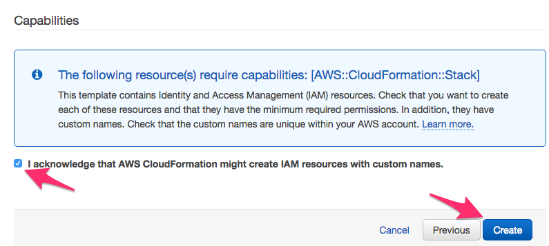
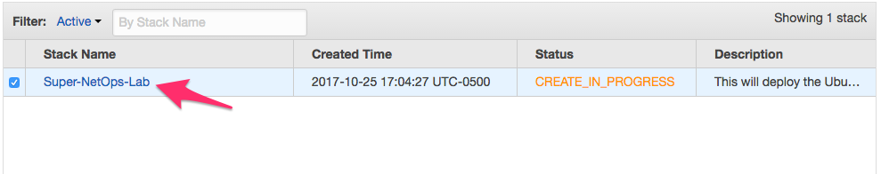
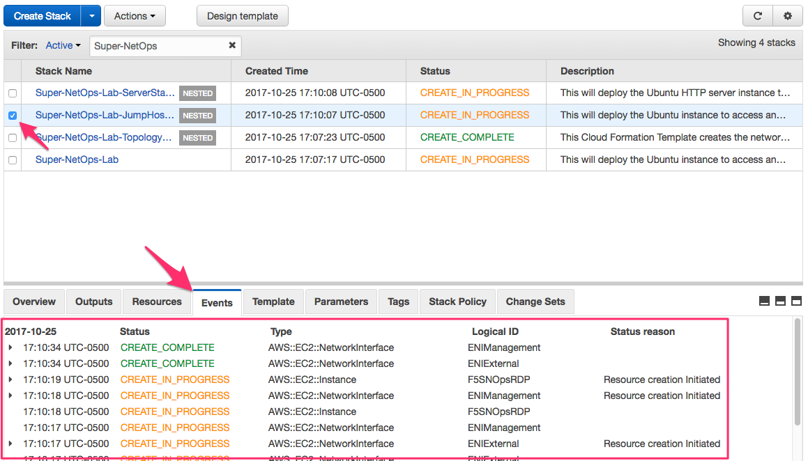

Amazon AWS Lab Environment Guide
--------------------------------

.. ERROR:: The AWS CFT is currently in testing and not complete.  This notice
   will be updated as progress is made.

.. WARNING:: The AWS CFT will run in your account.  The template includes
   components and instances that will incur a charge.  This charge will be
   billed to your account.

You can use an Amazon CloudFormation Template (CFT) to launch your own lab
environment in AWS.  This guide assumes the following:

- Pre-existing Amazon AWS account
- Access to create AWS Instances and Resources
- You have created an AWS Key Pair:

  - http://docs.aws.amazon.com/AWSEC2/latest/UserGuide/ec2-key-pairs.html

- *You will be responsible for all charges incurred*

More information about AWS can be found here:

https://aws.amazon.com/

Task 1 - Determine your Source IP Address
~~~~~~~~~~~~~~~~~~~~~~~~~~~~~~~~~~~~~~~~~

The AWS lab environment restricts access based on your Source IP Address.  We
will use a website to determine your Source IP for use in the next Task.

.. NOTE:: If your Source IP address changes you will lose access to your
   environment.

Perform the following steps to complete this task:

#. Open a web browser window or tab and navigate to https://www.whatismyip.com/

#. Copy the IP Address shown in the :guilabel:`Your IP Address is:` box into
   your clipboard

Task 2 - Launch the CloudFormation Template
~~~~~~~~~~~~~~~~~~~~~~~~~~~~~~~~~~~~~~~~~~~

Perform the following steps to complete this task:

#. Login to your AWS Management Console

   .. NOTE:: Access to the console is determined by your individual account
      setup.

      If you are using a personal account you should be able to
      login using https://console.aws.amazon.com/console/home

      If you are using a corporate account please contact your IT Help Desk.

#. Click :guilabel:`Services` at the top of the window.  Then type ``cloud``
   into the search box and look for the :guilabel:`CloudFormation` item.  Click
   on the :guilabel:`CloudFormation` item:

   |aws_image1|

#. Click the :guilabel:`Create Stack` button:

   |aws_image2|

#. On the :guilabel:`Select Template` screen, select the
   :guilabel:`Specify an Amazon S3 template URL` option.  Copy and paste the
   URL below into the box:

   ``https://s3.us-east-2.amazonaws.com/supernetops-cf-templates/class1.template``

   Click on the :guilabel:`Next` button

   |aws_image3|

#. Complete the form in the :guilabel:`Specify Details` screen:

   - :guilabel:`Stack Name`: ``Super-NetOps-Lab`` or a name of your choice
   - :guilabel:`Branch`: ``master``
   - :guilabel:`InstanceType`: ``t2.medium``
   - :guilabel:`KeyName`: Select your AWS Key Pair
   - :guilabel:`UserIP`: Paste the IP Address from Task 1 and add ``/32`` to
     to the end.

     .. NOTE:: You can also specify a CIDR formatted Subnet in this field

#. Click the :guilabel:`Next` button

#. On the :guilabel:`Options` screen click the :guilabel:`Next` button at
   the bottom of the screen

#. On the :guilabel:`Review` screen check the
   ``I acknowledge that AWS CloudFormation might create IAM resources
   with custom names`` field and click the :guilabel:`Create` button at
   the bottom of the screen

   |aws_image4|

#. Click the ``Super-NetOps-Lab`` stack to view details of the deployment

   |aws_image5|

#. Monitor the :guilabel:`Events` section of the page as the Stack deploys:

   |aws_image6|

#. The CFT used performs a nested deployment, leveraging other CFT's.  The
   :guilabel:`Events` will notify you when new status messages are available.
   Total deployment time varies.  As the Stack is being deployed you will see
   periodic ``CREATE_COMPLETE`` messages:

   |aws_image7|

#. You can also go back to the page listing 'Stacks' and monitor the progress of
   the nested templates from there:

   |aws_image8|

   |aws_image9|

#. Once the :guilabel:`Status` of the ``Super-NetOps-Lab`` **root** stack shows
   ``CREATE_COMPLETE`` click the :guilabel:`Outputs` tab.  You will see a
   :guilabel:`Key` named ``JumpHostPublicIP``.  The :guilabel:`Value` is the
   IP Address you can use to connect to the Lab Jumphost using RDP, HTTPS or
   SSH (diagnostics only).

   |aws_image10|
#. You can now connect to the Jumphost using RDP or HTTPS:

   - RDP: Configure your RDP client to connect to the ``JumpHostPublicIP``
   - HTTPS: Use a HTML5 browser to connect to ``https://<JumpHostPublicIP>``

#. Select how you would like to continue:

   - Review: :ref:`bigipbasics`
   - Start: :ref:`module1`

.. |aws_image6| image:: images/aws-image006.png
   :scale: 80%
.. |aws_image7| image:: images/aws-image007.png
   :scale: 80%
.. |aws_image8| image:: images/aws-image008.png

.. |aws_image10| image:: images/aws-image010.png
   :scale: 80%
