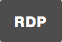
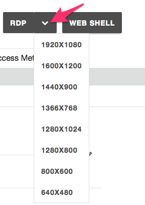
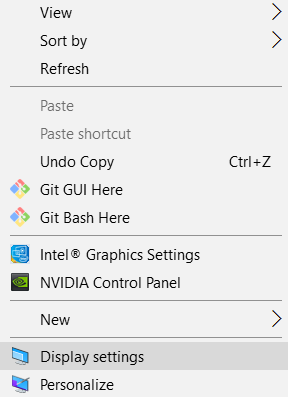
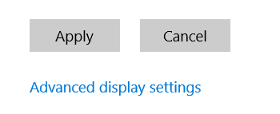
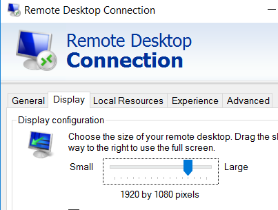

F5 Unified Demo Framework (UDF)
-------------------------------

.. NOTE:: This environment is currently available for F5 employees only

Determine how to start your deployment:

- **Official Events (ISC, SSE Summits):**  Please follow the
  instructions given by your instructor to join the UDF Course.

- **Self-Paced/On Your Own:** Login to UDF,
  :guilabel:`Deploy` the
  ``Programmability Class 1: Introduction to Automation & Orchestration``
  Blueprint and :guilabel:`Start` it.

Connecting to the Environment
~~~~~~~~~~~~~~~~~~~~~~~~~~~~~

To connect to the lab environment we will use a Remote Desktop Protocol
client to connect to the Jumphost.

.. NOTE:: We recommend that students open this lab guide on their Jumphost
   using the Chrome web browser.  The browser is configured to open the lab
   guide as it's start page.

.. preserving for future use

  The lab environment provides two access methods to the Jumphost:

  - RDP Connection using an RDP Client
  - HTML5 Browser-based VNC Connection using noVNC

    - Chrome
    - Firefox
    - Safari
    - EDGE

Connect using RDP
^^^^^^^^^^^^^^^^^

#. In the UDF navigate to your :guilabel:`Deployments`

#. Click the :guilabel:`Details` button for your Deployment

#. Click the :guilabel:`Components` tab

#. Find the ``Linux Jumphost`` Component and click the the :guilabel:`Details`
   button.

#. Download the RDP file by completed *one* of the following:

   - **Full Screen**: Click the |udf-rdp-button| button to download an RDP 
     file that will start the RDP session in full screen mode

   - **Specify Resolution**: Click the |udf-down-arrow| button and select a 
     screen resolution to use for the connection:

     |udf-rdp-resolution|

#. If you do not have the official Microsoft Remote Desktop Client, please
   install it using the instructions at
   https://docs.microsoft.com/en-us/windows-server/remote/remote-desktop-services/clients/remote-desktop-clients

#. .. WARNING:: If you have a HiDPI display please refer to the :ref:`lab-udf-hidpi`
      instructions below

#. Open the RDP file in the Remote Desktop Client and connect.  If you have
   any problems please ask your instructor for help

#. Select how you would like to continue:

   - Review: :ref:`bigipbasics`
   - Start: :ref:`module1`

.. preserving for future use

  Connect using an HTML5 Browser
  ^^^^^^^^^^^^^^^^^^^^^^^^^^^^^^

  #. In the UDF navigate to your :guilabel:`Deployments`

  #. Click the :guilabel:`Details` button for your Deployment

  #. Click the :guilabel:`Components` tab

  #. Find the ``Linux Jumphost`` Component and click the the :guilabel:`Access`
     button.  Then click the :guilabel:`NOVNC` option.  A new browser window/tab
     will be opened.

  #. In the new browser window/tab click the :guilabel:`Connect` button followed
     by the :guilabel:`Send Password` button.  You should now be connected.  If
     you have any problems please ask your instructor for help

  #. Select how you would like to continue:

     - Review: :ref:`bigipbasics`
     - Start: :ref:`module1`

.. _lab-udf-hidpi:

Using HiDPI Displays (RDP & Windows)
~~~~~~~~~~~~~~~~~~~~~~~~~~~~~~~~~~~~

.. WARNING:: Do these steps BEFORE you connect via RDP.  Choose ONE only.
   Do not do both.

If you are using Hi Resolution Display on Windows, we recommend that you either:

- **RECOMMENDED:** Resize your display to 1080p (1920 x 1080) or
- Use your RDP clients "Zoom" functionality to increase the size

Resize your display (Windows 10) - RECOMMENDED
^^^^^^^^^^^^^^^^^^^^^^^^^^^^^^^^^^^^^^^^^^^^^^

#. Right click on your Desktop and select Display Settings.

   |display-settings|

#. Click on :guilabel:`Advanced Display Settings`

   |advanced-display-settings|

#. Change the Resolution to ``1920 x 1080`` and click the :guilabel:`Apply`
   button

   |apply-resolution|

#. Connect to the RDP session

#. Select how you would like to continue:

   - Review: :ref:`bigipbasics`
   - Start: :ref:`module1`

Use RDP Zoom
^^^^^^^^^^^^

#. Right click on the RDP file and click on :guilabel:`Edit`

   |edit-rdp|

#. Under the :guilabel:`Display` tab change the resolution to
   ``1920x1080``, then click :guilabel:`Connect`

   |rdp-resolution|

#. After you connect, access the menu at the top left of your RDP Window and
   change the Zoom level (i.e. 175%).

   |rdp-zoom|

#. Select how you would like to continue:

   - Review: :ref:`bigipbasics`
   - Start: :ref:`module1`

.. |apply-resolution| image:: images/rdp-apply-resolution.png
   :scale: 75%
.. |edit-rdp| image:: images/rdp-edit.png
   :scale: 75%

.. |rdp-zoom| image:: images/rdp-zoom.png
   :scale: 75%

