Lab 1.2: REST API Authentication & ‘example’ Templates
------------------------------------------------------

.. graphviz::

   digraph breadcrumb {
      rankdir="LR"
      ranksep=.4
      node [fontsize=10,style="rounded,filled",shape=box,color=gray72,margin="0.05,0.05",height=0.1]
      fontname = "arial-bold"
      fontsize = 10
      labeljust="l"
      subgraph cluster_provider {
         style = "rounded,filled"
         color = lightgrey
         height = .75
         label = "BIG-IP"
         basics [label="REST Basics",color="palegreen"]
         authentication [label="Authentication",color="steelblue1"]
         globalsettings [label="Global Settings"]
         networking [label="Networking"]
         clustering [label="Clustering"]
         transactions [label="Transactions"]
         basics -> authentication -> globalsettings -> networking -> clustering -> transactions
      }
   }

One of the many basic concepts related to interaction with REST API’s is
how a particular consumer is authenticated to the system. BIG-IP and
iWorkflow support two types of authentication: **HTTP BASIC** and
**Token-Based (TBA)**. It’s important to understand both of these authentication
mechanisms, as consumers of the API will often make use of both types
depending on the use case. This lab will demonstrate how to interact
with both types of authentication.

Throughout this and other classes in the series we will make use of the Postman
REST API Client.  You can find more information about Postman at
https://getpostman.com

Task 1 - Import the Postman Collection & Environment
~~~~~~~~~~~~~~~~~~~~~~~~~~~~~~~~~~~~~~~~~~~~~~~~~~~~

In this task you will Import a Postman Collection & Environment for this lab.
Perform the following steps to complete this task:

#. Open the Postman tool by clicking the |postman-icon| icon of the desktop of
   your Linux Jumphost.  **The initial window may take a few moments to appear.**

   .. NOTE:: The Postman client receives very frequent updates.  If you are
      prompted to update the client please click the :guilabel:`Remind me later`
      button to skip updating the version installed in your lab environment

#. By default, the Postman client requires verification of SSL/TLS Certificates
   to a public Root Certificate Authority.  However, by default, BIG-IP and many other
   devices use a self-signed certificate for SSL/TLS connections.  To allow
   connections with self-signed certificates we need to modify the default
   settings of Postman.

   - Open the Postman Settings windows by clicking :menuselection:`File --> Settings`:

     |lab-2-19|

   - Verify your client is configured to allow self-signed certificates by
     setting ``SSL certificate verification`` to ``OFF``

     |lab-2-20|

   - Click the **X** in the top right of the Settings window

#. A Postman Collection lets you group individual REST requests together.  This
   Postman collection can then be shared and imported. To import a Postman
   Collection, click the :guilabel:`Import` button in the top left of the Postman
   window

   |lab-2-17|

#. Click the :guilabel:`Import from Link` tab.  Paste the following URL into the
   text box and click :guilabel:`Import`

   .. parsed-literal::

      :raw_github_url:`/postman_collections/Class_1.postman_collection.json`

   |lab-2-18|

#. You should now see a collection named ``F5 Programmability: Class 1``
   in your Postman Collections sidebar. Postman automatically resizes its GUI
   depending on its window size. It might be necessary to use the short
   ``Ctrl + \`` (on Windows) or click the show sidebar icon at the bottom left
   corner of postman if you do not see the sidebar.

   |lab-2-2|

#. To assist in multi-step procedures we make heavy use of the
   **Environments** capability in Postman. This capability allows us to
   set various global variables that are then substituted into a
   request before it’s sent. Import the Environment file by clicking
   :menuselection:`Import --> Import from Link` and pasting the following URL and
   clicking :guilabel:`Import`:

   .. parsed-literal::

      :raw_github_url:`/postman_collections/Class_1.postman_environment.json`

#. Set your environment to
   ``F5 Programmability: Class 1`` by using the menu at the top right
   of your Postman window:

   |lab-2-1|

   .. IMPORTANT:: In the pre-built lab environment a framework named
      ``f5-postman-workflows`` has been pre-installed in the environment.  The
      Collection we installed above **REQUIRES** this framework for testing and
      polling functionality.  If you are using a Self-Built Environment **you
      must install this framework into Postman by importing another
      collection**. Instructions to do this can be found :ref:`here <lab-self-built>`

Task 2 - HTTP BASIC Authentication
~~~~~~~~~~~~~~~~~~~~~~~~~~~~~~~~~~

In this task, we will use the Postman client to send API requests using
HTTP BASIC authentication. As its name implies this method of
authentication encodes the user credentials via the existing BASIC
authentication method provided by the HTTP protocol. The mechanism this
method uses is to insert an HTTP header named ‘Authorization’ with a
value that is built by Base 64 encoding the string
``<username>:<password>``. The resulting header takes this form:

``Authorization: Basic YWRtaW46YWRtaW4=``

It should be noted that cracking this method of authentication is
TRIVIAL; as a result API calls should always be performed using HTTPS encryption
(F5 default) with a certificate signed by an authority rather than HTTP.

Perform the following steps to complete this task:

#. Click the :guilabel:`Collections` tab on the left side of the screen, expand
   the ``F5 Programmability: Class 1`` collection on the left side
   of the screen, expand the
   ``Lab 1.2 - API Authentication & 'example' Templates`` folder:

   |lab-2-2|

#. Click the ``Step 1: HTTP BASIC Authentication`` item. Click the
   :guilabel:`Authorization` tab and select ``Basic Auth`` as the Type. Fill in
   the username and password (``admin/admin``) and click the :guilabel:`Send`
   button:

   |lab-2-3|

#. Click the :guilabel:`Headers` tab
   and examine the HTTP header. Notice that the number of Headers in the Headers
   tab changed from ``1`` to ``2``. This is because Postman automatically created
   the HTTP header and updated your request to include it.

   |lab-2-21|

#. Click the :guilabel:`Body` tab, if the request succeeded you should
   be presented with a listing of the ``/mgmt/tm/ltm``
   Organizing Collection:

   |lab-2-22|

#. Click the :guilabel:`Test Results` tab and ensure all the tests for this
   request have passed:

   |lab-2-23|

#. Update the credentials and specify an INCORRECT password. Send the
   request again and examine the response:

   |lab-2-4|

#. Check the :guilabel:`Test Results` tab and notice that our *Unit Tests* for
   this request are now failing (as expected):

   |lab-2-24|

.. IMPORTANT:: As you progress through this lab be sure to check the
   :guilabel:`Test Results` tab.  We have included *Unit Tests* where applicable
   to help you verify the requests being sent are succeeding.  If you notice
   a test has failed please double check your input or ask for help.

Task 3 - Token Based Authentication
~~~~~~~~~~~~~~~~~~~~~~~~~~~~~~~~~~~

One of the disadvantages of BASIC Authentication is that credentials are
sent with each and every request. This can result in a much greater
attack surface being exposed unnecessarily. As a result, **Token Based
Authentication (TBA)** is preferred in many cases. TBA only sends
the credentials once, on the first request. The system then responds
with a unique token for that session and the consumer then uses that
token for all subsequent requests. BIG-IP and iWorkflow support
token-based authentication that drops down to the underlying
authentication subsystems available in TMOS. As a result, the system can
be configured to support external authentication providers (Active Directory,
RADIUS, TACACS, etc) and those authentication methods can flow through to
the REST API. In this task we will demonstrate TBA using the local
authentication database, however, authentication to external providers
is fully supported.

.. NOTE:: For more information about external authentication providers see the
   section titled **About external authentication providers with
   iControl REST** in the iControl REST API User Guide available at
   https://devcentral.f5.com/d/icontrolr-rest-api-user-guide-version-1300-241 (v13)

Perform the following steps to complete this task:

#. Click the ``Step 2: Retrieve Authentication Token`` item in the Lab 1.2
   Folder.

#. Notice that we send a ``POST`` request to the ``/mgmt/shared/authn/login``
   endpoint.

   |lab-2-5|

#. Click the :guilabel:`Body` tab and examine the JSON that we will send to
   BIG-IP to provide credentials and the authentication provider:

   |lab-2-6|

#. Modify the JSON :guilabel:`Body` and add the required credentials
   (``admin/admin``).  Then click the :guilabel:`Send` button.

#. Examine the response status code. If authentication succeeded and
   a token was generated the response will have a ``200 OK`` status code.
   If the status code is ``401`` then check your credentials:

   - **Successful:**

     |lab-2-7|

   - **Unsuccessful:**

     |lab-2-8|

#. Once you receive a ``200 OK`` status code examine the Response
   :guilabel:`Body`.  The various attributes show the parameters assigned to the
   particular token. Find the ``token`` attribute and copy it into your
   clipboard (``Ctrl+c``) for use in the next step.

   |lab-2-9|

#. Click the ``Step 3: Verify Authentication Works`` item in the Lab
   1.2 Postman collection. Click the :guilabel:`Headers` tab and paste the
   token value copied above as the VALUE for the ``X-F5-Auth-Token``
   header. This header is required to be sent on all requests when
   using token-based authentication.

   |lab-2-10|

#. Click the :guilabel:`Send` button. If your request is successful you should
   see a ``200 OK`` status and a listing of the ``ltm`` Organizing
   Collection.

#. We will now update your Postman environment to use this auth token
   for the remainder of the lab. Click the Environment menu in the
   top right of the Postman window and click :guilabel:`Manage Environments`:

   |lab-2-11|

#. Click the ``F5 Programmability: Class 1`` item:

   |lab-2-12|

#. Update the value for ``bigip_a_auth_token`` by Pasting (``Ctrl+v``)
   in your auth token:

   |lab-2-13|

#. Click the ``Update`` button and then close the :guilabel:`Manage Environments`
   window. Because the subsequent requests refer to the
   ``{{bigip_a_auth_token}}`` variable, you will not have to set the
   token in the header of the following requests.

#. Click the ``Step 4: Set Authentication Token Timeout`` item in the
   Lab 1.2 Postman folder. This request will ``PATCH`` your token
   Resource (notice the URI) and update the timeout attribute so we
   can complete the lab easily. Examine the request type and JSON
   :guilabel:`Body` and then click the :guilabel:`Send` button. Verify
   that the timeout has been changed to ``36000`` in the response:

   |lab-2-14|

Task 4 - Get a pool ‘example’ Template
~~~~~~~~~~~~~~~~~~~~~~~~~~~~~~~~~~~~~~

In order to assist with REST API interactions, you can request a template
of the various attributes of a Resource type in a Collection. This
template can then be used as the body of a ``POST``, ``PUT`` or ``PATCH``
request as needed.

Perform the following steps:

#. Click the ``Step 5: Get ‘example’ of a Pool Resource`` item in the Lab
   1.2 Postman collection.

#. Examine the URI. Notice the addition of ``example`` at the end of the
   collection name:

   |lab-2-15|

#. Click :guilabel:`Send` and examine the FULL response. You will see
   descriptions and then all the attributes for the *Pool* resource
   type. The response also shows the default values for the attributes
   if applicable:

   |lab-2-16|

.. |postman-icon| image:: /images/postman-icon.png
   :scale: 70%
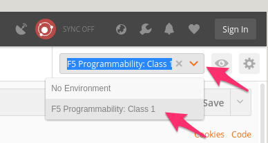
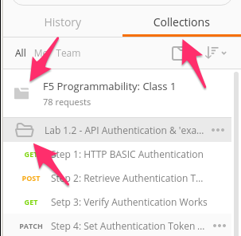
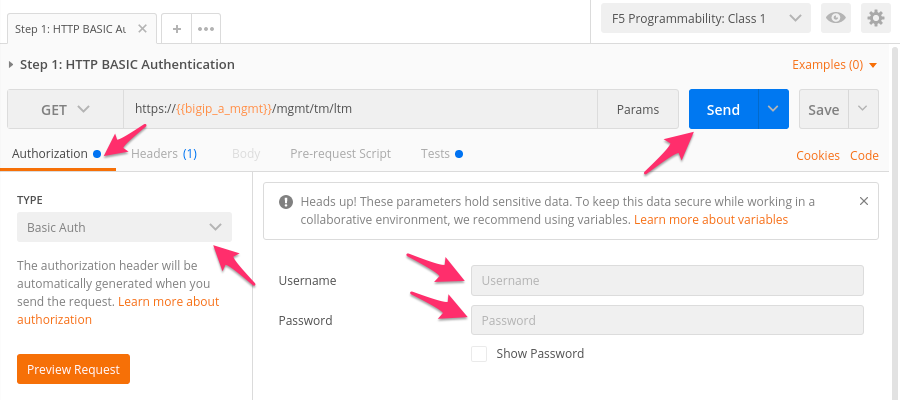
.. |lab-2-4| image:: images/lab-2-4.png
   :scale: 80%
.. |lab-2-5| image:: images/lab-2-5.png
.. |lab-2-6| image:: images/lab-2-6.png
.. |lab-2-7| image:: images/lab-2-7.png
.. |lab-2-8| image:: images/lab-2-8.png
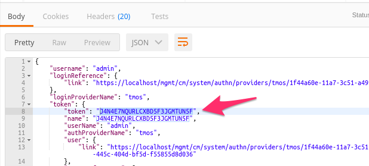
.. |lab-2-10| image:: images/lab-2-10.png
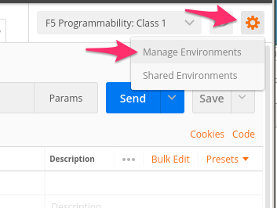
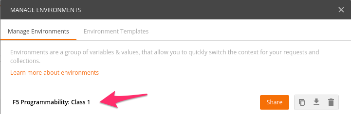
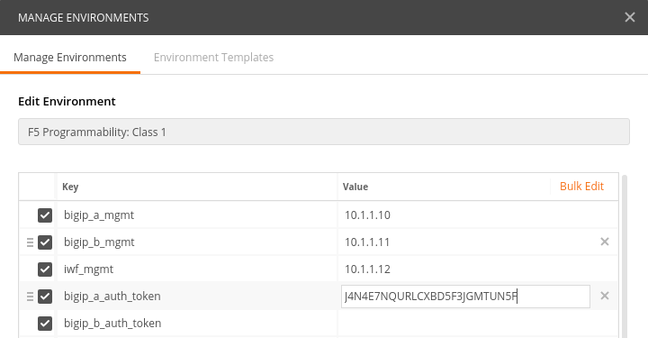
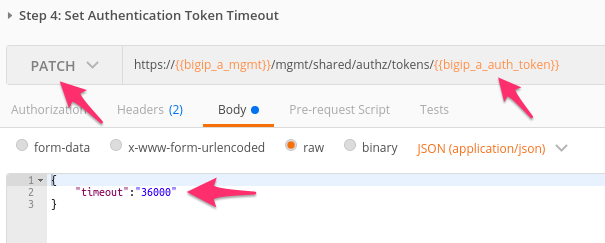
.. |lab-2-15| image:: images/lab-2-15.png
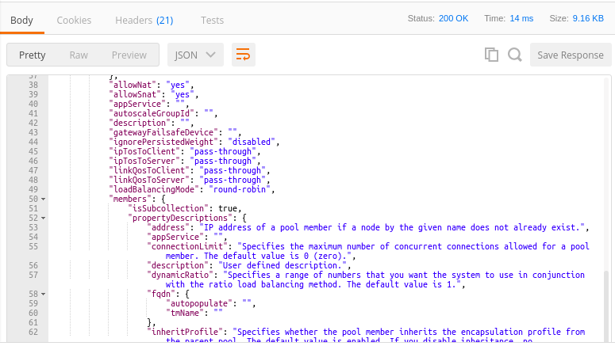
.. |lab-2-17| image:: images/lab-2-17.png
.. |lab-2-18| image:: images/lab-2-18.png
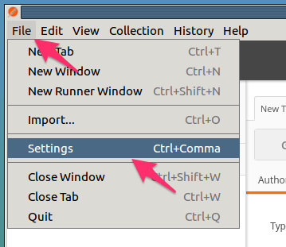
.. |lab-2-20| image:: images/lab-2-20.png
.. |lab-2-21| image:: images/lab-2-21.png
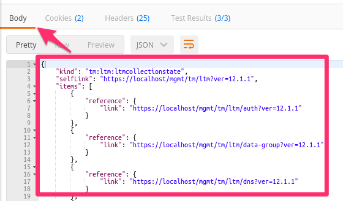
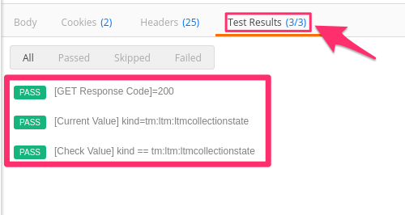
.. |lab-2-24| image:: images/lab-2-24.png
