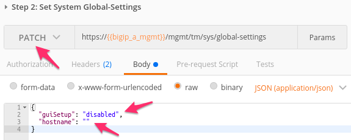
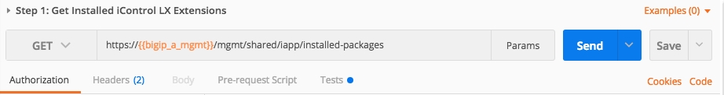

Lab 1.3: Review/Set Device Settings
-----------------------------------

.. graphviz::

   digraph breadcrumb {
      rankdir="LR"
      ranksep=.4
      node [fontsize=10,style="rounded,filled",shape=box,color=gray72,margin="0.05,0.05",height=0.1]
      fontsize = 10
      labeljust="l"
      subgraph cluster_provider {
         style = "rounded,filled"
         color = lightgrey
         height = .75
         label = "BIG-IP"
         basics [label="REST Basics",color="palegreen"]
         authentication [label="Authentication",color="palegreen"]
         globalsettings [label="Global Settings",color="steelblue1"]
         networking [label="Networking"]
         clustering [label="Clustering"]
         transactions [label="Transactions"]
         basics -> authentication -> globalsettings -> networking -> clustering -> transactions
      }
   }

All devices are already licensed so we can focus on
configuring the basic infrastructure related settings to complete the
Device Onboarding process. The remaining items include (list not
exhaustive):

-  Device Settings

   -  **NTP/DNS Settings**

   -  Remote Authentication

   -  **Hostname**

   -  **Admin Credentials**

-  L1-3 Networking

   -  Physical Interface Settings

   -  L2 Connectivity (**VLAN**, VXLAN, etc.)

   -  L3 Connectivity (**Self IPs, Routing**, etc.)

-  HA Settings

   -  **Global Settings**

      -  **Config Sync IP**

      -  **Mirroring IP**

      -  **Failover Addresses**

   -  **CMI Device Trusts**

   -  **Device Groups**

   -  **Traffic Groups**

   -  **Floating Self IPs**

We will specifically cover the items in **BOLD** above in the following
labs. It should be noted that many permutations of the Device Onboarding
process exist due to the nature of real-world environments. This class is
designed to teach enough information so that you can then apply the
knowledge learned and help articulate and/or deliver a specific solution
for your environment.

Task 1 - Set Device Hostname & Disable GUI Setup Wizard
~~~~~~~~~~~~~~~~~~~~~~~~~~~~~~~~~~~~~~~~~~~~~~~~~~~~~~~

In this task we will modify the device hostname and disable the GUI
Setup Wizard. The Resource that contains these settings is
``/mgmt/tm/sys/global-settings``.

Perform the following steps to complete this task:

#. Expand the ``Lab 1.3 - Review/Set Device Settings`` folder in the
   Postman collection.

#. Click the ``Step 1: Get System Global-Settings`` request. Click the
   :guilabel:`Send` button and review the response :guilabel:`Body` to see what
   the current settings on the device are. Examine the resulting response to
   understand what settings are currently applied.

#. Click the ``Step 2: Set System Global-Settings`` request. This item uses
   a ``PATCH`` request to the ``global-settings`` resource to modify the
   attributes contained within it. We will update the ``guiSetup`` and
   ``hostname`` attribute.

   - Click on :guilabel:`Body`. Review the JSON body and modify the ``hostname``
     attribute to set the hostname to ``bigip-a.f5.local``

   - Also notice that we are disabling the GUI Setup Wizard as part of
     the same request:

     |lab-3-1|

#. Click the :guilabel:`Send` button and review the response :guilabel:`Body`.
   You should see that the attributes modified above have been updated by
   looking at the response. You can also ``GET`` the ``global-settings`` by
   sending the ``Step 1: Get System Global-Settings`` request again to verify
   they have been updated.

Task 2 - Modify DNS/NTP Settings
~~~~~~~~~~~~~~~~~~~~~~~~~~~~~~~~

.. NOTE:: This task will make use of JSON arrays.  The syntax for defining a
   JSON array is:

   ``myArray: [ Object0, Object1 ... ObjectX ]``

   To define an array consisting of Strings the syntax is:

   ``myStringArray: [ "string0", "string1" ... "stringX" ]``

Much like the previous task we can update system DNS and NTP settings by
sending a PATCH request to the correct resource in the ``sys`` Organizing
Collection. The relevant Resources for this task are:

.. list-table::
   :header-rows: 1

   * - **URL**
     - **Type**
   * - ``/mgmt/tm/sys/dns``
     - DNS Settings
   * - ``/mgmt/tm/sys/ntp``
     - NTP Settings

Perform the following steps to complete this task:

#. Click the ``Step 3: Get System DNS Settings`` item in the folder.
   Click :guilabel:`Send` and review the current settings.

#. Click the ``Step 4: Set System DNS Settings`` item in the folder.
   Click :guilabel:`Body`. Review the JSON body to verify the name server IPs
   ``4.2.2.2`` and ``8.8.8.8`` are listed. Additionally, add a search domain of
   ``f5.local``. You will modify a JSON array to add a search domain:

   |lab-3-4|

#. Click the :guilabel:`Send` button and verify the requested changes were
   successfully implemented by looking at the response or by sending the
   ``Step 3: Get System DNS Settings`` request again.

#. Click the ``Step 5: Get System NTP Settings`` item in the folder.
   Click :guilabel:`Send` and review the current settings.

#. Click the ``Step 6: Set System NTP Settings`` item in the folder.
   Click :guilabel:`Body`. Review the JSON body to verify the NTP servers
   with hostnames ``0.pool.ntp.org`` and ``1.pool.ntp.org`` are contained
   in the ``servers`` attribute (another JSON array!).

#. Click the :guilabel:`Send` button and verify the requested changes were
   successfully implemented by looking at the response or sending the
   ``Step 5: Get System NTP Settings`` again.

Task 3 - Update default user account passwords
~~~~~~~~~~~~~~~~~~~~~~~~~~~~~~~~~~~~~~~~~~~~~~

In this task we will update the passwords for the ``root`` and ``admin``
accounts. The process for updating the root account is different than
other system accounts because it is used by underlying Linux OS.

To update the root account password we will use a ``POST`` to the
``/mgmt/shared/authn/root`` REST endpoint.

To update all other system accounts we will ``PATCH`` the
``/mgmt/tm/auth/user/<username>`` Resource.

Perform the following steps to change the ``root`` user password:

#. Click the ``Step 7: Set root User Password`` item in the folder.

#. We are performing a POST operation to change the root user password
   and have to specify the ``oldPassword`` because the REST implementation
   on the BIG-IP uses the underlying Linux mechanism.  Click
   :guilabel:`Body`.  Modify the JSON body to update the password to the
   value ``newdefault`` and click the :guilabel:`Send` button.

   |lab-3-2|

#. You can verify the password has been changed by opening an SSH session
   to BIG-IP A.  A shortcut to a terminal is included on the desktop of
   the Linux jumphost.  Open a Terminal window and then open an SSH connection
   to BIG-IP A using the command ``ssh root@10.1.1.10``:

   |lab-3-5|

#. **Repeat the procedure above to change the password back to** ``default``.

Perform the following steps to change the **admin** user password:

#. Click the ``Step 8: Set admin User Password`` item in the collection.

#. We are performing a ``PATCH`` operation to admin user
   Resource. Click :guilabel:`Body` and modify the JSON body to update the
   password to the value ``newadmin`` and click the :guilabel:`Send` button.

   |lab-3-3|

#. You can verify the password has been changed by opening an SSH session
    OR by logging into TMUI (HTTP GUI) to BIG-IP A in a Chrome browser tab.

#. **Repeat the procedure above to change the password back to** ``admin``.

.. |lab-3-2| image:: images/lab-3-2.png
.. |lab-3-3| image:: images/lab-3-3.png

.. |lab-3-5| image:: images/lab-3-5.png
