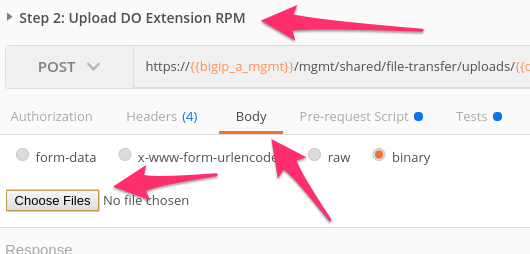
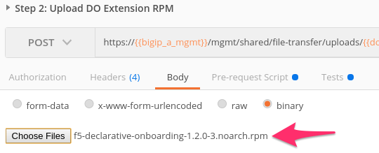
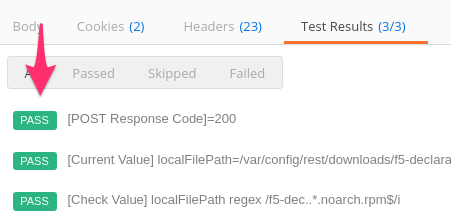
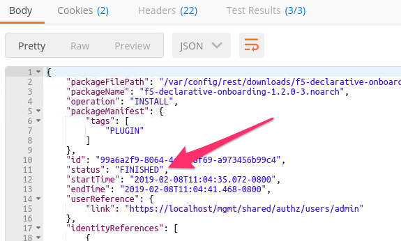
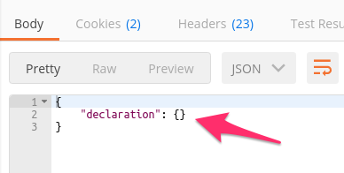

Lab 1.3: Review-Install Declarative Onboarding
----------------------------------------------

.. graphviz::

   digraph breadcrumb {
      rankdir="LR"
      ranksep=.4
      node [fontsize=10,style="rounded,filled",shape=box,color=gray72,margin="0.05,0.05",height=0.1]
      fontsize = 10
      labeljust="l"
      subgraph cluster_provider {
         style = "rounded,filled"
         color = lightgrey
         height = .75
         label = "BIG-IP"
         basics [label="REST Basics",color="palegreen"]
         authentication [label="Authentication",color="palegreen"]
         extensibility [label="Extensibility",color="steelblue1"]
         onboarding [label="Onboarding"]
         clustering [label="Clustering"]
         transactions [label="Transactions"]
         basics -> authentication -> extensibility -> onboarding -> clustering -> transactions
      }
   }

In the following labs we will be utilizing `Declarative Onboarding (DO) <https://clouddocs.f5.com/products/extensions/f5-declarative-onboarding/latest/>`_, part of The F5 Automation Toolchain, to onboard base configuration to the lab BIG-IPs. Declarative Onboarding is built on top of the extensible, Node.js based iControl LX framework and implements a declarative interface for onboarding BIG-IPs.

.. NOTE:: Previous versions of this class utilized the REST API of the BIG-IPs to imperatively configure the base config objects in the list above.

When onboarding devices using DO we will use a declarative interface and JSON based schema. This declaration describes the desired end state of the device. If your declaration includes parameters for all base config objects, DO will provision those settings with a single API call to its interface. Additionally DO is:

- `Idempotent <https://whatis.techtarget.com/definition/idempotence>`_
- `Atomic <https://www.techopedia.com/definition/3466/atomic-operation>`_
- `Supported by F5 <https://f5.com/support/support-policies>`_

For further information on the Declarative Onboarding Extension see:

- **GitHub Repository:** https://github.com/F5Networks/f5-declarative-onboarding

- **Documentation:** https://clouddocs.f5.com/products/extensions/f5-declarative-onboarding/latest/

An overview of iControl LX can be found at 
https://devcentral.f5.com/wiki/icontrollx.homepage.ashx

Task 1 - Explore Declarative Onboarding
~~~~~~~~~~~~~~~~~~~~~~~~~~~~~~~~~~~~~~~
iControl LX Extensions use the common Redhat Package Manager (RPM) distribution
format.  To install an extension you need to first obtain the RPM file
associated with the extension.

DO RPMs are available at https://github.com/F5Networks/f5-declarative-onboarding/releases

DO can be installed in a few ways:

- using the iControl REST API
- using the BIG-IP GUI (TMUI)
- using a command prompt

All of these mechanisms are supported and, if required, can be used in
conjunction with each other.

For instance, you can install DO from BIG-IP GUI and then deploy
the configuration via iControl REST using tools such as cURL, Postman
and Ansible.

To view installed iControl LX Extensions in the BIG-IP GUI you must first
enable this functionality.  To do this, log in via SSH into the system with an ``admin``
account and execute ``touch /var/config/rest/iapps/enable``. No reboot is required.
This will enable the :menuselection:`iApps --> Package Management LX` menu:

|lab-3-1|

Clicking :guilabel:`Package Management LX` will show a table of installed
iControl LX Extensions:

.. NOTE:: This will be empty until one or more iControl LX Extension packages have been imported.

|lab-3-2|

iControl LX allows Extensions to register new REST API endpoints with the
iControl REST API.  In the case of DO the following endpoint is exposed.

- **Declarations:** ``/mgmt/shared/declarative-onboarding``

This endpoint accepts the Create, Read operations using the HTTP ``POST`` and ``GET`` methods.

As mentioned previously, iControl LX Extensions are packaged using an RPM
format.  We will use the REST API to install AS3 onto our BIG-IP device.

.. NOTE:: This lab work will be performed from
   ``Lab 1.3 - Install DO onto BIG-IP`` folder in the Postman
   Collection

   |lab-3-3|

Task 1 - View Installed iControl LX Extensions
~~~~~~~~~~~~~~~~~~~~~~~~~~~~~~~~~~~~~~~~~~~~~~

Perform the following steps to complete this task:

#. :guilabel:`Send` the ``Step 1: Get Installed iControl LX Extensions``
   request to view extensions installed on the BIG-IP device:

   |lab-3-4|

#. Review the JSON response :guilabel:`Body`.  The JSON payload shows
   extensions that are installed on the BIG-IP device in the ``items`` array.
   In this case we have no extensions installed so the ``items`` array is empty.

   |lab-3-5|

Task 2 - Install the DO Extension
~~~~~~~~~~~~~~~~~~~~~~~~~~~~~~~~~~

Perform the following steps to complete this task:

#. Using the Chrome web browser open a new tab and click the
   ``DO Release`` bookmark.

#. Click the file with the ``.rpm`` extension to download it.  The file will be
   located in the ``/home/ubuntu/Downloads`` folder on your jumphost.

#. Click the ``Step 2: Upload DO Extension RPM`` request.

#. Click the :guilabel:`Body` tab, then click the :guilabel:`Choose Files`
   button:

   |lab-3-6|

#. Select the previously downloaded RPM file located in the ``Downloads``
   folder on your jumphost.  Then click the :guilabel:`Send` button to upload
   the RPM file to the BIG-IP system:

   |lab-3-7|

#. Review the :guilabel:`Test Results` to ensure the file upload was successful:

   |lab-3-8|

#. Click the ``Step 3: Create DO Extension Install Task`` request and click
   :guilabel:`Send`.  This request will command the iControl LX framework to
   install the RPM uploaded in the previous step.  Because the installation
   task is an asynchronous operation we need to check the status of the task
   in the next step.

#. Click the ``Step 4: Get DO Install Task Status`` request and click
   :guilabel:`Send`.

#. Check the **Response** :guilabel:`Body` and ensure the task ``status`` is
   ``FINISHED``:

   |lab-3-9|

#. Click the ``Step 5: Get DO State`` request and click
   :guilabel:`Send`.  Review the **Response** :guilabel:`Body` and ensure that it shows an empty declaration like the image below. This shows that DO has not received any previous declarations.

   |lab-3-10|

.. |lab-3-1| image:: images/lab-3-1.png
.. |lab-3-2| image:: images/lab-3-2.png
.. |lab-3-3| image:: images/lab-3-3.png#########image of postmanfolder
.. |lab-3-4| image:: images/lab-3-4.png
.. |lab-3-5| image:: images/lab-3-5.png

