Lab 1.5: Onboard BIG-IP with DO
-------------------------------

.. graphviz::

   digraph breadcrumb {
      rankdir="LR"
      ranksep=.4
      node [fontsize=10,style="rounded,filled",shape=box,color=gray72,margin="0.05,0.05",height=0.1]
      fontsize = 10
      labeljust="l"
      subgraph cluster_provider {
         style = "rounded,filled"
         color = lightgrey
         height = .75
         label = "BIG-IP"
         basics [label="REST Basics",color="palegreen"]
         authentication [label="Authentication",color="palegreen"]
         extensibility [label="Extensibility",color="palegreen"]
         onboarding [label="Onboarding",,color="steelblue1"]
         clustering [label="Clustering"]
         transactions [label="Transactions"]
         basics -> authentication -> extensibility -> onboarding -> clustering -> transactions
      }
   }

All devices are already licensed although Declarative Onboarding has the ability
to license the BIG-IP as well. We will focus on configuring the basic 
infrastructure related settings to complete the Device Onboarding process. 
The remaining items include (list not exhaustive):

-  Device Settings

   -  **NTP/DNS Settings**

   -  Remote Authentication

   -  **Hostname**

-  L1-3 Networking

   -  Physical Interface Settings

   -  L2 Connectivity (**VLAN**, VXLAN, etc.)

   -  L3 Connectivity (**Self IPs, Routing**, etc.)

-  HA Settings

   -  **Global Settings**

      -  **Config Sync IP**

      -  **Mirroring IP**

      -  **Failover Addresses**

   -  **CMI Device Trusts**

   -  **Device Groups**

   -  **Traffic Groups**

   -  **Floating Self IPs**

We will specifically cover the items in **BOLD** above in the following
labs. It should be noted that many permutations of the Device Onboarding
process exist due to the nature of real-world environments. This class is
designed to teach enough information so that you can then apply the
knowledge learned and help articulate and/or deliver a specific solution
for your environment.

Task 1 - Review and Deploy a DO Declaration
~~~~~~~~~~~~~~~~~~~~~~~~~~~~~~~~~~~~~~~~~~~

Now that DO has been installed on your BIG-IP we may proceed configuring the base-config objects listed above. Unlike imperative workflows, you will not need to define an API call per object (NTP, DNS, Hostname, etc). You will include each one of these attributes within a JSON payload and submit it through Declarative Onboarding. DO will handle configuring the desired end state defined within the declaration.

.. NOTE:: This lab work will be performed from
   ``Lab 1.4 - Onboarding with DO`` folder in the
   Postman Collection

   |lab-4-1|

#. Select ``Step 1: Deploy DO Declaration``. Notice the destination path of ``/mgmt/shared/declarative-onboarding`` to where the declaration ``POST`` will be sent. This is the REST endpoint that you installed in the previous lab. We will review the JSON :guilabel:`Body` to see the different configuration objects being defined in the next steps.

   |lab-4-2|

#. The top of the declaration contains **Base Components** such as the schemaVersion to use and the optional `async` flag. In our example we are setting `async` to true which tells DO to respond immediatly with a 202. You can then poll DO for an updated status on the request. At the following link you can read more about `Asynchronus vs Synchronous <https://docs.apigee.com/api-baas/get-started/asynchronous-vs-synchronous-calls>`_.

   |lab-4-3|

#. The next section is the  **Common Class**. This is where all other parameters are defined such as resources, license, hostname, dns, vlans, etc.  Near the top of the :guilabel:`Body` you will see attributes such as DNS servers, 2 NTP servers, and device hostname. Look through the rest of the :guilabel:`Body` to familiarize yourself with other options be set.

   |lab-4-4|

#. Select :guilabel:`Send` to make a request to the DO endpoint. Verify that you receive a **202** response from the BIG-IP. The status will show as **processing**. 

   |lab-4-5|

Task 2 - Get DO declaration status from BIG-IP
~~~~~~~~~~~~~~~~~~~~~~~~~~~~~~~~~~~~~~~~~~~~~~

Now that we have deployed our desired end state to DO, we need to check and see if has finished processing the request. Since we have requested that the BIG-IP enable more resource modules, **Application Security(asm) and Application Visibility(avr)**, it can take a minute or two. Follow the steps below to check the status.

#. Select ``Step 2: Get DO Status``. Notice that the path endpoint is the same as before but the HTTP mehhod is now **GET** instead of **POST**. This will tell DO that we are looking to receive the current configuration and status rather than define it.

   |lab-4-6|

#. Select :guilabel:`Send`. Review the JSON :guilabel:`Body` and look for if DO has finished provisioning with `"message": "success"` or if it is still in progress with `"message": "processing"`. You may click :guilabel:`Send` to check the status until it has completed. You will also notice that the declaration of the box in its current state is returned with each request.

   |lab-4-7|

#. In your browser, go to the BIG-IP A GUI bookmark or :guilabel:`https://10.1.1.10/`. Verify that the objects requested are now provisioned. The images below show VLANs and Self-IPs for the network section as an example.

   |lab-4-8|

   |lab-4-9|

Task 3 - Modify our DO Declaration
~~~~~~~~~~~~~~~~~~~~~~~~~~~~~~~~~~

In this task we will go back and modify Task1's payload and redploy to DO. We will make 1 edit and allow DO's declarative nature make the appropriate changes on the back end to update the BIG-IP.

#. Select ``Step 1: Deploy DO Declaration``. In the request :guilabel:`Body` go down into the **myDns** class. We are going to add a second search domain to our BIG-IP. Edit the **search** array by adding `f5.local` to the array as below.

   |lab-4-10|

#. Select :guilabel:`Send` to make a request to the DO endpoint again. DO will return a **202** as it did last time.

   |lab-4-11|

#. Select ``Step 2: Get DO Status`` and click :guilabel:`Send`. This time you will notice that DO is already finished as it only had to make 1 small change to get to the desired end state. The first time DO was run it was deploying all settings as well as enabling new features on the BIG-IP.

   |lab-4-12|

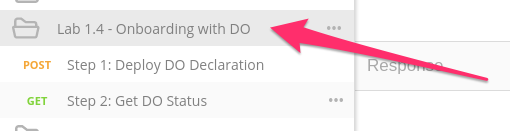
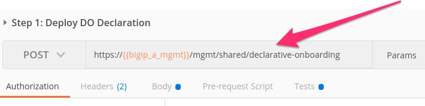
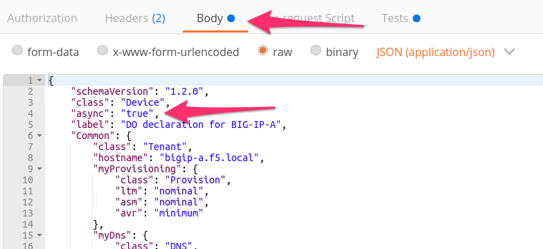
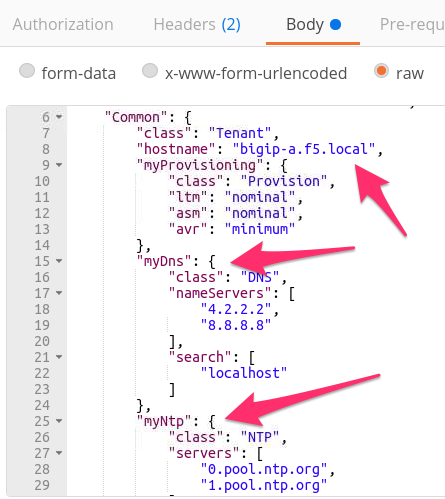
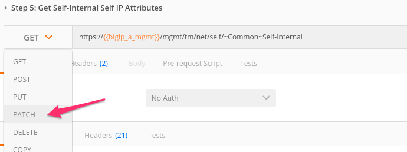
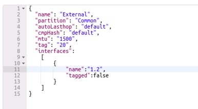
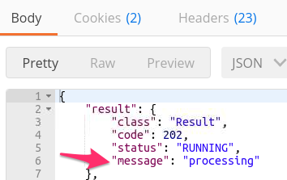
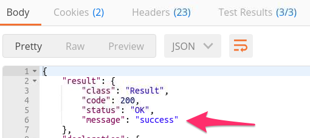
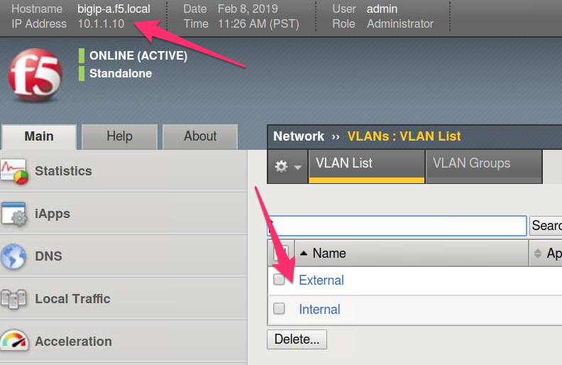
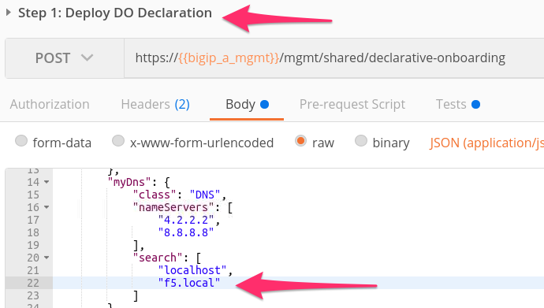
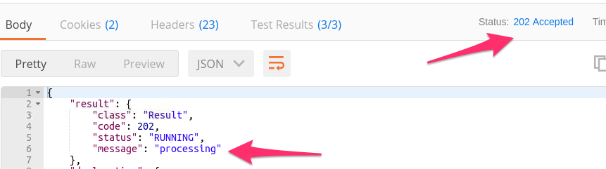
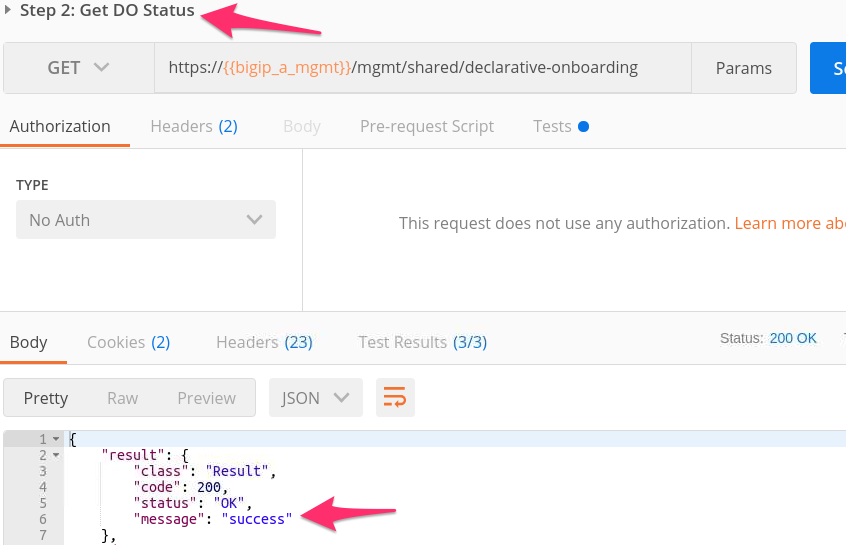