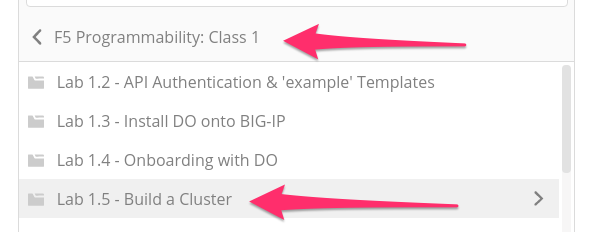
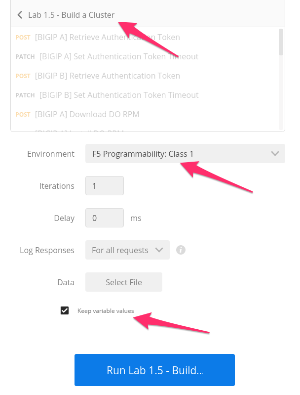
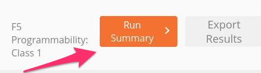
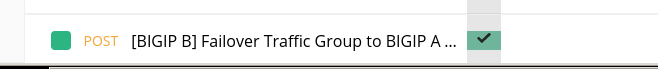
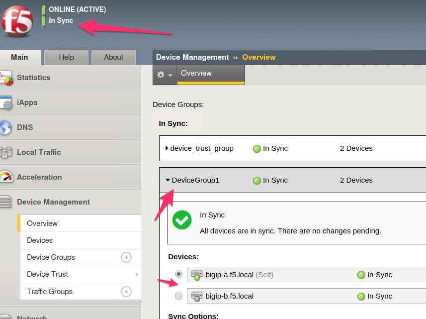

Lab 1.6: Build a BIG-IP Cluster using a Collection
--------------------------------------------------

.. graphviz::

   digraph breadcrumb {
      rankdir="LR"
      ranksep=.4
      node [fontsize=10,style="rounded,filled",shape=box,color=gray72,margin="0.05,0.05",height=0.1]
      fontsize = 10
      labeljust="l"
      subgraph cluster_provider {
         style = "rounded,filled"
         color = lightgrey
         height = .75
         label = "BIG-IP"
         basics [label="REST Basics",color="palegreen"]
         authentication [label="Authentication",color="palegreen"]
         extensibility [label="Extensibility",color="palegreen"]
         onboarding [label="Onboarding",color="palegreen"]
         clustering [label="Clustering",color="steelblue1"]
         transactions [label="Transactions"]
         basics -> authentication -> extensibility -> onboarding -> clustering -> transactions
      }
   }

As you have seen in the previous labs, we can use the Collections and Folders
features of the Postman client to group REST requests logically.  Additionally,
as you've seen most of the examples so far have consisted of executing a
sequence of REST request to achieve some outcome.

In this lab, we will use a feature in Postman called the **Collection Runner
(Runner)** to execute a sequence of REST requests.  Using the Runner we can
rapidly prototype REST requests into an **Imperative Workflow** that can be
executed without user intervention.

The purpose of this exercise is to provide an example of how new workflows can
be built from scratch or existing workflows can be modified.

Additionally, we will use some Postman Javascript Tests to programmatically
populate environment variables with the output of our workflow.

In this lab, we will build an active-standby cluster between BIG-IP A and
BIG-IP B using Declarative Onboarding. As mentioned previously, to save time, BIG-IP B is
already licensed and has its device-level settings configured. This lab will
use the Postman Runner functionality introduced above.
We will run the requests in a Collection Folder to build the cluster.
If you examine the ``Lab 1.5 - Build a Cluster`` folder in the Collection you
can see the value of **Declarative** proccesses. The collection is a few API calls
to provision both BIG-IP devices and cluster them. In the past using an **Imperative**
model could have taken 100's of API calls to accomplish the same end state.

The high-level procedure required to create the cluster is:

#. Obtain Authentication Tokens for BIG-IP A & B

#. Install Declarative Onboarding Extension

#. Send DO declaration to both devices defining desired end state

#. Verify declarations have completed

#. Failover the Traffic Group to make BIG-IP A the Active device

Task 1 - Build a Cluster using Runner
~~~~~~~~~~~~~~~~~~~~~~~~~~~~~~~~~~~~~

In this task we will use the :guilabel:`Runner` to execute a series of
requests contained in the ``Lab 1.5 - Build a Cluster`` folder. Additionally, we
will make use of a JavaScript framework called ``f5-postman-workflows`` that extends
the Postman client to include common test and polling functions.

Perform the following steps to build the cluster:

#. Click the :guilabel:`Runner` button at the top left of your Postman window:

   |postman-runner-button|

#. Select the ``F5 Programmability: Class 1`` Collection then the
   ``Lab 1.5 - Build a Cluster`` folder.  Next, be sure the
   environment is set to ``F5 Programmability: Class 1`` and ``Persist Variables``
   is selected:

   |lab-5-1|

   Your Runner window should look like:

   |lab-5-2|

#. Click the :guilabel:`Run Lab 1.5 - Buil...` button

#. The results window will now populate.  You will see each request in the
   folder is sent and its associated test results are displayed on the screen.
   Building the cluster can take a few minutes.  You can follow the progress
   by scrolling down the results window. A few expected errors may appear depending
   on the installation status of DO from the previous labs.

#. Once the :guilabel:`Run Summary` button appears, the folder has completed
   running.  You should have 0 failures and the last item in the request
   list should be named ``[BIGIP B] Failover Traffic Group to BIGIP A``

   .. NOTE:: You may have 1 FAIL on `[BIGIP A] Check Install Status` as DO was already installed in previous lab. Please ignore.

   |lab-5-3|

   |lab-5-4|

.. raw:: html

   <iframe width="600" height="315" src="https://www.youtube.com/embed/je1fCb1qBZE" frameborder="0" gesture="media" allowfullscreen></iframe>

*Source: https://youtu.be/je1fCb1qBZE*

Task 2 - Verify the Built Cluster in BIG-IP GUI
~~~~~~~~~~~~~~~~~~~~~~~~~~~~~~~~~~~~~~~~~~~~~~~

#. At this point you can log into BIG-IP A using Chrome at ``https://10.1.1.10``.
   Verify that the cluster was built by navigating to
   :menuselection:`Device Management --> Overview` using the menu in the BIG-IP
   TMUI GUI. Verify that the cluster and failover status indicators are all green.

   |lab-5-5|

.. |postman-runner-button| image:: /images/postman-runner-button.png
