Lab 1.7: Build a Basic LTM Config using REST Transactions
---------------------------------------------------------

.. graphviz::

   digraph breadcrumb {
      rankdir="LR"
      ranksep=.4
      node [fontsize=10,style="rounded,filled",shape=box,color=gray72,margin="0.05,0.05",height=0.1]
      fontsize = 10
      labeljust="l"
      subgraph cluster_provider {
         style = "rounded,filled"
         color = lightgrey
         height = .75
         label = "BIG-IP"
         basics [label="REST Basics",color="palegreen"]
         authentication [label="Authentication",color="palegreen"]
         globalsettings [label="Global Settings",color="palegreen"]
         networking [label="Networking",color="palegreen"]
         clustering [label="Clustering",color="palegreen"]
         transactions [label="Transactions",color="steelblue1"]
         basics -> authentication -> globalsettings -> networking -> clustering -> transactions
      }
   }

In this lab we will build a basic LTM Config using |icr| Transactions.

Task 1 - Create a Transaction
~~~~~~~~~~~~~~~~~~~~~~~~~~~~~~

Transactions are very useful in cases where you would like to have discrete REST
operations to act as a batch operation. As a result, the nature of a
transaction is that either all the operations succeed or none of them
do (all-or-nothing). This is very useful when we are creating a configuration
that is linked together because it allows roll back of operations in
case one fails.  All the commands issued are queued one after the other in the
transaction. We will also review how to change the order of a queued
command or remove a single command from the queued list before committing.

.. NOTE:: Transactions are essential to ensure that an Imperative process is
   **Atomic** in nature.

.. WARNING:: Transactions have a default timeout of 120 seconds.  Taking
   longer than the timeout period to execute a transaction will result in
   automatic deletion of the transaction.  **To avoid having to redo the steps
   in this task, please first read through the steps below and execute each of
   them in a timely manner.**

Perform the following steps to complete this task:

#. Expand the ``Lab 1.7 - Build a Basic LTM Config using Transactions`` folder in the Postman
   collection:

   |lab-7-1|

#. Click the ``Step 1: Create a Transaction`` request. Examine the URL and
   JSON :guilabel:`Body`. We will send a ``POST`` to the
   ``/mgmt/tm/transaction`` endpoint with an empty JSON body to create a new
   transaction.

   |lab-7-2|

#. Click the :guilabel:`Send` button to send the request. Examine the response
   and find the ``transId`` attribute.  Additionally, notice that there are
   timeouts for both the submission of the transaction and how long it would
   take to execute. Please be aware that upon exceeding the ``timeoutSeconds``
   period, the ``transId`` will be silently removed:

   |lab-7-3|

   The ``transId`` value has been automatically populated for you in the
   ``bigip_transaction_id`` environment variable:

   |lab-7-4|

#. Click the ``Step 2: Add to Transaction: Create a HTTP Monitor`` request in the
   folder. This request is similar to a non-transaction enabled request  in terms
   of the ``POST`` request method, URI and JSON body. The difference is that, a
   header named ``X-F5-REST-Coordination-Id`` with the value of the ``transId``
   attribute is added to the transaction:

   |lab-7-5|

#. Click the :guilabel:`Send` button and examine the response.

#. Examine and click :guilabel:`Send` on **Steps 3-6** in the folder.

#. Click ``Step 7: View the Transaction Queue``. Examine the request type and
   URI and click :guilabel:`Send`. This request allows you to see the current
   list of ordered commands in the transaction.

Task 2 - Modify a Transaction
~~~~~~~~~~~~~~~~~~~~~~~~~~~~~

#. Click the ``Step 8: View Queued Command 4 from Transaction`` request in the
   folder. Examine the request method and URI. We will ``GET`` command number
   **4** from the transaction queue.

   |lab-7-7|

#. Click the ``Step 9: Change Eval Order 4 -> 1`` request in the folder.
   Examine the request method, URI, JSON body, then click :guilabel:`Send`.
   We will PATCH our transaction resource and change the value of the ``evalOrder``
   attribute from ``4`` to ``1`` to move to the first position of the transaction queue:

   |lab-7-8|

   .. NOTE:: Requests in the ordered transaction queue must obey the order of
      operations present in the underlying BIG-IP system.

   .. WARNING:: When sending the Header ``X-F5-REST-Coordination-Id``, the
      system assumes that you want to **ADD** an entry in the transaction
      queue. You **MUST** remove this header if you want to issue
      any other transaction queue changes (such as deleting an entry from the
      queue, changing the order, or committing a transaction). If you
      fail to remove the header, the system will respond with a ``400``
      HTTP error code with the following error text:

      ``"message": "Transaction XXXXX operation .... is not allowed
      to be added to transaction."``

#. Click the ``Step 10: View the Transaction Queue Changes`` request in the
   folder. Verify that command number ``4`` has moved into position ``1``
   and the order of all other commands has been updated accordingly.

Task 3 - Commit a Transaction
~~~~~~~~~~~~~~~~~~~~~~~~~~~~~

#. Click the ``Step 11: Commit the Transaction`` request in the folder.
   Examine the request type, URI and JSON body. We will ``PATCH`` our
   transaction resource and change the value of the ``state`` attribute
   to submit the transaction:

   |lab-7-6|

#. Click the :guilabel:`Send` button and examine the response.  The ``state``
   may already be ``COMPLETED``, however, it's a good practice to explicitly
   check for this.

#. Click the ``Step 12: View the Transaction Status`` request in the folder and
   click the :guilabel:`Send` button.  Verify that the ``state`` of the
   transaction is ``COMPLETED``

#. You can verify the configuration was created on the BIG-IP device via the
   BIG-IP A GUI at ``https://10.1.1.10``

#. Verify that the virtual server works by opening ``http://10.1.20.120`` in
   Chrome web browser

Task 4 - [Service Provider] AFM and CGNAT
~~~~~~~~~~~~~~~~~~~~~~~~~~~~~~~~~~~~~~~~~

In this task we will do basic AFM logging setup, CGNAT LSN Pool setup,
AFM basic policy and setup of VS and associated AFM policies.

Perform following steps to complete this task:

#. Step 1: Verify AFM Security report settings using GET. Validate
   response in postman.

   .. NOTE:: The response shows the the default settings for AFM. Notice that
      there are some settings that are disabled, some are enabled.

#. Step 2: Update AFM Security report settings using PATCH. We are
   setting all settings to disabled.

   |lab-7-9|

   Verify in the BIG-IP A GUI

   |lab-7-10|

#. Step 3: Update AFM Security report settings using PATCH. We are
   setting all settings to enabled.

   |lab-7-11|

#. Step 4: Verify AFM Event Logging settings using GET. Validate
   response in postman.

#. Step 5: Create AFM Event Logging settings using POST. Validate
   response in postman, and F5.

   |lab-7-12|

#. Step 6: Verify AFM Source address translation using GET. There should
   be no Pools configured.

   .. NOTE:: Source Address translation in AFM is used for LSN pools in old
      CGNAT configuration.

#. Step 7: Create AFM Source address translation using POST. Validate
   successful creation in F5.

   |lab-7-13|

#. Step 8: Create AFM CGNAT Policy using POST. Validate successful
   creation in F5.

   |lab-7-14|

   .. NOTE:: There are no Rules in this Policy (these will be created in the
      next step).

   |lab-7-15|

#. Step 9: Create AFM CGNAT NAT within the above created Policy using
   POST. Validate successful creation in F5.

   |lab-7-16|

#. Step 10: Create AFM Firewall Policy using POST. Validate successful
   creation in F5.

   |lab-7-17|

    .. NOTE:: There are no rules in this policy (these will be created in the
       next step).

   |lab-7-18|

#. Step 11: Create AFM rules and add to Policy using POST. Validate
   successful creation in F5.

   .. NOTE:: The use of the ``placeAfter`` attribute in rules is required
      otherwise rule placement will not occur.

   |lab-7-19|

#. Step 12: Create FastL4 forwarding Virtual Server using a ``POST``. Validate
   successful creation in the BIG-IP A GUI.

   |lab-7-20|

   .. NOTE:: There are no security policies, network translation, or firewall
      rules present in the Virtual Server. These items with be associated using
      a ``PATCH`` the next step.

   |lab-7-21|

#. Step 13: Add Network Firewall, NAT and Rules to the Virtual Server using a
   ``PATCH``.  Validate successful creation in using the BIG-IP A GUI

   |lab-7-22|

.. |lab-7-1| image:: images/lab-7-1.png
.. |lab-7-2| image:: images/lab-7-2.png
.. |lab-7-3| image:: images/lab-7-3.png
.. |lab-7-4| image:: images/lab-7-4.png
.. |lab-7-5| image:: images/lab-7-5.png
.. |lab-7-6| image:: images/lab-7-6.png
.. |lab-7-7| image:: images/lab-7-7.png
.. |lab-7-8| image:: images/lab-7-8.png
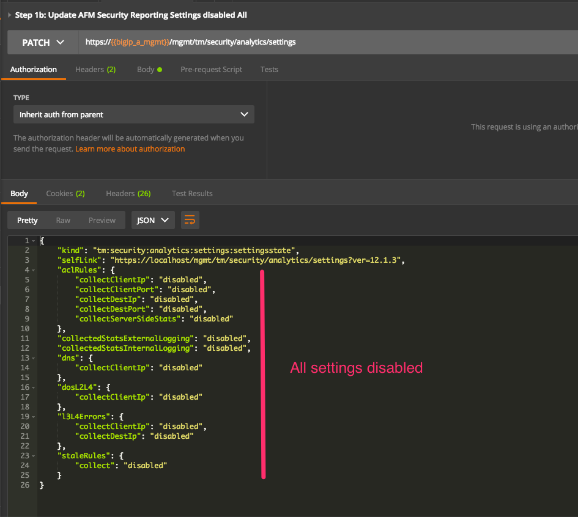
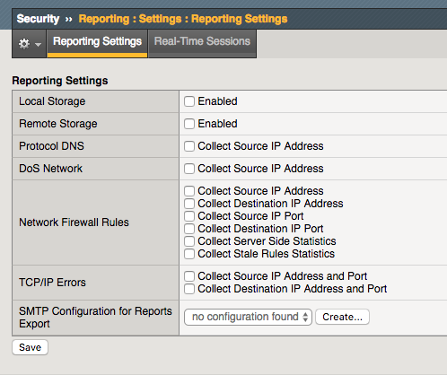
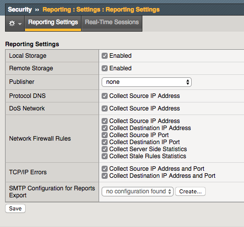
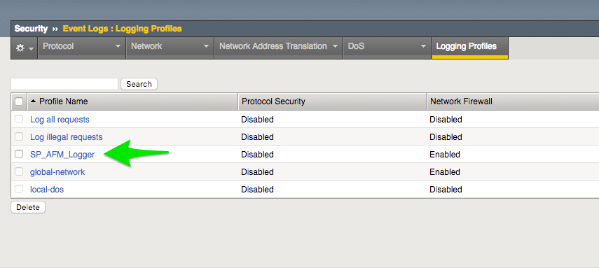
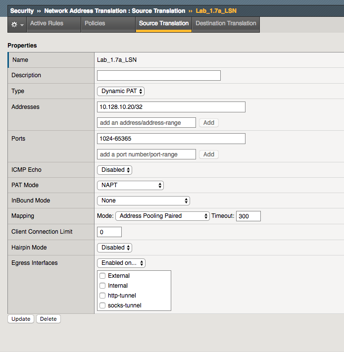
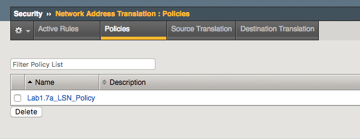
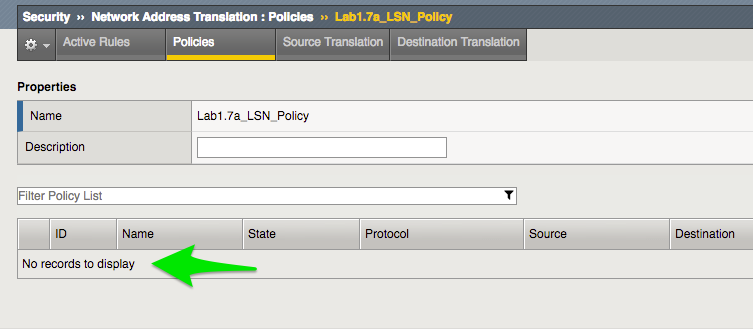
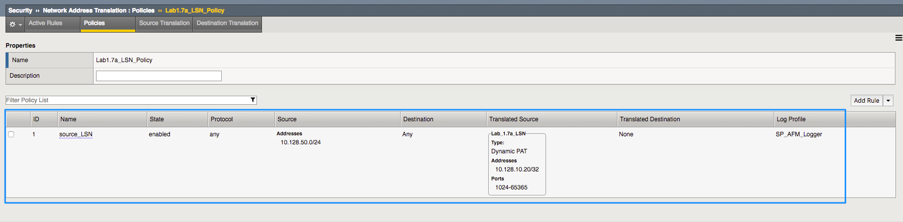
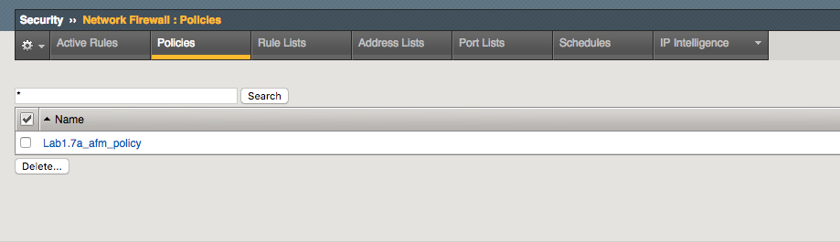
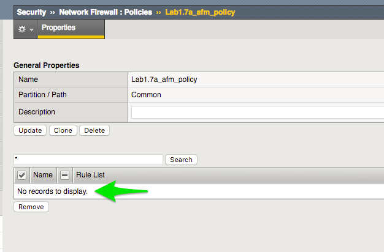
.. |lab-7-19| image:: images/lab-7-19.png
   :width: 6.50000in
   :height: 5.40313in
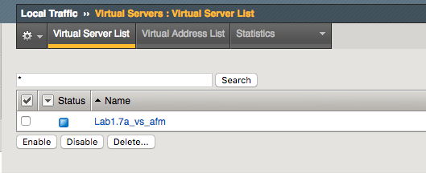
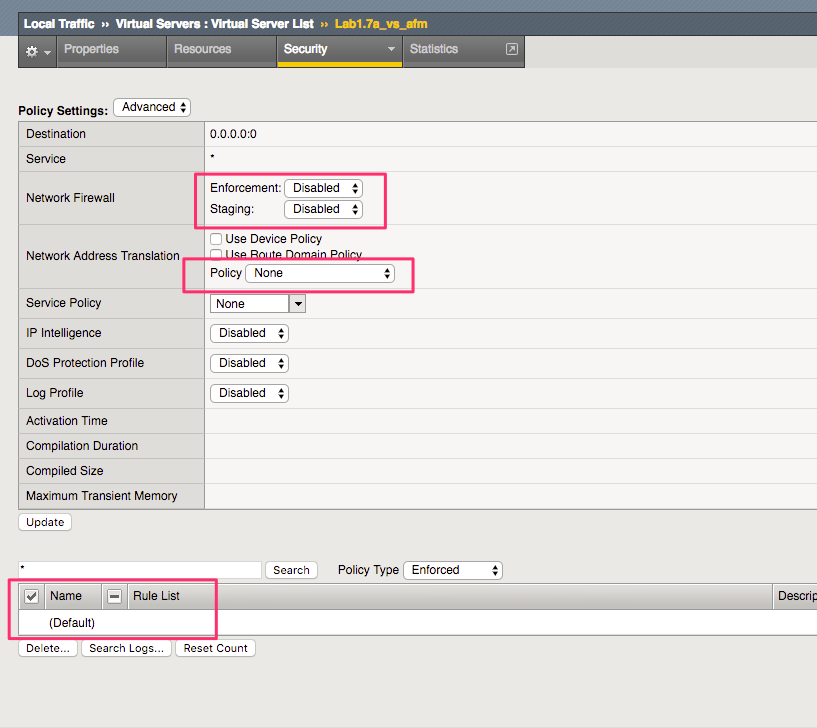
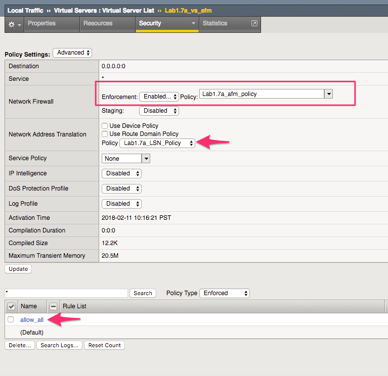
