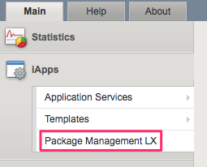
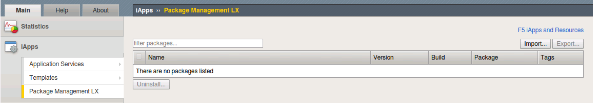

Lab 2.1: Exploring AS3
----------------------

.. graphviz::

   digraph breadcrumb {
      rankdir="LR"
      ranksep=.4
      node [fontsize=10,style="rounded,filled",shape=box,color=gray72,margin="0.05,0.05",height=0.1]
      fontsize = 10
      labeljust="l"
      subgraph cluster_provider {
         style = "rounded,filled"
         color = lightgrey
         height = .75
         label = "AS3 Installation & Deployments"
         basics [label="AS3 Basics",color="steelblue1"]
         templates [label="AS3 Installation"]
         deployments [label="AS3 Deployments"]
         basics -> templates -> deployments
      }
   }

Installation
~~~~~~~~~~~~

AS3 is another iControl LX Extensions that is part of the F5 Automation Toolchain. 
To install the extension you need to first obtain the RPM file associated with the extension.

AS3 RPMs are available at https://github.com/f5networks/f5-appsvcs-extension/releases

AS3 can be installed in a few ways:

- using the iControl REST API
- using the BIG-IP GUI (TMUI)
- using a command prompt

All of these mechanisms are supported and, if required, can be used in
conjunction with each other.

For instance, you can install AS3 from BIG-IP GUI and then deploy
a new service via iControl REST using tools such as cURL, Postman
and Ansible.

|lab-1-1|

Clicking :guilabel:`Package Management LX` will show a table of installed
iControl LX Extensions:

.. NOTE:: This should show Declarative Onboarding which was installed in the last module.

|lab-1-2|

Deployments
~~~~~~~~~~~

.. NOTE:: Redeployment of AS3 services is facilitated/protected by a mechanism
   in BIG-IP platform to ensure safe changes to the configurations without
   disrupting existing user traffic.

iControl LX allows Extensions to register new REST API endpoints with the
iControl REST API.  In the case of AS3 the following endpoints are exposed:

- **Version Info:** ``/mgmt/shared/appsvcs/info``
- **Declarations:** ``/mgmt/shared/appsvcs/declare``
- **Self-Test:** ``/mgmt/shared/appsvcs/selftest``

Deployments use the `/mgmt/shared/appsvcs/declare` endpoint.  This endpoint
accepts the Create, Read, Update and Delete (CRUD) operations using the HTTP
``POST``, ``GET``, ``PATCH`` and ``DELETE`` methods.

Additionally various query parameters are also supported.  Full documentation
is available in the `AS3 Reference <http://clouddocs.f5.com/products/extensions/f5-appsvcs-extension/3/refguide/as3-api.html>`_

Source-of-Truth
~~~~~~~~~~~~~~~

In an automated environment, we **must** always ensure that the
**AS3 declarations** are being used as the Source-of-Truth for an underlying
deployment.  Therefore, you should **NOT** perform out-of-band modifications
to the configuration using the BIG-IP GUI or REST API.

For instance, after an AS3 declaration is deployed, modifying the underlying
configuration will result in a Source-of-Truth violation.  AS3 **does not**
prevent out-of-band changes from occuring.  This allows administrators to ensure
total control over the system in emergency situations, however, the direct
modification of objects configured on BIG-IP will effect the integrity of
AS3 declaration that automation tools are interacting with, causing failures.
It is therefore important to prevent out-of-band changes at all times for
automated deployments in normal production circumstances.

