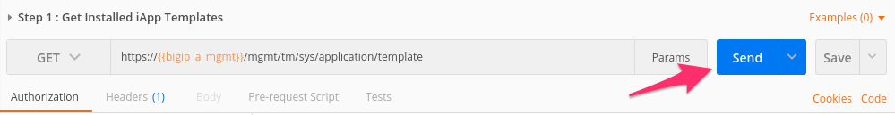
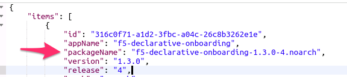
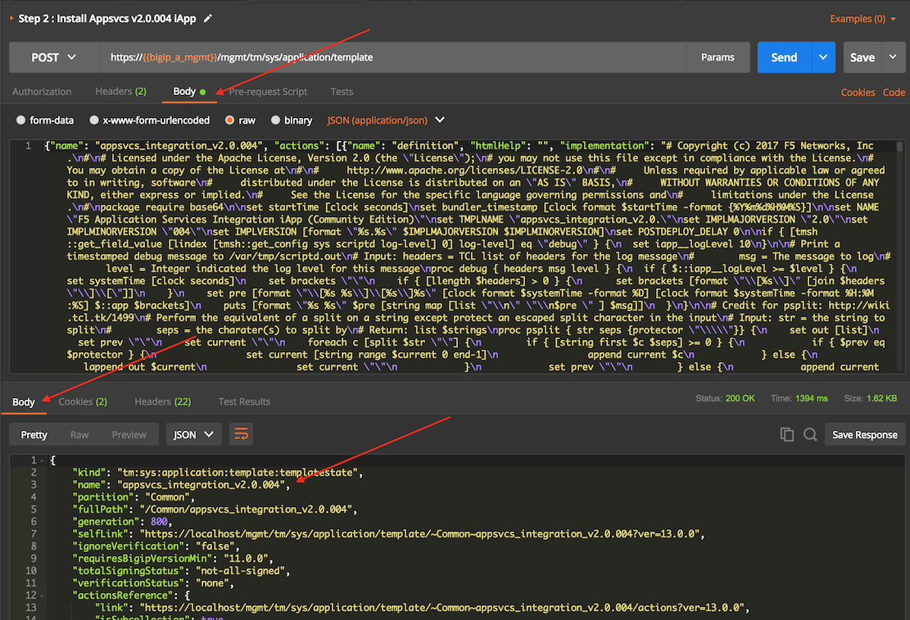
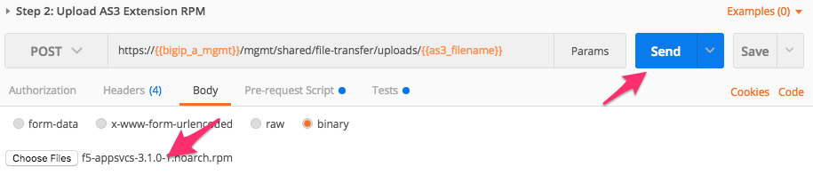
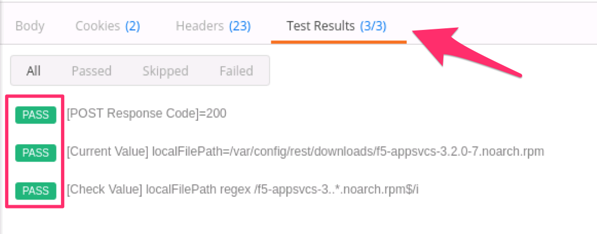
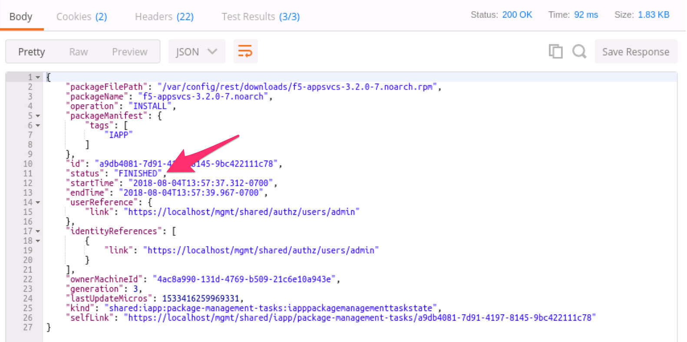
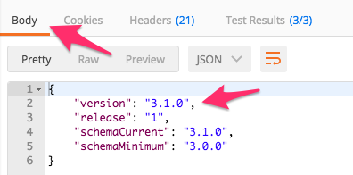

Lab 2.2: Install the AS3 Extension
----------------------------------

.. graphviz::

   digraph breadcrumb {
      rankdir="LR"
      ranksep=.4
      node [fontsize=10,style="rounded,filled",shape=box,color=gray72,margin="0.05,0.05",height=0.1]
      fontsize = 10
      labeljust="l"
      subgraph cluster_provider {
         style = "rounded,filled"
         color = lightgrey
         height = .75
         label = "AS3 Installation & Deployments"
         basics [label="AS3 Basics",color="palegreen"]
         templates [label="AS3 Installation",color="steelblue1"]
         deployments [label="AS3 Deployments"]
         basics -> templates -> deployments
      }
   }

We will use the REST API to install AS3 onto our BIG-IP device.

.. NOTE:: This lab work will be performed from
   ``Lab 2.2 - Install AS3 onto BIG-IP`` folder in the Postman
   Collection

   |lab-2-1|

Task 1 - View Installed iControl LX Extensions
~~~~~~~~~~~~~~~~~~~~~~~~~~~~~~~~~~~~~~~~~~~~~~

Perform the following steps to complete this task:

#. :guilabel:`Send` the ``Step 1: Get Installed iControl LX Extensions``
   request to view extensions installed on the BIG-IP device:

   |lab-2-2|

#. Review the JSON response :guilabel:`Body`.  The JSON payload shows
   extensions that are installed on the BIG-IP device in the ``items`` array.
   In this case we have no extensions installed so the ``items`` array is empty.

   |lab-2-3|

.. NOTE:: Previous modules in this lab guide had you install the DO extension.
   If you completed previous lab modules, then you will see DO extension installed
   and listed in the JSON response.

Task 2 - Install the AS3 Extension
~~~~~~~~~~~~~~~~~~~~~~~~~~~~~~~~~~

Perform the following steps to complete this task:

#. Using the Chrome web browser open a new tab and click the
   ``AS3 Release`` bookmark.

#. Click the file with the ``.rpm`` extension then click the download button.  The file will be
   located in the ``/home/ubuntu/Downloads`` folder on your jumphost.

#. Click the ``Step 2: Upload AS3 Extension RPM`` request.

#. Click the :guilabel:`Body` tab, then click the :guilabel:`Choose Files`
   button:

   |lab-2-4|

#. Select the previously downloaded RPM file located in the ``Downloads``
   folder on your jumphost.  Then click the :guilabel:`Send` button to upload
   the RPM file to the BIG-IP system:

   |lab-2-5|

#. Review the :guilabel:`Test Results` to ensure the file upload was successful:

   |lab-2-6|

#. Click the ``Step 3: Create AS3 Extension Install Task`` request and click
   :guilabel:`Send`.  This request will command the iControl LX framework to
   install the RPM uploaded in the previous step.  Because the installation
   task is an asynchronous operation we need to check the status of the task
   in the next step.

#. Click the ``Step 4: Get AS3 Install Task Status`` request and click
   :guilabel:`Send`.

#. Check the **Response** :guilabel:`Body` and ensure the task ``status`` is
   ``FINISHED``:

   |lab-2-7|

#. Click the ``Step 5: Get AS3 Version Info`` request and click
   :guilabel:`Send`.  Review the **Response** :guilabel:`Body` to ensure
   the AS3 is installed and has started:

   |lab-2-8|

.. |lab-2-2| image:: images/lab-2-2.png

