Lab 2.3: Create iApp Deployments using the REST API
---------------------------------------------------

.. graphviz::

   digraph breadcrumb {
      rankdir="LR"
      ranksep=.4
      node [fontsize=10,style="rounded,filled",shape=box,color=gray72,margin="0.05,0.05",height=0.1]
      fontsize = 10
      labeljust="l"
      subgraph cluster_provider {
         style = "rounded,filled"
         color = lightgrey
         height = .75
         label = "iApp Templates & Deployments"
         basics [label="iApp Basics",color="palegreen"]
         templates [label="iApp Templates",color="palegreen"]
         deployments [label="iApp Deployments",color="steelblue1"]
         basics -> templates -> deployments
      }
   }

Now that the App Services iApp template is installed, we can deploy a new
Layer 4 to 7 Service. We will start with **Creating** a Basic HTTP Service,
demonstrate **Modifying/Mutate** the service by changing the node state,
and finally **Delete** the whole service. Once we've demonstrated with these
tasks, we'll introduce more complex deployments options with iRules, Custom
Profiles, Certificates, and an ASM Policy.

.. NOTE:: This lab work will be performed from
   ``Lab 2.3 - Create iApp Deployments using the REST API`` folder in the
   Postman Collection

|lab-3-1|

Task 1 - View Deployed Services
~~~~~~~~~~~~~~~~~~~~~~~~~~~~~~~

Perform the following steps to complete this task:

#. :guilabel:`Send` the ``Step 1: Get Deployed iApp Services``
   request to view current iApp deployments on the BIG-IP device:

   |lab-3-2|

#. Review the JSON Response :guilabel:`Body`.  The BIG-IP device does not have
   any iApp deployments.  As a result the ``items`` array is empty (``[]``):

   |lab-3-3|

Task 2 - Deploy Basic HTTP Service
~~~~~~~~~~~~~~~~~~~~~~~~~~~~~~~~~~

Perform the following steps to complete this task:

#. Click ``Step 2: Deploy Service - HTTP``. Review the **Request** JSON
   :guilabel:`Body`. The JSON body of the POST contains the input for the iApp
   template to execute the deployment of the service.

   |lab-3-5|

#. Click the :guilabel:`Send` button to **Create** a Basic HTTP Service:

   |lab-3-4|

   In this task, we will deploy our first service. Review the **Response**
   JSON :guilabel:`Body` to verify if the Service has been deployed.

   |lab-3-32|

   .. NOTE:: We've just progressed into a **Declarative** instantiation, by
      defining the end state and relying on the iApp templates to handle the
      order of operations and configuration of specific objects.  By doing this,
      we have drastically reduced the amount of **Domain Specific Knowledge**
      required to interact with the device.  In the next module, we will combine
      this concept with **Abstraction** to further simplify the interface the
      service consumer has to interact with.

#. Now that the service has been deployed, let's review the BIG-IP configuration.
   You can validate by sending the ``Step 1: Get Deployed iApp Services``
   request again. Alternatively, you can login to BIG-IP A GUI to observe the service
   deployment via TMUI:

   - **REST**: :guilabel:`Send` ``Step 1: Get Deployed iApp Services`` request:

     |lab-3-7|

   - **TMUI GUI**: :menuselection:`iApps --> Application Services --> Applications`

     |lab-3-6|

#. From the TMUI GUI, examine the Virtual Server that was created from
   this deployment by clicking :menuselection:`Local Traffic --> Virtual Servers
   --> Virtual Server List --> Demo_vs`.  The configuration is simple, but it
   does contain the key components for an HTTP service (Listener, HTTP Profile,
   Monitor, Pool, and Pool Members):

   |lab-3-8|

#. The service is available and active, you can connect to the Virtual Server
   using Chrome web browser at ``http://10.1.20.121`` and examine its responses:

   |lab-3-24|

   .. NOTE:: The colors of the text, images, and borders may vary depending on the
      back-end server selected during the load balancing process.

Task 3 - Modify our Deployed Service
~~~~~~~~~~~~~~~~~~~~~~~~~~~~~~~~~~~~

In this task, we will modify the existing service. We will disable all pool
members and bring the service down.

Perform the following steps to complete this task:

#. Click on ``Step 3: Modify Service - HTTP``. Review the **Request** URL and
   JSON :guilabel:`Body`.  Notice that we specified the **Resource** URL for our
   deployment.  Modifying or *Redeploying* a service is handled by sending
   **only** the updated JSON to the specific Resource (our service) using a
   ``PUT`` request method.  We set the state of the pool members to ``disabled``
   which forces the service to go offline.

   |lab-3-10|

#. Click the :guilabel:`Send` button to **Modify** the previously deployed
   Basic HTTP Service:

   |lab-3-9|

#. In the BIG-IP GUI click :menuselection:`Local Traffic --> Network Map` to view the
   new state of the Pool Members (Black indicators reflect the disabled state).
   The state has been updated to reflect the state we declared in our call.
   The Virtual Server is no longer passing traffic at ``http://10.1.20.121``
   because all the Members in the Pool have been disabled:

   |lab-3-11|

Task 4 - Delete our Deployed Service
~~~~~~~~~~~~~~~~~~~~~~~~~~~~~~~~~~~~

The lifecycle of a service also includes the service removal.  We will now delete
an existing service.

Perform the following steps to complete this task:

#. :guilabel:`Send` the ``Step 4: Delete Service - HTTP`` request to
   **Delete** the previously deployed Basic HTTP Service:

   |lab-3-12|

#. Similar to modification process, the deletion of a service is performed on
   the **Resource** URL. When we created the service, we defined a Declarative
   state to the iApp template which subsequently created the configuration and
   all of its associated objects.  With a ``DELETE`` request, BIG-IP will process
   the removal of all objects linked to the ASO in a recursive manner. This is
   crucial to Application Lifecycle Management as it provides a mechanism to
   make sure all parts of the service are removed successfully.

   .. NOTE:: There is no JSON body to a ``DELETE`` call, as the HTTP Method
      is defining the action.

   Now that the service has been deleted, let's review the BIG-IP configuration.
   You can review via REST by sending the ``Step 1: Get Deployed iApp Services``
   request again, or you can login to the BIG-IP A GUI to observe the service
   deployment via TMUI:

   - **REST**: :guilabel:`Send` ``Step 1: Get Deployed iApp Services`` request:

     |lab-3-3|

   - **TMUI GUI**: :menuselection:`iApps --> Application Services --> Applications`

     |lab-3-13|

Task 5 - Deploy an HTTP Service with Custom created Profile and a referenced iRule
~~~~~~~~~~~~~~~~~~~~~~~~~~~~~~~~~~~~~~~~~~~~~~~~~~~~~~~~~~~~~~~~~~~~~~~~~~~~~~~~~~

Perform the following steps to complete this task:

#. :guilabel:`Send` the ``Step 5: Deploy Service - HTTP w/ iRule and
   Custom Profiles`` request to deploy an HTTP Service with Custom Profiles
   and an iRule:

   |lab-3-14|

#. The App Services iApp can *Create* or *Reference* various objects.  In this
   deployment we perform two actions:

   #. Create custom profiles on the BIG-IP device with various options
      specified.  These profiles do not exist on the BIG-IP but are created
      dynamically during the deployment.

   #. Create an iRule on the BIG-IP device by using a **URL Reference**.  The
      App Services iApp downloads the iRule resource from the URL and then
      creates a new iRule object on the system.  The iRule object is then
      automatically linked to the Virtual Server

      .. WARNING:: When using URL references, it is important to properly secure
         the repository which hosts the resource(s).  The example in this lab
         uses a publicly readable repository, however, most environments should
         use a private repository with appropriate access control.

#. Review the **Request** JSON :guilabel:`Body` to see how the desired outcomes
   above were declared:

   - **Custom Profiles:**

     |lab-3-15|

   - **URL Referenced iRule:**

     |lab-3-16|

   - **iRule linked to Virtual Server:** (:menuselection:`Local Traffic --> Network Map`)

     |lab-3-17|

#. Open Chrome and connect to the Virtual Server at ``http://10.1.20.121``. The
   iRule that was attached to the service contains an ``HTTP_RESPOND`` event,
   which responds with a simple Maintenance Page.

   |lab-3-18|

Task 6 - Deploy an HTTPS Service
~~~~~~~~~~~~~~~~~~~~~~~~~~~~~~~~

Perform the following steps to complete this task:

#. :guilabel:`Send` the ``Step 6: Deploy Service - HTTPS`` request to deploy
   an HTTPS Service using **URL Resources** for the SSL/TLS Key, Certificate and
   Certificate Bundle.

   |lab-3-19|

#. iApps are a Declarative interface, allowing us to modify deployment without
   the need to delete it (this also means we can re-name objects **if**
   we needed too).  For this service we will:

   - Use the same custom profiles
   - Remove the iRule
   - Change the Listener port to ``443`` (HTTPS)
   - Use URL Resources to obtain the SSL/TLS Key, Certificate and Certificate
     Bundle

     .. WARNING:: When using URL references, it is important to properly secure
        the repository which hosts the resource(s).  The example in this lab
        uses a publicly readable repository. However, most environments should
        use a private repository with appropriate access control.

   - Create and apply a Client SSL Profile

#. Review the **Request** JSON :guilabel:`Body` to see how the desired outcomes
   above were declared:

   |lab-3-20|

#. Review the configured Virtual Servers in the TMUI GUI.  The App Services iApp
   created a new Virtual Server to redirect ``TCP/80`` traffic to ``TCP/443``
   and reconfigured the Virtual Server to listen on ``TCP/443``

   |lab-3-21|

#. The configuration of the Virtual Server now uses an SSL Client profile
   containing our imported SSL Resources.  The deployment is now providing
   SSL Offload for the backend compute nodes.

   |lab-3-22|

#. Open Chrome and access the service with ``http://10.1.20.121``. It should
   redirect you to ``https://10.1.20.121``.

   .. NOTE:: We are using self signed certificates in the lab so an SSL
      warning will be shown.

   .. IMPORTANT:: RFC2616 (HTTP/1.1) allows for a TCP session to stay open.
      Had we not included "noserver Cache-Control no-cache *Connection Close*"
      in the iRule the following would have happened:

      When you would have refreshed the page, the maintenance page would still
      appear because of two reasons:

      #. Chrome keeps HTTP connections open in the background to improve network
         performance

      #. BIG-IP maintains a fully versioned configuration internally.
         Stateful connections, like HTTP, are then pinned to a specific version
         of the configuration for the lifetime of the connection.

      As a result, because Chrome has not closed the actual TCP connection,
      BIG-IP still processes traffic with the configuration that was present
      when the connection was originally created.  That *stale* connection
      was still using the version of the configuration with the iRule attached
      to the Virtual Service resulting in the maintenance page being shown.

   |lab-3-23|

Task 7 - Deploy an HTTPS Service with an Web Application Firewall Policy
~~~~~~~~~~~~~~~~~~~~~~~~~~~~~~~~~~~~~~~~~~~~~~~~~~~~~~~~~~~~~~~~~~~~~~~~

Another advantage of Service Deployment using iApp Templates is that they can
deploy advanced Layer 4-7 services from various F5 modules.  In this task we
will deploy a service that includes a Web Application Firewall policy with the
base HTTPS offload and load balancing features.

Perform the following steps to complete this task:

#. :guilabel:`Send` the ``Step 7: Deploy Service - HTTPS w/ WAF Policy`` request
   to deploy an HTTPS Service using **URL Resources** for a Web Application
   Firewall policy that will be used with the Application Security Manager
   (ASM) module.

   |lab-3-25|

#. This final iApp deployment will build upon our service by having the iApp
   load a WAF policy Resource from our repository.  The App Services iApp will
   then create a Layer 7 Traffic Policy and apply it to the Virtual Server.

   This deployment recognizes the need for Security from the beginning of the
   application lifecycle.  It lays the groundwork for **Continuous
   Improvement** by having the policy reside in a repository.  It allows us
   to treat resources as code leading to an Infrastructure as Code (IaC)
   methodology.  As the policy is updated in the repository, additional automation
   and orchestration can be enabled to deploy the policy into the environment.
   The result is an ability to rapidly build, test and iterate Layer 7
   security policies and guarantee deployment into the environment.

#. Review the **Request** JSON :guilabel:`Body` to see how the desired outcomes
   above were declared:

   - **Layer 7 Policy Rules:**

     |lab-3-28|

   - **Layer 7 Policy Actions:**

     |lab-3-26|

   - **ASM Policy URL:**

     |lab-3-27|

#. In the TMUI GUI, you will notice a Layer 7 policy has been applied to the Virtual
   Server. In :guilabel:`Application Security`, we will be able to observe that the
   policy is being dynamically fetched, applied, and set to Blocking mode.

   - **Layer 7 Policy:**

     |lab-3-31|

   - **Layer 7 Policy attached to Virtual Server:**

     |lab-3-29|

   - **ASM WAF Policy:**

     |lab-3-30|

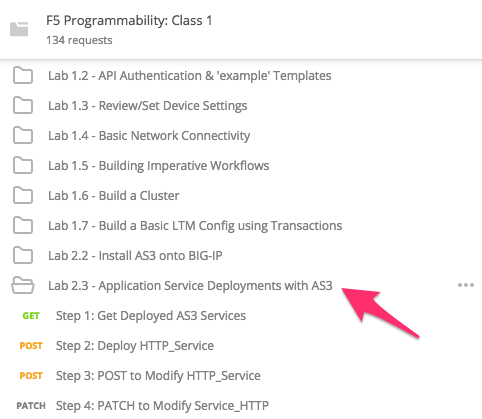
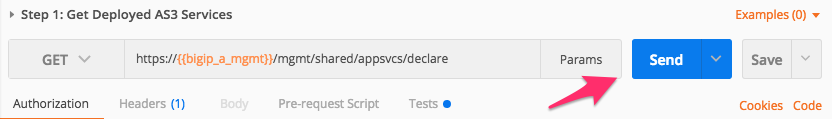
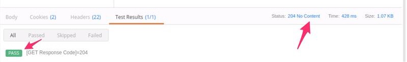
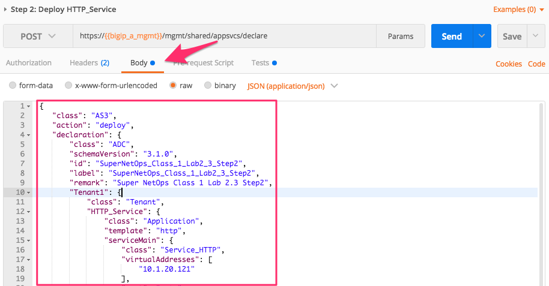
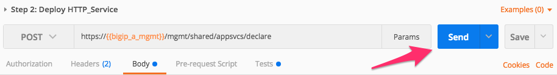
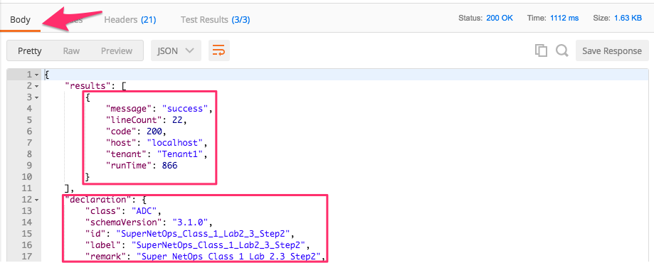
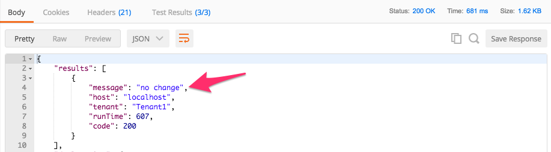
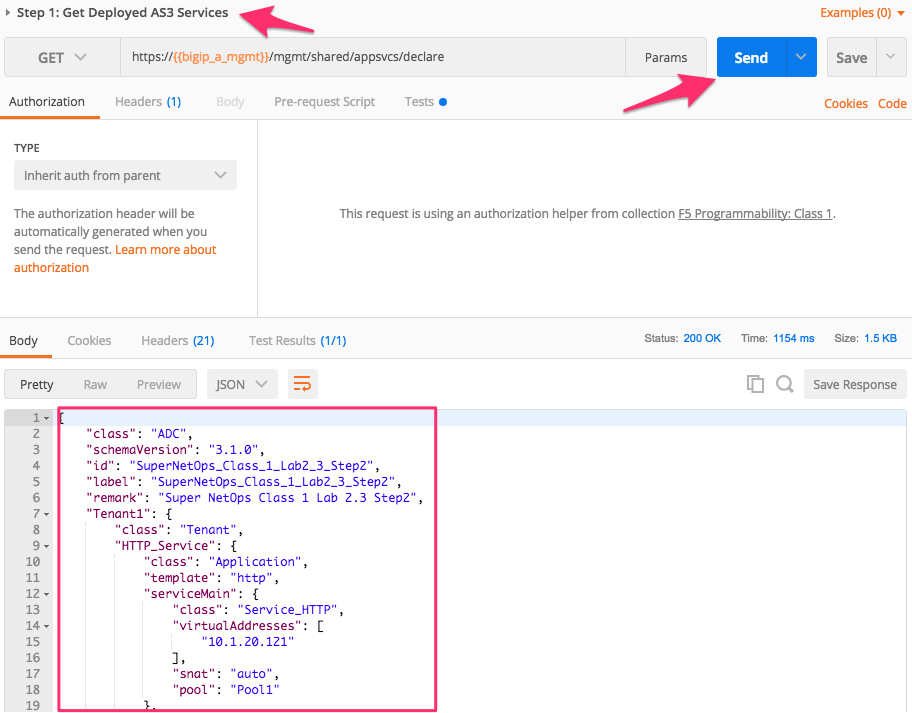
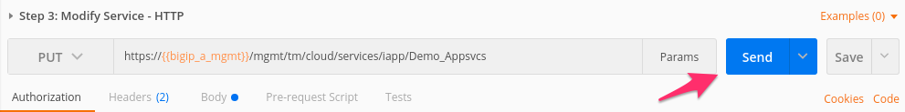
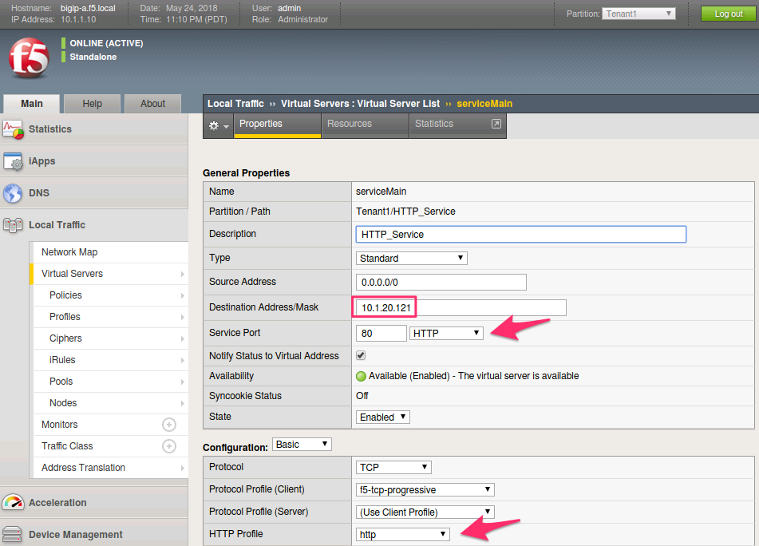
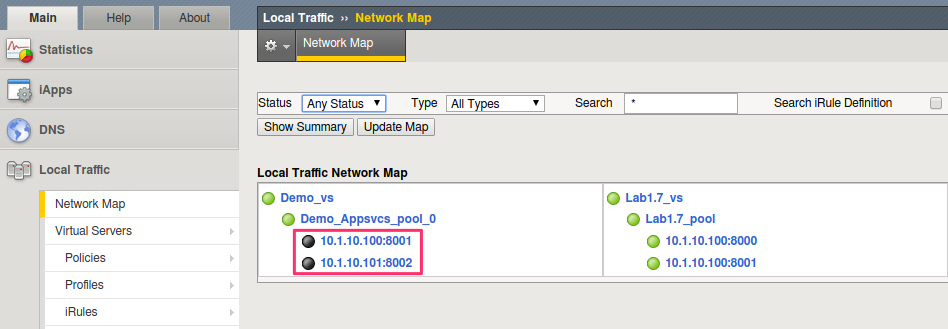
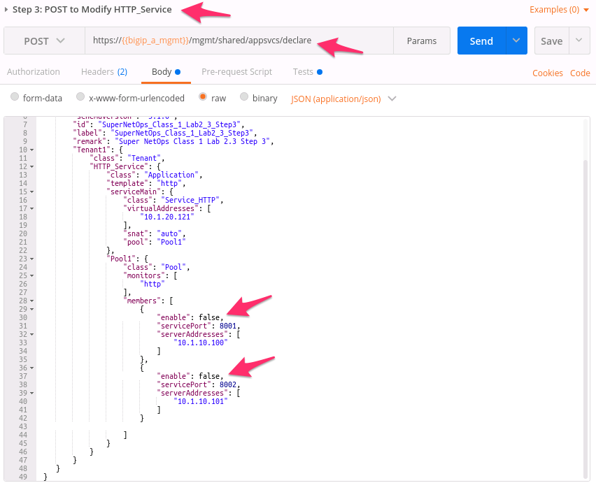
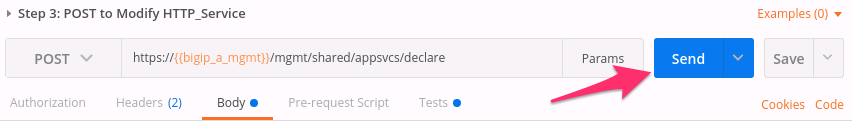
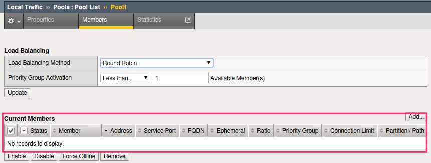
.. |lab-3-15| image:: images/lab-3-15.png
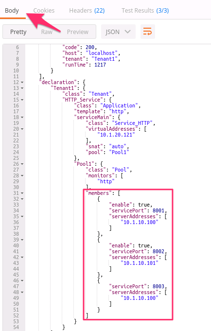
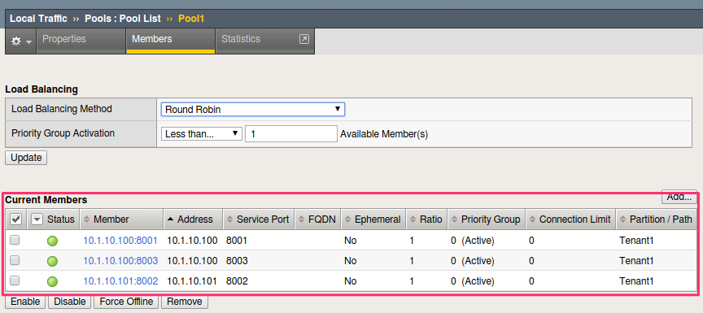
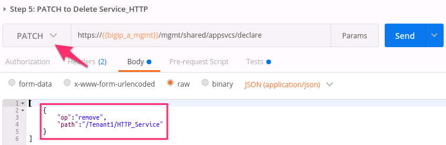
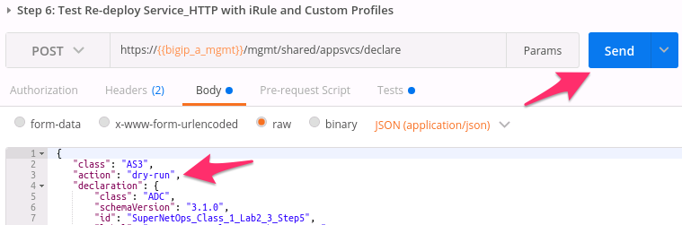
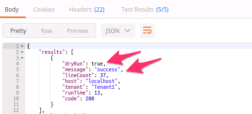
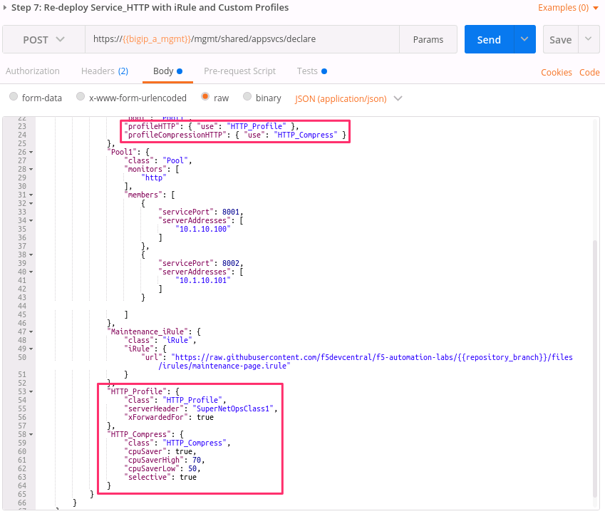
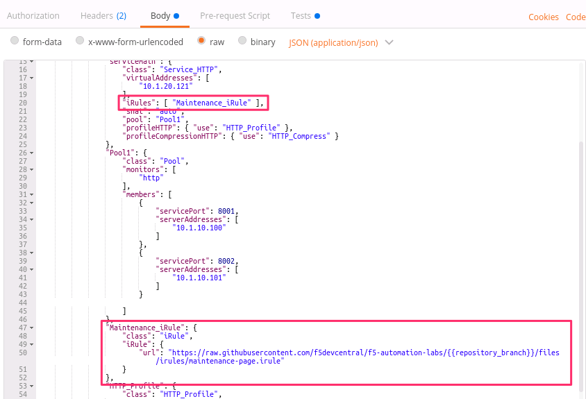
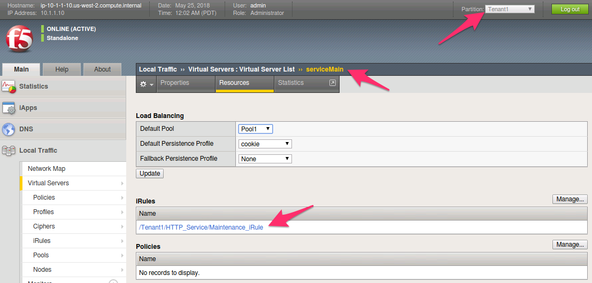
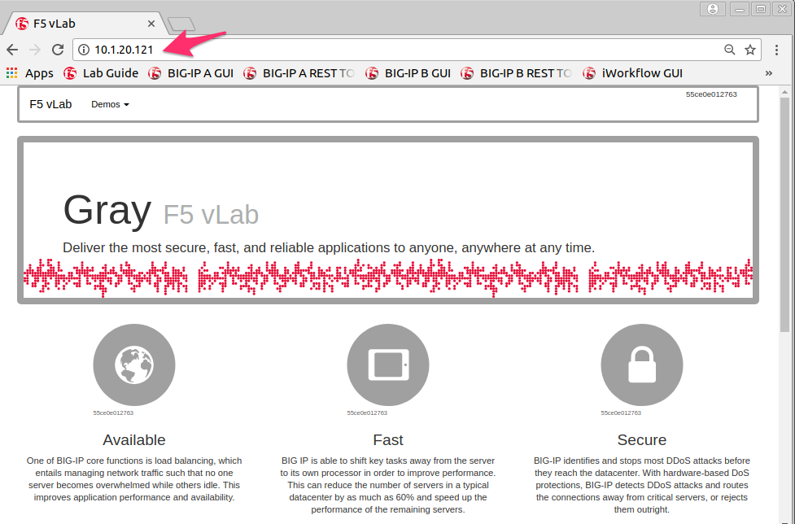
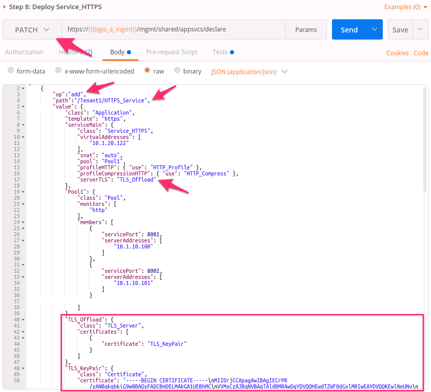
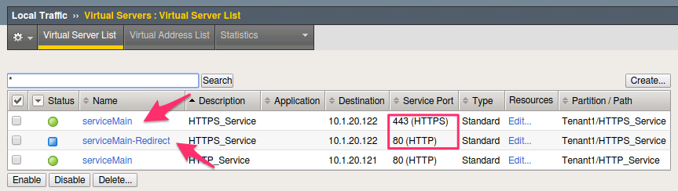
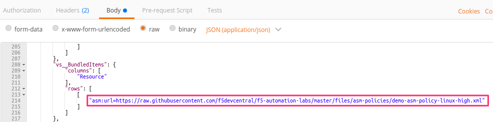
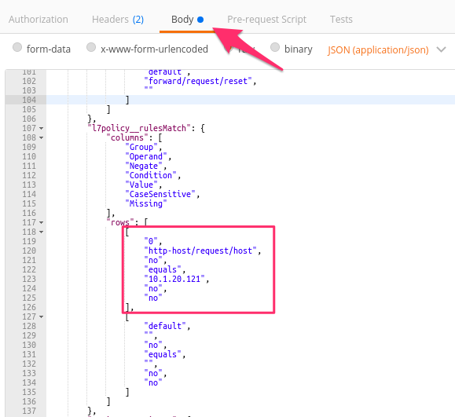
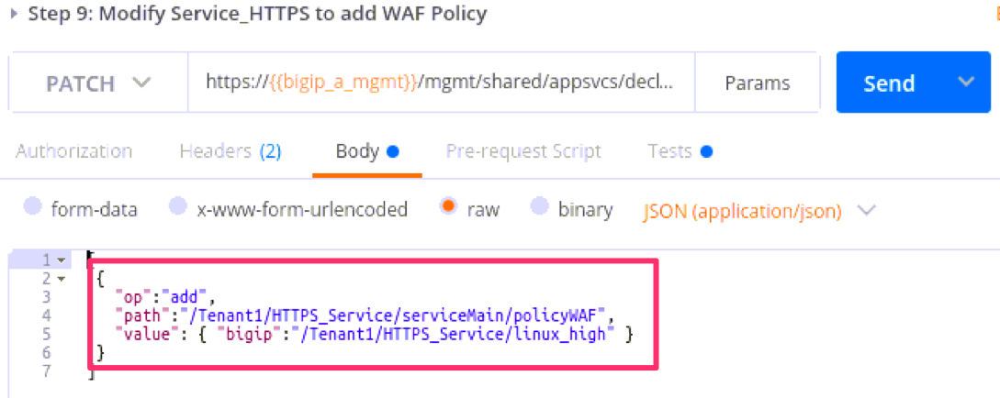
.. |lab-3-30| image:: images/lab-3-30.png
.. |lab-3-31| image:: images/lab-3-31.png
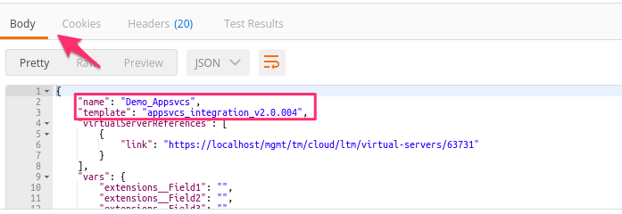
