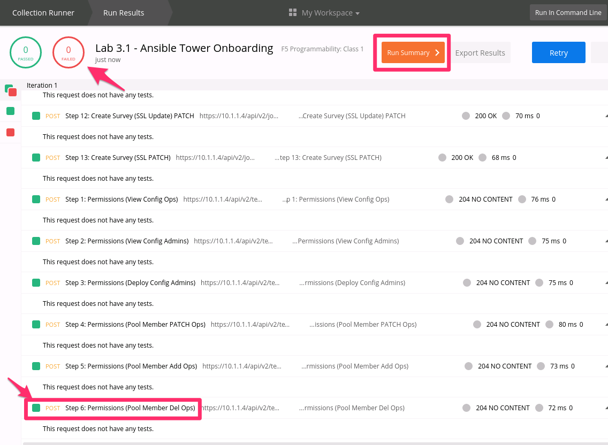
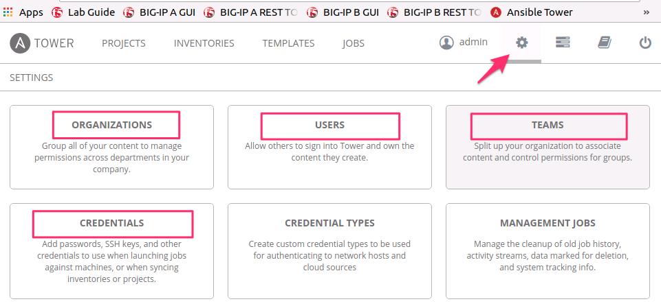

Lab 3.1: Ansible Tower Onboarding
---------------------------------

.. graphviz::

   digraph breadcrumb {
      rankdir="LR"
      ranksep=.4
      node [fontsize=10,style="rounded,filled",shape=box,color=gray72,margin="0.05,0.05",height=0.1]
      fontsize = 10
      labeljust="l"
      subgraph cluster_provider {
         style = "rounded,filled"
         color = lightgrey
         height = .75
         label = "Service Templates, Catalog and Deployments"
         onboarding [label="Basics",color="steelblue1"]
         templates [label="Templates"]
         catalog [label="Catalog"]
         deployments [label="Deployments"]
         onboarding -> templates -> catalog -> deployments
      }
   }

In this lab we will use the :guilabel:`Runner`, introduced in previous labs to
complete the onboarding of the Ansible Tower device.  The onboarding process
creates the initial configuration required to start utilizing Ansible Tower with BIG-IP.

Ansible Tower Overview
~~~~~~~~~~~~~~~~~~~~~~

Before looking at the details of the onboarding process, lets discuss the new
components Ansible Tower introduces to our toolchain. Some of the components are general Ansible terms and
not specific to Tower. As mentioned earlier we will be focusing primarily on the concepts within Tower itself.

Ansible Tower Term Reference
^^^^^^^^^^^^^^^^^^^^^^^^^^^^

- **Inventory:** Device(s) to perform action against. In this lab we will be using bigip_a_mgmt as the inventory object.
- **Playbook:** A group of plays/tasks to be performed against devices within the **Inventory**.
- **Project:** A collection of Ansible **Playbooks** within tower. In this lab were are using a **GITHUB Repo** to store the playbooks.
- **Templates:** A template provides the ability supply parameters to a playbook. Templates are what will provide the **Abstraction** to
  AS3.
- **Credentials:** Used to authenticate Tower to the destination device within the **Inventory**.

Roll Based Access Control (RBAC)
^^^^^^^^^^^^^^^^^^^^^^^^^^^^^^^^

Ansible Tower provides a control hierarchy with the terms below:

- **Orginization (AS3 Tenant):** An organization is a logical collection
  of **Users, Teams, Projects, and Inventories**. It is the highest level in the Tower object hierarchy.
- **Team:** A subdivision of an organization with associated **Users, Projects, Credentials, and Permissions**.
- **User:** A Users is usually associated with a **Team** to allow for group based RBAC control.

Example of the RBAC structure being used in this lab:

-  Tenant1 (Orginization)

   -  T1-Admins (Team)

      -  T1-admin-user (User)

   -  T1-Ops (Team)

      -  T1-ops-user (User)

Source-of-Truth
^^^^^^^^^^^^^^^

As discussed in Module 2, it is key to keep source-of-truth in mind as Tower will be making changing through
F5's declarative AS3 interface. For this lab we have created an AS3 declaration (source-of-truth) file for each of the primary
**Service Examples** from the previous Module. The intent here is to demonstrate the ability of Tower to manage and push source-of-truth
declarations from within its **Project (GIT SCM)**.

Onboarding Process Overview
~~~~~~~~~~~~~~~~~~~~~~~~~~~

The process implemented in the ``Lab 3.1 - Ansible Tower Onboarding`` folder of
the Postman collection is outlined below. The items will be done **automatically** for you udinrg **Task1**.

#. Token Authentication
#. Setup RBAC

   -  Create Orginization **Tenant1**

   -  Create Teams ( **T1-Admin / T1-Ops** )

   -  Create Users ( **T1-admin-user / T1-ops-user** )

   -  Associate Users to their respective Teams

#. Create Tower Project SCM
#. Create Tower Inventory

   -  Create Tower Inventory group

   -  Create Inventory Host (The BIG-IP we will be manipulating)

   -  Associate the Host to the Inventory group

#. Create Tower Credentials to Authenticate to the BIG-IP
#. Create Job Templates

   -  Deploy Config (POSTS AS3 Declaration to BIG-IP)

      -  Create Survey for "Deploy Config"

   -  Deploy Config (POSTS AS3 Declaration to BIG-IP)

      -  Create Survey for "Deploy Config"

Task 1 - Onboard iWorkflow using Runner
~~~~~~~~~~~~~~~~~~~~~~~~~~~~~~~~~~~~~~~

In this task we will use the :guilabel:`Runner` to execute a series of
requests contained in the ``Lab 3.1 - iWorkflow Onboarding`` folder.

Perform the following steps to build the cluster:

#. Click the :guilabel:`Runner` button at the top left of your Postman window:

   |postman-runner-button|

#. Select the ``F5 Programmability: Class 1`` Collection then the
   ``Lab 3.1 - iWorkflow Onboarding`` folder.  Next, be sure the
   environment is set to ``F5 Programmability: Class 1``:

   |lab-1-1|

#. Click the :guilabel:`Run Lab 3.1 - iWor...` button

#. The results window will now populate.  You will see each request in the
   folder is sent and it's associated test results are displayed on the screen.
   Onboarding iWorkflow can take a few minutes.  You can follow the progress
   by scrolling down the results window.

#. Once the :guilabel:`Run Summary` button appears the folder has finished
   running.  You should have 0 failures and the last item in the request
   list should be named ``Install App Services Template on iWorkflow``

   |lab-1-2|

#. At this point you can log into iWorkflow using Chrome at
   ``https://10.1.1.12`` and ``admin/admin`` credentials.  Click
   :guilabel:`Clouds and Services` at the top of the window:

   |lab-1-3|

#. Browse the various panes to see what was created:

   |lab-1-4|

.. |postman-runner-button| image:: /images/postman-runner-button.png
.. |lab-1-1| image:: images/lab-1-1.png

