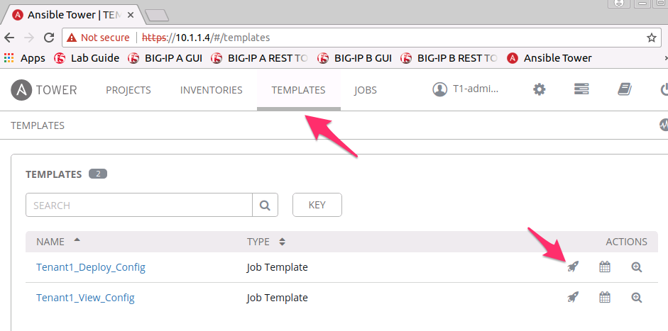
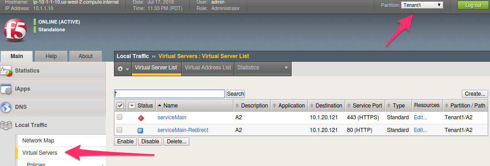

Lab 3.2: Deploying Templates with Tower
---------------------------------------

.. graphviz::

   digraph breadcrumb {
      rankdir="LR"
      ranksep=.4
      node [fontsize=10,style="rounded,filled",shape=box,color=gray72,margin="0.05,0.05",height=0.1]
      fontsize = 10
      labeljust="l"
      subgraph cluster_provider {
         style = "rounded,filled"
         color = lightgrey
         height = .75
         label = "Service Templates, Catalog and Deployments"
         onboarding [label="Basics",color="palegreen"]
         templates [label="Templates",color="steelblue1"]
         catalog [label="Catalog"]
         deployments [label="Deployments"]
         onboarding -> templates -> catalog -> deployments
      }
   }

Tower is a powerfull tool which can be tailored to your specific environment.
The following example **Job Templates** are meant to act as demonstrations of
what is possible. These are a great starting point for developing your own
**Service Catalog** and Templates that meet the requirements of your workflow.

In this first example we will show the underlying Ansible objects that make the
Catalog work such as **Playbooks** and **Jinja2 Templates**. These files are
stored within the **GIT Repo** associated with the **Project** in Tower. You
may browse the additional files used in the lab by viewing them in the link
below.

   .. parsed-literal::

      :raw_github_url:`/files/tower/playbooks`

This lab covers the example of deploying a single AS3 declaration that is stored
within a GIT Repository. We will be treating the JSON files in this Repository
as **Source-of-Truth**. In an enterprise environment, you would update
these files via Orchestration and use Tower to push them to the BIG-IPs AS3
**Declarative** interface. For simplicity a few different example files were
pre-populated into the repository throughout this module.

.. NOTE:: We will be switching user accounts throughout the Labs. Pay attention
   to Template differences between Admin and Ops Users.

Task 1 - Deploy HTTPs Tower Template
~~~~~~~~~~~~~~~~~~~~~~~~~~~~~~~~~~~~

In this task we will be running through an example Template and will come back
in Task2 and explain the flow Tower took to get the end result.
Perform the following steps to complete this task:

#. Open the Ansible Tower GUI in Chrome by navigating to ``https://10.1.1.12``
   and login using ``T1-admin-user``/``default`` credentials.

#. Click :guilabel:`TEMPLATES` in the top menu bar of tower. Notice that there
   are only two templates now visible as you are no longer logged in as the
   ``Tower`` admin but as the ``Tenant1`` admin. In this Role you are able to
   view what is currently deployed within your Tenant and also POST a new
   declaration to **AS3** for your Tenant.

   |lab-2-1|

#. Select the ``Rocket-Ship Icon`` next to the Template titled
   ``Tenant1_Deploy_Config``.

#. The modal that comes up is the **Survey** we referred to earlier. This takes
   in the variables which will be passed to the **Ansible Playbook**. This
   example takes two parameters.

   - Tenant: This is limited by the **RBAC** policies that were deployed
     through Postman. You are not able to change this value which reduces
     the blast radius of changes made to your Tenant (Tenant1).
   - Template FIle: This is the **source-of-truth** JSON file that we will be
     deploying. For now set this to ``f5-https-offload-app``.

   |lab-2-2|

#. Select the :guilabel:`LAUNCH` button to deploy this configuration.
#. Tower will bring you to a a page to view the **Job** running. Wait for the
   ``Status`` located in the top left to become ``Green`` and ``Successful``.
   - At this point the JSON file was deployed to the BIG-IP.

   |lab-2-3|

#. Open a Chrome window/tab to the BIG-IP A GUI at ``https://10.1.1.10`` and
   login with ``admin/admin`` credentials. Navigate to
   :menuselection:`Local Traffic --> Virtual Servers`. Make sure to select
   ``Tenant1`` Partition in the top right hand corner to view your AS3 Tenant.
   You should see the Application that was created with AS3.

   |lab-2-4|

Task 2 - Review Templates/Playbooks
~~~~~~~~~~~~~~~~~~~~~~~~~~~~~~~~~~~

Now that we ran our first Tower Job, lets review what actually happened and how
Tower was able to deploy a full configuration with so little input. Keep in mind
that the JSON file referenced within the previous Template was considered to be
``Tenant1's`` source-of-truth. Major changes to the Tenant would be performed
out of band from this current process and pushed to the GIT Repo. We will cover
**PATCH** changes in upcoming Tasks and labs.

Review the following data objects to finish this Task

#. The template we ran called :guilabel:`Tenant1_Deploy_Config` calls an Ansible
   :guilabel:`Playbook` called :guilabel:`tenant_template.yaml`. The key points
   to notice are:

   - :guilabel:`tenant_body`: This is where Ansible is looking up the base AS3
     application.

   - :guilabel:`body`: This object refers to a :guilabel:`Jinja2` template. This
     allows ansible to place variables provided in the Tower **Survey** into the
     AS3 declaration. We will review the Jinja2 template in the next step.

.. code-block:: yaml
   :linenos:
   :emphasize-lines: 8,19

   ---
   - name: Update Tenant
     hosts: bigip
     gather_facts: false
     connection: local

     vars:
       tenant_body: "{{ lookup('url', 'https://<<repo-location>>/{{ f5_template }}.json', split_lines=False) }}"
       uri_method: "POST"
     tasks:
       ##### AS3 POST #####
     - name: URI POST Tenant
       uri:
         url: "https://{{ inventory_hostname }}/mgmt/shared/appsvcs/declare"
         method: "{{ uri_method }}"
         user: "admin"
         password: "admin"
         validate_certs: no
         body: "{{ lookup('template', '../j2/tenant_base.j2') }}"
         body_format: json


#. Lets examine the :guilabel:`Jinja2` template that is called by the playbooks
   below.

   - :guilabel:`tenant`: This is where the Tenant/Partition is inserted into
     the AS3 playbook. This prevents the user from editing someone elses Tenant.

   - :guilabel:`tenant_body`: The JSON Source-of-Truth is inserted here.

   - Together the two objects above create a complete AS3 Declaration for Tenant1.

   .. code-block:: console
      :linenos:
      :emphasize-lines: 11-12

      {
         "class": "AS3",
         "action": "deploy",
         "persist": true,
         "declaration": {
            "class": "ADC",
            "schemaVersion": "3.2.0",
            "id": "testid",
            "label": "test-label",
            "remark": "test-remark",
            "{{tenant}}":
               {{tenant_body}}
          }
      }


#. This same logic could be followed for grouping multiple applications Together
   under 1 declartion. Testing has been performed to demonstrate AS3s ability
   to deploy hundreds of Applications through a single declaration.


Task 3 - Viewing the state of AS3 on the BIG-IP
~~~~~~~~~~~~~~~~~~~~~~~~~~~~~~~~~~~~~~~~~~~~~~~

The other :guilabel:`Template` available to our T1-admin-user is
``Tenant1_View_config``. This is a simple :guilabel:`Playbook` which will perform
a ``GET``` against AS3 for the current users ''Tenant'' and display it within
the Job output.

#. Navigate to :guilabel:`Templates` in the GUI and select the
   ``Rocket-Ship Icon`` next to the Template titled ``Tenant1_Deploy_Config``.

   |lab-2-5|

#. This Template does not have a survey associated with it. When the Job
   Completes you will be able to click directly on the JSON output to review the
   current AS3 Config.

   |lab-2-6|

   |lab-2-7|


Task 4 - Explore Additional Source-of-Truth Files
~~~~~~~~~~~~~~~~~~~~~~~~~~~~~~~~~~~~~~~~~~~~~~~~~

Using the procedures above explore Deploying the other example Source-of-Truth
files that are available within the :guilabel:`Tenant1_Deploy_Config`
template. The table below represents what each template contains.

.. NOTE:: Once done exploring please run the :guilabel:`Tenant1_Deploy_Config`
   Template again with the ``f5-https-offload-app`` option as we will be using
   that in the next section.

.. list-table::
    :widths: 30 70
    :header-rows: 1

    * - **Service Template**
      - **Description**
    * - ``f5-http-app``
      - HTTP Load Balancing to a Single Pool
    * - ``f5-https-offload-app``
      - HTTPS Offload and Load Balancing to a Single Pool
    * - ``f5-http-irule-routing-app``
      - HTTP Load Balancing with URL Based Content Routing to Multiple Pools
    * - ``f5-tcp-app``
      - Generic L4 TCP Load Balancing to a Single Pool
    * - ``f5-udp-app``
      - Generic L4 UDP Load Balancing to a Single Pool
    * - ``f5-https-waf-app``
      - HTTPS Offload, Web Application Firewall Protection and Load Balancing
        to a Single Pool







