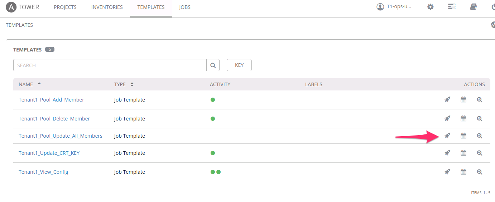
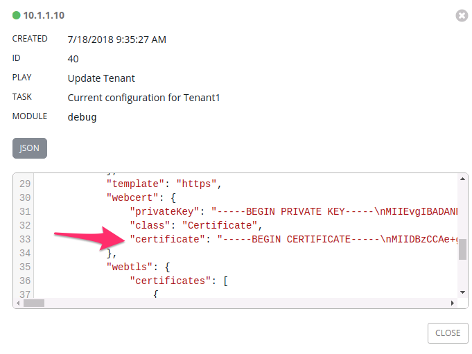

Lab 3.3: Modify AS3 Apps using Tower
------------------------------------

.. graphviz::

   digraph breadcrumb {
      rankdir="LR"
      ranksep=.4
      node [fontsize=10,style="rounded,filled",shape=box,color=gray72,margin="0.05,0.05",height=0.1]
      fontsize = 10
      labeljust="l"
      subgraph cluster_provider {
         style = "rounded,filled"
         color = lightgrey
         height = .75
         label = "Service Templates, Catalog and Deployments"
         onboarding [label="Basics",color="palegreen"]
         templates [label="Templates",color="palegreen"]
         catalog [label="Catalog",color="steelblue1"]
         deployments [label="Deployments",color="steelblue1"]
         onboarding -> templates -> catalog -> deployments
      }
   }

At this point we have deployed full Applications with Tower and AS3 but have not
modified an application after it was deployed. In this Lab we will focus on
Adding, Removing, and Replacing Pool Members using **AS3 PATCH** through Tower.
We will also demonstrate updating SSL Certificates on an existing Virtual.

.. NOTE:: Ensure that you ran the :guilabel:`Tenant1_Deploy_Config`
   Template again with the ``f5-https-offload-app`` option as indicated at
   the end of the last Lab.

Task 1 - Adding a Pool Member using Tower
~~~~~~~~~~~~~~~~~~~~~~~~~~~~~~~~~~~~~~~~~

Just like our Deployment Job Templates, modification Job Templates also
utlilize both :guilabel:`Playbooks` and :guilabel:`Jinja2` templates.

#. Open the Ansible Tower GUI in Chrome by navigating to ``https://10.1.1.4``
   and login using ``T1-ops-user``/``default`` credentials.

#. Navigate to the :guilabel:`Templates` section in the Web UI. Notice the
   difference in Templates available to the :guilabel:`Operations User`. This
   is where breaking up roles to match your orginization can really add value
   when using Tower. There can be Templates designated for Security,
   Network Admins,App Owners, etc.

   |lab-3-1|

#. Select the ``Rocket-Ship Icon`` next to the Template titled
   ``Tenant1_Pool_Add_Member``

#. A Survey will appear asking you to specify the following fields and press
   :guilabel:`LAUNCH`

   - :guilabel:`Application`: This is the AS3 Application Name: Enter ``A2``

   - :guilabel:`Pool Name`: Name of the App Pool: Enter ``web_pool``

   - :guilabel:`New Member`: IP of new Pool Member: Enter ``10.1.10.125``

   |lab-3-2|

#. Once you see the ``Status Success`` message on the Job Output open a Chrome
   window/tab to the BIG-IP A GUI at ``https://10.1.1.10`` and login with
   ``admin/admin`` credentials. Navigate to
   :menuselection:`Local Traffic --> Pools`. Make sure to select ``Tenant1``
   Partition in the top right hand corner to view your AS3 Tenant. You should
   see ``web_pool`` listed with ``3`` members in the pool.

   |lab-3-3|

#. Click on the :guilabel:`3` pool members to see the one we just added.

   |lab-3-4|

Task 2 - Removing a Pool Member using Tower
~~~~~~~~~~~~~~~~~~~~~~~~~~~~~~~~~~~~~~~~~~~

#. Navigate to the :guilabel:`Templates` section in the Web UI and Select the
   ``Rocket-Ship Icon`` next to the Template titled ``Tenant1_Pool_Delete_Member``

   |lab-3-5|

#. A Survey will appear asking you to specify the following fields and press
   :guilabel:`LAUNCH`

   - :guilabel:`Application`: This is the AS3 Application Name: Enter ``A2``

   - :guilabel:`Pool Name`: Name of the App Pool: Enter ``web_pool``

   - :guilabel:`Index of Member`: IP of new Pool Member: Enter ``2``

   |lab-3-6|

#. Once you see the ``Status Success`` message on the Job Output open a Chrome
   window/tab to the BIG-IP A GUI at ``https://10.1.1.10`` and login with
   ``admin/admin`` credentials. Navigate to
   :menuselection:`Local Traffic --> Pools`. Make sure to select ``Tenant1``
   Partition in the top right hand corner to view your AS3 Tenant. You should
   see ``web_pool`` listed with ``2`` members again in the pool.

#. You have now successfully Added and Removed ``10.1.10.125`` from the
   AS3 Application using Ansible Tower.

Task 3 - Perform Service Lifecycle Operations
~~~~~~~~~~~~~~~~~~~~~~~~~~~~~~~~~~~~~~~~~~~~~

In this task we will perform CRUD operations on Service Deployments
demonstrating a full Service Lifecycle for a Tenant Service.

Create
^^^^^^

Perform the following steps to complete this task:

#. Click the ``Deploy example-f5-http-lb Service`` request in the folder.

#. Examine the URI.  Notice that the variable ``iwf_tenant_name`` is used to
   specify the Tenant we are performing the operation on.  In this case
   ``iwf_tenant_name`` is set to ``MyTenant`` in the Postman environment:

   |lab-3-3|

#. Examine the JSON Request :guilabel:`Body`; it contains the following data:

   - Deployment ``name``
   - A URI Reference to the Service Template ``f5-http-lb-v1.0``
   - The input ``vars`` and ``tables`` for the deployment.  These
     fields were marked ``Tenant Editable`` in the Service Template
   - A URI Reference to the Connector to use for deployment.  This specifies
     which BIG-IP devices will be used for this deployment

   The data in the list above is highlighted below:

   |lab-3-4|

#. Click the :guilabel:`Send` button to **Create** the Service Deployment

#. Switch to the Chrome iWorkflow Tenant UI window.  The ``example-f5-http-lb``
   Service is now present in the :guilabel:`L4-L7 Services` pane.  Double
   click the Service and examine its properties.  You can compare the
   values in the UI to the JSON Request :guilabel:`Body` from the step above.

   |lab-3-5|

#. Open a Chrome window/tab to the BIG-IP A GUI at ``https://10.1.1.10`` and
   login with ``admin/admin`` credentials. Navigate to
   :menuselection:`iApps --> Application Services`.  Select
   ``example-f5-http-lb`` from the list of deployed services and examine the
   :guilabel:`Components` of the deployed service:

   |lab-3-6|

Update
^^^^^^

Perform the following steps to complete this task:

#. Click the ``Modify example-f5-http-lb Service`` request in the folder.

#. We will send a ``PUT`` request to the Resource URI for the existing
   deployment and add a Pool Member as shown in the JSON Request
   :guilabel:`Body`:

   |lab-3-7|

#. Click the :guilabel:`Send` button to **Update** the Service Deployment.

#. Update the iWorkflow Tenant UI and notice that the Service has been updated:

   |lab-3-8|

#. Update the BIG-IP GUI and notice that the :guilabel:`Components` tree has
   been updated:

   |lab-3-9|

Read
^^^^

Perform the following steps to complete this task:

#. Click the ``Get example-f5-http-lb Service`` request in the folder.

#. We will send a ``GET`` request to the Resource URI for the existing
   deployment.

#. Click the :guilabel:`Send` button to **Read** the Service Deployment.

#. Examine the JSON Response :guilabel:`Body` to see the state of the current
   Service Deployment:

   |lab-3-10|

Delete
^^^^^^

Perform the following steps to complete this task:

#. Click the ``Delete example-f5-http-lb Service`` request in the folder.

#. We will send a ``DELETE`` request to the Resource URI for the existing
   deployment.

#. Click the :guilabel:`Send` button to **Delete** the Service Deployment.

#. Update the iWorkflow Tenant UI and verify that the Service has been deleted:

   |lab-3-11|

#. In the BIG-IP GUI navigate to
   :menuselection:`iApps --> Application Services` and verify the service was
   deleted.

   |lab-3-12|

Task 3 - Deploy Additional Services
~~~~~~~~~~~~~~~~~~~~~~~~~~~~~~~~~~~

Examples **Create** requests are included in the
``Lab 3.3 - Deploy L4-7 Services`` folder.  For the remaining services
refer to the table below to see which ones apply most to your specific use
cases.  You can repeat the steps in Task 2 for the additional services by
modifying the requests as needed.

.. list-table::
    :widths: 30 70
    :header-rows: 1
    :stub-columns: 1

    * - **Service Name**
      - **Description**
    * - ``f5-http-lb``
      - HTTP Load Balancing to a Single Pool
    * - ``f5-https-offload``
      - HTTPS Offload and Load Balancing to a Single Pool
    * - ``f5-fasthttp-lb``
      - Performance-enhanced HTTP Load Balancing to a Single Pool
    * - ``f5-fastl4-tcp-lb``
      - Generic L4 TCP Load Balancing to a Single Pool
    * - ``f5-fastl4-udp-lb``
      - Generic L4 UDP Load Balancing to a Single Pool
    * - ``f5-http-url-routing-lb``
      - HTTP Load Balancing with URL Based Content Routing to Multiple Pools
    * - ``f5-https-waf-lb``
      - HTTPS Offload, Web Application Firewall Protection and Load Balancing
        to a Single Pool

.. |lab-3-2| image:: images/lab-3-2.png
   :scale: 80%
.. |lab-3-3| image:: images/lab-3-3.png
   :scale: 80%
.. |lab-3-4| image:: images/lab-3-4.png

.. |lab-3-6| image:: images/lab-3-6.png

