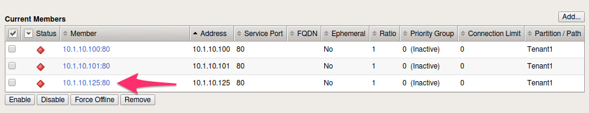

Lab 3.3: Modify AS3 Apps using Tower
------------------------------------

.. graphviz::

   digraph breadcrumb {
      rankdir="LR"
      ranksep=.4
      node [fontsize=10,style="rounded,filled",shape=box,color=gray72,margin="0.05,0.05",height=0.1]
      fontsize = 10
      labeljust="l"
      subgraph cluster_provider {
         style = "rounded,filled"
         color = lightgrey
         height = .75
         label = "Service Templates, Catalog and Deployments"
         onboarding [label="Basics",color="palegreen"]
         templates [label="Templates",color="palegreen"]
         catalog [label="Catalog",color="steelblue1"]
         deployments [label="Deployments",color="steelblue1"]
         onboarding -> templates -> catalog -> deployments
      }
   }

At this point we have deployed full Applications with Tower and AS3 but have not
modified an application after it was deployed. In this Lab we will focus on
Adding, Removing, and Replacing Pool Members using **AS3 PATCH** through Tower.
We will also demonstrate updating SSL Certificates on an existing Virtual.

.. NOTE:: Ensure that you ran the :guilabel:`Tenant1_Deploy_Config`
   Template again with the ``f5-https-offload-app`` option as indicated at
   the end of the last Lab.

Task 1 - Adding a Pool Member using Tower
~~~~~~~~~~~~~~~~~~~~~~~~~~~~~~~~~~~~~~~~~

Just like our Deployment Job Templates, modification Job Templates also
utlilize both :guilabel:`Playbooks` and :guilabel:`Jinja2` templates.

#. Open the Ansible Tower GUI in Chrome by navigating to ``https://10.1.1.12``
   and login using ``T1-ops-user``/``default`` credentials.

#. Navigate to the :guilabel:`Templates` section in the Web UI. Notice the
   difference in Templates available to the :guilabel:`Operations User`. This
   is where breaking up roles to match your orginization can really add value
   when using Tower. There can be Templates designated for Security,
   Network Admins, App Owners, etc.

   |lab-3-1|

#. Select the ``Rocket-Ship Icon`` next to the Template titled
   ``Tenant1_Pool_Add_Member``

#. A Survey will appear asking you to specify the following fields and press
   :guilabel:`LAUNCH`:

   - :guilabel:`Application`: This is the AS3 Application Name: Enter ``A2``

   - :guilabel:`Pool Name`: Name of the App Pool: Enter ``web_pool``

   - :guilabel:`New Member`: IP of new Pool Member: Enter ``10.1.10.125``

   |lab-3-2|

#. Once you see the ``Status Success`` message on the Job Output open a Chrome
   window/tab to the BIG-IP A GUI at ``https://10.1.1.10`` and login with
   ``admin/admin`` credentials. Navigate to
   :menuselection:`Local Traffic --> Pools`. Make sure to select ``Tenant1``
   Partition in the top right hand corner to view your AS3 Tenant. You should
   see ``web_pool`` listed with ``3`` members in the pool.

   |lab-3-3|

#. Click on the :guilabel:`3` pool members to see the one we just added.

   |lab-3-4|

Task 2 - Removing a Pool Member using Tower
~~~~~~~~~~~~~~~~~~~~~~~~~~~~~~~~~~~~~~~~~~~

#. Navigate to the :guilabel:`Templates` section in the Web UI and Select the
   ``Rocket-Ship Icon`` next to the Template titled ``Tenant1_Pool_Delete_Member``.

   |lab-3-5|

#. A Survey will appear asking you to specify the following fields and press
   :guilabel:`LAUNCH`:

   - :guilabel:`Application`: This is the AS3 Application Name: Enter ``A2``

   - :guilabel:`Pool Name`: Name of the App Pool: Enter ``web_pool``

   - :guilabel:`Index of Member`: IP of new Pool Member: Enter ``2``

   |lab-3-6|

#. Once you see the ``Status Success`` message on the Job Output open a Chrome
   window/tab to the BIG-IP A GUI at ``https://10.1.1.10`` and login with
   ``admin/admin`` credentials. Navigate to
   :menuselection:`Local Traffic --> Pools`. Make sure to select ``Tenant1``
   Partition in the top right hand corner to view your AS3 Tenant. You should
   see ``web_pool`` listed with ``2`` members again in the pool.

#. You have now successfully Added and Removed ``10.1.10.125`` from the
   AS3 Application using Ansible Tower.

Task 3 - Replacing all Pool Members
~~~~~~~~~~~~~~~~~~~~~~~~~~~~~~~~~~~~

This task is similar to the ``Replace-All-With`` tmsh feature. The template will
take ``extra-vars`` as input and will replace all current members in the pool
with the ones that are provided during the Template execution.

#. Navigate to the :guilabel:`Templates` section in the Web UI and Select the
   ``Rocket-Ship Icon`` next to the Template titled ``Tenant1_Update_All_Members``.

   |lab-3-7|

#. Before the Survey launches this time, Tower will ask you to fill in
   ``extra-vars``. This ``vars`` will represent how you would like the pool to
   be after the Template pushes. You can add or remove members from the blank
   as long as the syntax is followed. In this example we are Replacing
   the existing members with the same IP but now port 8001 instead of 80.

   |lab-3-8|

#. Select ``NEXT`` and the Survey will appear asking you to specify the
   following fields and then to press :guilabel:`LAUNCH`

   - :guilabel:`Application`: This is the AS3 Application Name: Enter ``A2``

   - :guilabel:`Pool Name`: Name of the App Pool: Enter ``web_pool``

   |lab-3-9|

#. Once you see the ``Status Success`` message on the Job Output open a Chrome
   window/tab to the BIG-IP A GUI at ``https://10.1.1.10`` and login with
   ``admin/admin`` credentials. Navigate to
   :menuselection:`Local Traffic --> Pools`. Make sure to select ``Tenant1``
   Partition in the top right hand corner to view your AS3 Tenant. You should
   see ``web_pool`` listed with ``2`` members again but with the ports as 8001.

   |lab-3-10|

Task 4 - Updating the SSL CRT/KEY on a VIP
~~~~~~~~~~~~~~~~~~~~~~~~~~~~~~~~~~~~~~~~~~

#. Following the same process as the last three tasks, login to Tower and run the
   :guilabel:`Tenant1_Update_CRT_KEY` Template. For this example we have
   prefilled the CRT and KEY into the Survey to avoid mistakes when copying the
   files. You must still fill in the ``Application`` name as ``A2``.

   |lab-3-11|

#. After the State shows as ``Successful`` you can retrieve the updated AS3
   declaration by running the ``Tenant1_View_Config``. The output will shows
   the new certificate in the JSON output of the Job Page.

   |lab-3-12|

.. |lab-3-1| image:: images/lab-3-1.png

.. |lab-3-5| image:: images/lab-3-5.png
   :scale: 80%

.. |lab-3-7| image:: images/lab-3-7.png
.. |lab-3-8| image:: images/lab-3-8.png
.. |lab-3-9| image:: images/lab-3-9.png
.. |lab-3-10| image:: images/lab-3-10.png
.. |lab-3-11| image:: images/lab-3-11.png
.. |lab-3-12| image:: images/lab-3-12.png
