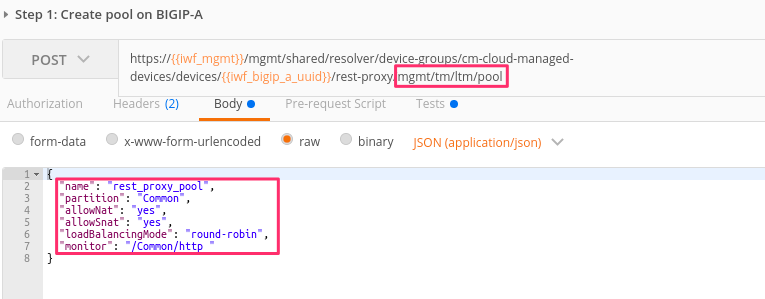

Lab 3.4: Ansible Tower and REST
-------------------------------

.. graphviz::

   digraph breadcrumb {
      rankdir="LR"
      ranksep=.4
      node [fontsize=10,style="rounded,filled",shape=box,color=gray72,margin="0.05,0.05",height=0.1]
      fontsize = 10
      labeljust="l"
      subgraph cluster_provider {
         style = "rounded,filled"
         color = lightgrey
         height = .75
         label = "Service Templates, Catalog and Deployments"
         onboarding [label="Basics",color="palegreen"]
         templates [label="Templates",color="gray72"]
         catalog [label="Catalog",color="gray72"]
         deployments [label="Deployments",color="steelblue1"]
         onboarding -> templates -> catalog -> deployments
      }
   }

While much of the focus on Tower has been using the GUI, this has primarily
been to familiarize users with Ansible Tower and its object model. The Job
Templates that are created within Tower all have the ability to be exposed with
a REST API. In this lab we will call the same playbook template
``Tenant1_Pool_Add_Member`` as we did in the web GUI. This method makes it much
easier to work Tower into a CI/CD toolset.

Task 1 - Call Tenant1_Pool_Add_Member with REST API
~~~~~~~~~~~~~~~~~~~~~~~~~~~~~~~~~~~~~~~~~~~~~~~~~~~

.. NOTE:: This lab work will be performed from
   ``Lab 3.4- Ansible Tower and REST`` folder in the
   Postman Collection

#. Select ``Step 1: Retrieve Authentication Token``. Review the **Request** JSON
   :guilabel:`Body`. The JSON body of the POST contains the declaration AS3
   uses to deploy the service.

   |lab-4-1|

