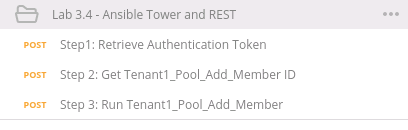

Lab 3.4: Ansible Tower and REST
-------------------------------

.. graphviz::

   digraph breadcrumb {
      rankdir="LR"
      ranksep=.4
      node [fontsize=10,style="rounded,filled",shape=box,color=gray72,margin="0.05,0.05",height=0.1]
      fontsize = 10
      labeljust="l"
      subgraph cluster_provider {
         style = "rounded,filled"
         color = lightgrey
         height = .75
         label = "Service Templates, Catalog and Deployments"
         onboarding [label="Basics",color="palegreen"]
         templates [label="Templates",color="gray72"]
         catalog [label="Catalog",color="gray72"]
         deployments [label="Deployments",color="steelblue1"]
         onboarding -> templates -> catalog -> deployments
      }
   }

While much of the focus on Tower has been using the GUI, this has primarily
been to familiarize users with Ansible Tower and its object model. The Job
Templates that are created within Tower all have the ability to be exposed with
a REST API. In this lab we will call the same playbook template
``Tenant1_Pool_Add_Member`` as we did in the web GUI. This method makes it much
easier to work Tower into a CI/CD toolset.

Task 1 - Call Tenant1_Pool_Add_Member with REST API
~~~~~~~~~~~~~~~~~~~~~~~~~~~~~~~~~~~~~~~~~~~~~~~~~~~

.. NOTE:: This lab work will be performed from
   ``Lab 3.4- Ansible Tower and REST`` folder in the
   Postman Collection

   |lab-4-1|

#. Using Postman select ``Step 1: Retrieve Authentication Token``. Review the
   **Request** JSON :guilabel:`Body`. The JSON body is used to get the Auth
   token from Tower. Press :guilabel:`Send`.

   |lab-4-2|

#. Select ``Step 2: Get Tenant1_Pool_add_member ID``. This is a GET Request
   to retrieve the ID of the Template that we want to call for adding a Member.
   Press :guilabel:`Send`.

   |lab-4-3|

#. Select ``Step 3: Run Tenant1_Pool_Add_Member``. Review the JSON Body of this
   request. The variables being sent are the same ones that the ``Survey``
   would request in the GUI. Press :guilabel:`Send`.

   |lab-4-4|

#. Open a Chrome window/tab to the Tower GUI at ``https://10.1.1.12`` and login
   with ``admin/admin`` credentials. Navigate to :menuselection:`Jobs` in
   the top Menu. Select the job that completed on the top of the list. The ID
   may vary, but the name will be ``Tenant1_Pool_Add_Member``.

   |lab-4-5|

#. Once the Job template is complete you should see the Status as ``Successful``.
   At this point you have add a Pool member to the pool on the BIG-IP using the 
   REST API in Ansible Tower.

   |lab-4-6|

.. NOTE:: For more information about ansible tower please reference the following
   start point.
   https://www.ansible.com/products/tower

