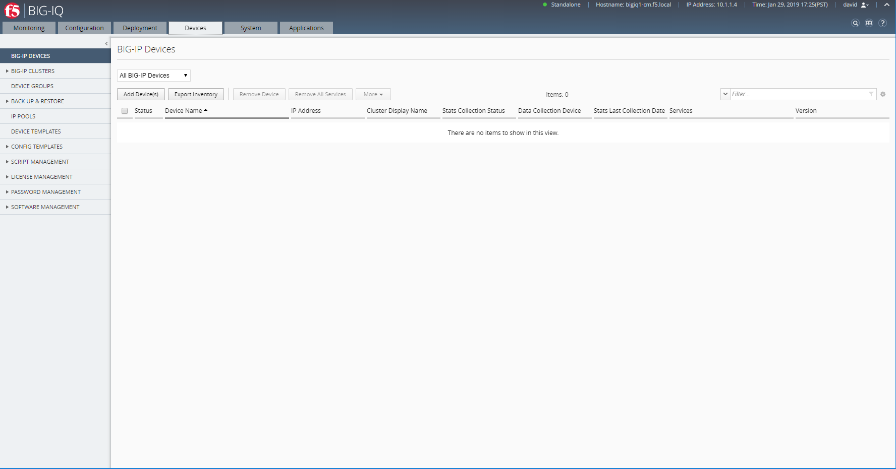
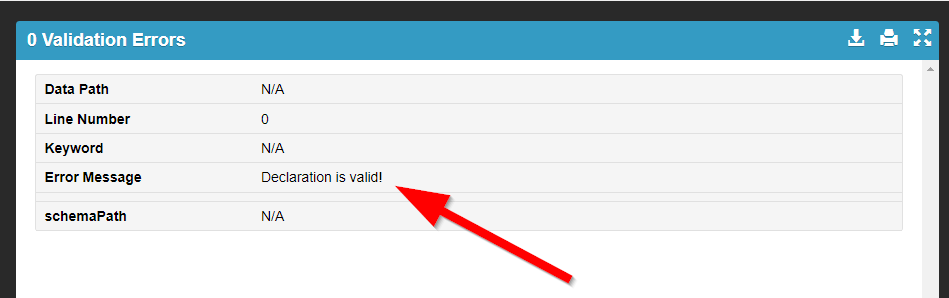
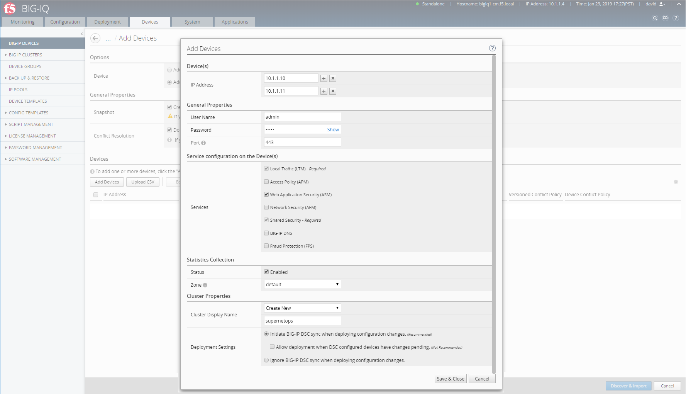
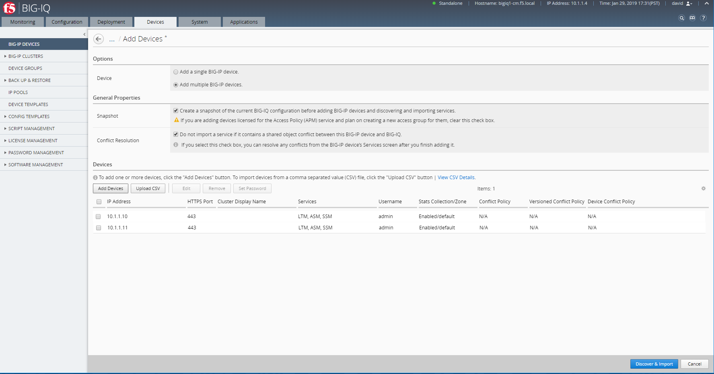
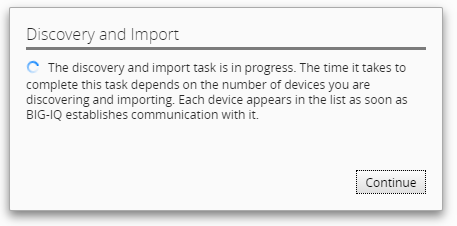
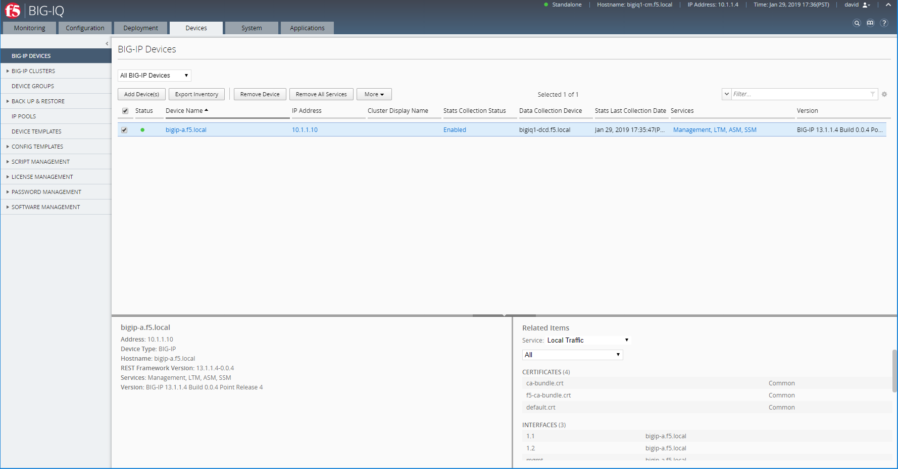
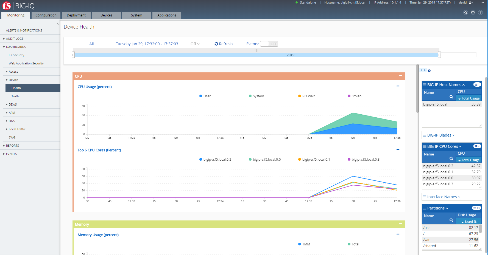

Lab 4.1: Exploring BIG-IQ
-------------------------

This lab will focus on adding **BIG-IQ A** and **BIG-IQ B** (clustered) in **BIG-IQ CM**.

.. NOTE:: This guide may require you to Copy/Paste information from the
   guide to your jumphost.  To make this easier you can open a copy of the
   guide by using the **Lab Guide** bookmark in Chrome.

.. WARNING:: BIG-IP A must be fully configured and provisionned (see previous lab for BIG-IP onboarding using iControl REST API or Declarative Onboarding)

#. Open Google Chrome and navigate to the following bookmarks: **BIG-IQ
   CM GUI** or navigate to the URL ``https://10.1.1.4``. Bypass any SSL errors that appear and ensure you see the login screen for each bookmark.

   .. WARNING:: Skipping this step will result in errors in subsequent steps

   .. WARNING:: We are using a self-signed certificate in this lab. In your
      environment you must make sure that you use certificates issued by your
      certificate authority for both production and lab equipments. Not doing
      so would make it possible for an attacker to do a man-in-the-middle
      attack and allow him the ability to steal passwords and tokens.

#. Click on the **Devices** tab, under the BIG-IP Devices section, click on **Add Devices**

   |lab-1-1|

#. Select **Add multiple BIG-IP devices**, then click on **Add Devices**

   |lab-1-2|

#. The *Add Devices* window opens

    - Enter BIG-IP A IP management address 10.1.1.10
    - Enter BIG-IP B IP management address 10.1.1.11
    - Enter User Name and Password (admin/admin)
    - Select LTM and ASM services
    - Under Statistic Collection, check Status Enabled
    - Under Cluster Properties, select Create New and enter a name for the cluster (e.g. supernetops).

   |lab-1-4|

   Click on Save & Close.

#. BIG-IP A and BIG-IP B are added to the Devices list. CLick on Discover & Import.

   |lab-1-5|

#. Wait for the Discovery and Import process to complete.

   |lab-1-6|

#. Once completed, the BIG-IP A (and BIG-IP B if clustered) shows in the device list.

   |lab-1-7|

#. Nativate to the **Monitoring** tab, under DASHBOARDS, Device, Health, notice the device analytics showing in the BIG-IQ UI.

   |lab-1-8|

