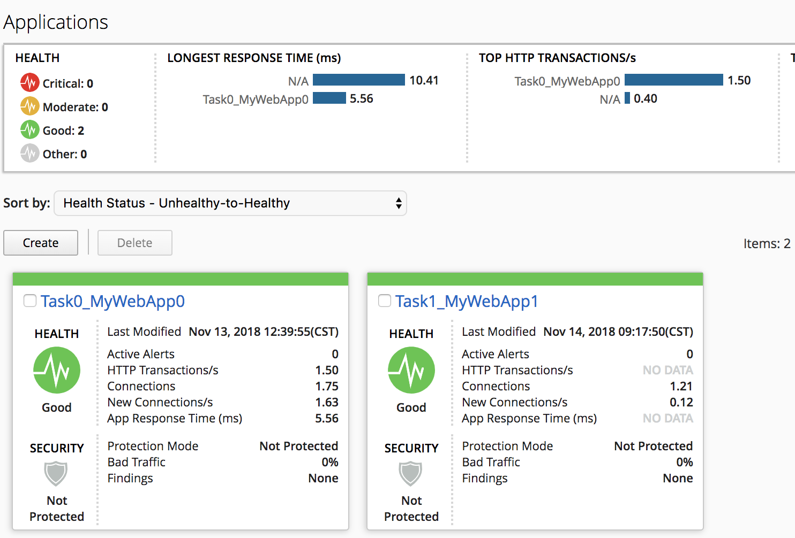

Lab 4.1: Application Creation using AS3 through BIG-IQ
------------------------------------------------------

From UDF, launch a Console/RDP session to have access to the Ubuntu Desktop. To do this, in your UDF deployment, click on the *Access* button
of the *Ubuntu Lamp Server* system and select *Console* or *XRDP*

.. image:: ../../pictures/udf_ubuntu.png
    :align: center
    :scale: 50%

|

If you are using Ravello, select the *Ubuntu Lamp Server* and click on *Console*:

.. image:: ../../pictures/ravello_ubuntu.png
    :align: center
    :scale: 50%

|

Open Chrome and Postman.

For Postman, click right and click on execute (wait ~2 minutes).

.. image:: ../../pictures/postman.png
    :align: center
    :scale: 100%

|

Using the declarative AS3 API, let's send the following BIG-IP configuration through BIG-IQ:

Using Postman select ``BIG-IQ Token (david)`` available in the Collections.
Press Send. This, will save the token value as _f5_token. If your token expires, obtain a new token by resending the ``BIG-IQ Token``

.. note:: The token timeout is set to 5 min. If you get the 401 authorization error, request a new token.

|lab-1-1|

Task 1 - HTTP Application Service
~~~~~~~~~~~~~~~~~~~~~~~~~~~~~~~~~

This declaration will create an HTTP application on BIG-IQ using an HTTP template. This declaration abstracts the complexity of having to configure all the HTTP defaults such as cookies, persistance, etc...

1. Copy below example of an AS3 Declaration into a JSON validator. The validator is your IDE.

.. code-block:: yaml
   :linenos:
   :emphasize-lines: 12,33,49,50

   {
       "class": "AS3",
       "action": "deploy",
       "persist": true,
       "declaration": {
           "class": "ADC",
           "schemaVersion": "3.7.0",
           "id": "example-declaration-01",
           "label": "Task1",
           "remark": "Task 1 - HTTP Application Service",
           "target": {
               "hostname": "<hostname>"
           },
           "Task1": {
               "class": "Tenant",
               "MyWebApp1http": {
                   "class": "Application",
                   "template": "http",
                   "statsProfile": {
                       "class": "Analytics_Profile",
                       "collectedStatsInternalLogging": true,
                       "collectedStatsExternalLogging": false,
                       "capturedTrafficInternalLogging": false,
                       "capturedTrafficExternalLogging": true,
                       "collectPageLoadTime": true,
                       "collectClientSideStatistics": true,
                       "collectResponseCode": true,
                       "sessionCookieSecurity": "ssl-only"
                   },
                   "serviceMain": {
                       "class": "Service_HTTP",
                       "virtualAddresses": [
                           "<virtual>"
                       ],
                       "pool": "web_pool",
                       "profileAnalytics": {
                           "use": "statsProfile"
                       }
                   },
                   "web_pool": {
                       "class": "Pool",
                       "monitors": [
                           "http"
                       ],
                       "members": [
                           {
                               "servicePort": 80,
                               "serverAddresses": [
                                   "<node1>",
                                   "<node2>"
                               ],
                               "shareNodes": true
                           }
                       ]
                   }
               }
           }
       }
   }

.. note:: You can use any JSON formatter/Validator available. A specific AS3 plugin to validate the JSON against AS3 schema will be available soon.

2. Make sure the Declaration is valid!

3. Now that the JSON is validated, let's add the target (BIG-IP device)::

    "target": {
        "hostname": "BOS-vBIGIP01.termmarc.com"
    },

.. note:: The target BIG-IP is standalone but it could be configured as an HA pair.
          If you want, configure the HA in auto-sync mode. Configure the BIG-IP cluster in BIG-IQ.
          The target in this case can be either device.

Modify the Virtual Address to 10.1.10.111 and the serverAddresses to 10.1.20.110 and 10.1.20.111.

4. Click on  ``Format JSON``, ``Validate JSON`` and ``Validate AS3 Declaration``. Make sure the Declaration is valid!

.. note:: Ignore the schemaVersion error. Note the schema validator is using AS3.6 and we are using AS3.7.

5. Using Postman, use the **BIG-IQ AS3 Declaration** collection in order to create the service on the BIG-IP through BIG-IQ.
Copy/Paste the AS3 declaration from the validator to the declaration body into Postman:

   POST https://10.1.1.4/mgmt/shared/appsvcs/declare?async=true
   
   This will give you an ID which you can query using the **BIG-IQ Check AS3 Deployment Task**

6. Use the **BIG-IQ Check AS3 Deployment Task** collection to ensure that the AS3 deployment is successfull without errors: 

   GET https://10.1.1.4/mgmt/shared/appsvcs/task/<id>
   
.. note:: Notice that the app deployment may take a few minutes.

7. Logon on **BOS-vBIGIP01.termmarc.com** and verify the Application is correctly deployed in partition Task1.

8. Logon on **BIG-IQ** as **david**, go to Application tab and check the application is displayed and analytics are showing.

|lab-1-3|

Click on your Application, Properties > CONFIGURATION, look at AS3 Declaration.

|lab-1-4|

Task 2 - HTTPS Offload
~~~~~~~~~~~~~~~~~~~~~~

Now we are going to create another service but this time, we will do some SSL offloading.

1. Using Postman, use the **BIG-IQ AS3 Declaration** collection in order to create the service on the BIG-IP through BIG-IQ.
Copy/Paste the below AS3 declaration into the body (Postman):

   POST https://10.1.1.4/mgmt/shared/appsvcs/declare?async=true
   
   This will give you an ID which you can query using the **BIG-IQ Check AS3 Deployment Task**

.. code-block:: yaml
   :linenos:

   {
       "class": "AS3",
       "action": "deploy",
       "persist": true,
       "declaration": {
           "class": "ADC",
           "schemaVersion": "3.7.0",
           "id": "isc-lab",
           "label": "Task2",
           "remark": "Task 2 - HTTPS Application Service",
           "target": {
               "hostname": "BOS-vBIGIP01.termmarc.com"
           },
           "Task2": {
               "class": "Tenant",
               "MyWebApp2https": {
                   "class": "Application",
                   "template": "https",
                   "statsProfile": {
                       "class": "Analytics_Profile",
                       "collectedStatsInternalLogging": true,
                       "collectedStatsExternalLogging": false,
                       "capturedTrafficInternalLogging": false,
                       "capturedTrafficExternalLogging": true,
                       "collectPageLoadTime": true,
                       "collectClientSideStatistics": true,
                       "collectResponseCode": true,
                       "sessionCookieSecurity": "ssl-only"
                   },
                   "serviceMain": {
                       "class": "Service_HTTPS",
                       "virtualAddresses": [
                           "10.1.10.113"
                       ],
                       "pool": "web_pool",
                       "profileAnalytics": {
                           "use": "statsProfile"
                       },
                       "serverTLS": "webtls"
                   },
                   "web_pool": {
                       "class": "Pool",
                       "monitors": [
                           "http"
                       ],
                       "members": [
                           {
                               "servicePort": 80,
                               "serverAddresses": [
                                   "10.1.20.112",
                                   "10.1.20.113"
                               ],
                               "shareNodes": true
                           }
                       ]
                   },
                   "webtls": {
                       "class": "TLS_Server",
                       "certificates": [
                           {
                               "certificate": "webcert"
                           }
                       ]
                   },
                   "webcert": {
                       "class": "Certificate",
                       "certificate": {
                           "bigip": "/Common/default.crt"
                       },
                       "privateKey": {
                           "bigip": "/Common/default.key"
                       }
                   }
               }
           }
       }
   }

2. Use the **BIG-IQ Check AS3 Deployment Task** calls to ensure that the AS3 deployment is successfull without errors: 

   GET https://10.1.1.4/mgmt/shared/appsvcs/task/<id>

Task 3a - HTTPS Application with Web Application Firewall
~~~~~~~~~~~~~~~~~~~~~~~~~~~~~~~~~~~~~~~~~~~~~~~~~~~~~~~~~

This declaration will create an HTTP application on BIG-IQ using an HTTP template, a WAF policy and a security Log Profile.

Update the WAF policy section below with the policy available on BIG-IP::

 "policyWAF": {
          "bigip": "/Common/templates-default"
        }

.. code-block:: yaml
   :linenos:
   :emphasize-lines: 41

   {
       "class": "AS3",
       "action": "deploy",
       "persist": true,
       "declaration": {
           "class": "ADC",
           "schemaVersion": "3.7.0",
           "id": "isc-lab",
           "label": "Task3a",
           "remark": "Task 3a - HTTPS Application with WAF",
           "target": {
               "hostname": "BOS-vBIGIP01.termmarc.com"
           },
           "Task3": {
               "class": "Tenant",
               "MyWebApp3waf": {
                   "class": "Application",
                   "template": "https",
                   "statsProfile": {
                       "class": "Analytics_Profile",
                       "collectedStatsInternalLogging": true,
                       "collectedStatsExternalLogging": false,
                       "capturedTrafficInternalLogging": false,
                       "capturedTrafficExternalLogging": true,
                       "collectPageLoadTime": true,
                       "collectClientSideStatistics": true,
                       "collectResponseCode": true,
                       "sessionCookieSecurity": "ssl-only"
                   },
                   "serviceMain": {
                       "class": "Service_HTTPS",
                       "virtualAddresses": [
                           "10.1.10.123"
                       ],
                       "pool": "web_pool",
                       "profileAnalytics": {
                           "use": "statsProfile"
                       },
                       "serverTLS": "webtls",
                       "policyWAF": {
                           "bigip": "/Common/<ASM policy>"
                       },
                       "securityLogProfiles": [
                           {
                              "bigip": "/Common/templates-default"
                           }
                       ]
                   },
                   "web_pool": {
                       "class": "Pool",
                       "monitors": [
                           "http"
                       ],
                       "members": [
                           {
                               "servicePort": 80,
                               "serverAddresses": [
                                   "10.1.20.122",
                                   "10.1.20.123"
                               ],
                               "shareNodes": true
                           }
                       ]
                   },
                   "webtls": {
                       "class": "TLS_Server",
                       "certificates": [
                           {
                               "certificate": "webcert"
                           }
                       ]
                   },
                   "webcert": {
                       "class": "Certificate",
                       "certificate": {
                           "bigip": "/Common/default.crt"
                       },
                       "privateKey": {
                           "bigip": "/Common/default.key"
                       }
                   }
               }
           }
       }
   }

1. Using Postman, use the **BIG-IQ AS3 Declaration** call in order to create the service on the BIG-IP through BIG-IQ.
Copy/Paste the above AS3 declaration into the declaration body into Postman(DON T FORGET TO UPDATE THE WAF Policy):

   POST https://10.1.1.4/mgmt/shared/appsvcs/declare?async=true
   
   This will give you an ID which you can query using the **BIG-IQ Check AS3 Deployment Task**

2. Use the **BIG-IQ Check AS3 Deployment Task** Postman calls to ensure that the AS3 deployment is successfull without errors: 

   GET https://10.1.1.4/mgmt/shared/appsvcs/task/<id>

Task 4 - Generic Services
~~~~~~~~~~~~~~~~~~~~~~~~~

.. note:: Note that because this declaration uses the generic template, the service does not have to be named serviceMain

Modify the Generic virtual with something other than <generic_virtual>.

.. code-block:: yaml
   :linenos:
   :emphasize-lines: 30

   {
       "class": "AS3",
       "action": "deploy",
       "persist": true,
       "declaration": {
           "class": "ADC",
           "schemaVersion": "3.7.0",
           "id": "isc-lab",
           "label": "Task4",
           "remark": "Task 4 - Generic Services",
           "target": {
               "hostname": "BOS-vBIGIP01.termmarc.com"
           },
           "Task4": {
               "class": "Tenant",
               "MyWebApp4generic": {
                   "class": "Application",
                   "template": "generic",
                   "statsProfile": {
                       "class": "Analytics_Profile",
                       "collectedStatsInternalLogging": true,
                       "collectedStatsExternalLogging": false,
                       "capturedTrafficInternalLogging": false,
                       "capturedTrafficExternalLogging": true,
                       "collectPageLoadTime": true,
                       "collectClientSideStatistics": true,
                       "collectResponseCode": true,
                       "sessionCookieSecurity": "ssl-only"
                   },
                   "<generic_virtual>": {
                       "class": "Service_Generic",
                       "virtualAddresses": [
                           "10.1.10.127"
                       ],
                       "virtualPort": 8080,
                       "pool": "web_pool",
                       "profileAnalytics": {
                           "use": "statsProfile"
                       }
                   },
                   "web_pool": {
                       "class": "Pool",
                       "monitors": [
                           "tcp"
                       ],
                       "members": [
                           {
                               "servicePort": 80,
                               "serverAddresses": [
                                   "10.1.20.126",
                                   "10.1.20.127"
                               ],
                               "shareNodes": true
                           }
                       ]
                   }
               }
           }
       }
   }

1. Using Postman, use the **BIG-IQ AS3 Declaration** call in order to create the service on the BIG-IP through BIG-IQ.
Copy/Paste the above AS3 declaration into the declaration body of Postman:

   POST https://10.1.1.4/mgmt/shared/appsvcs/declare?async=true
   
   This will give you an ID which you can query using the **BIG-IQ Check AS3 Deployment Task**

2. Use the **BIG-IQ Check AS3 Deployment Task** calls to ensure that the AS3 deployment is successfull without errors: 

   GET https://10.1.1.4/mgmt/shared/appsvcs/task/<id>

.. |lab-1-1| image:: images/lab-1-1.png
   :scale: 60%
.. |lab-1-2| image:: images/lab-1-2.png
   :scale: 80%

.. |lab-1-4| image:: images/lab-1-4.png
   :scale: 60%
.. |lab-1-5| image:: images/lab-1-5.png
   :scale: 40%