Lab 4.2: Application Creation using AS3 through BIG-IQ
------------------------------------------------------

Using the declarative AS3 API, let's send the following BIG-IP configuration through BIG-IQ:

Using Postman select ``BIG-IQ Token (david)`` available in the Collections.
Press Send. This, will save the token value as _f5_token. If your token expires, obtain a new token by resending the ``BIG-IQ Token``

.. WARNING:: The token timeout is set to 5 min. If you get the 401 authorization error, request a new token.

.. NOTE:: This lab work will be performed from
   ``Lab 4 - BIG-IQ and AS3`` folder in the Postman Collection

|lab-2-1|

Task 1 - HTTP Application Service
~~~~~~~~~~~~~~~~~~~~~~~~~~~~~~~~~

This declaration will create an HTTP application on BIG-IQ using an HTTP template. This declaration abstracts the complexity of having to configure all the HTTP defaults such as cookies, persistance, etc...

#. Copy below example of an AS3 Declaration into a JSON validator. The validator is your IDE.

   .. code-block:: yaml
      :linenos:
      :emphasize-lines: 12,33,49,50

      {
         "class": "AS3",
         "action": "deploy",
         "persist": true,
         "declaration": {
            "class": "ADC",
            "schemaVersion": "3.7.0",
            "id": "example-declaration-01",
            "label": "Task1",
            "remark": "Task 1 - HTTP Application Service",
            "target": {
                  "hostname": "<hostname>"
            },
            "Task1": {
                  "class": "Tenant",
                  "MyWebApp1http": {
                     "class": "Application",
                     "template": "http",
                     "statsProfile": {
                        "class": "Analytics_Profile",
                        "collectedStatsInternalLogging": true,
                        "collectedStatsExternalLogging": false,
                        "capturedTrafficInternalLogging": false,
                        "capturedTrafficExternalLogging": false,
                        "collectPageLoadTime": true,
                        "collectClientSideStatistics": true,
                        "collectResponseCode": true,
                        "sessionCookieSecurity": "ssl-only"
                     },
                     "serviceMain": {
                        "class": "Service_HTTP",
                        "virtualAddresses": [
                              "<virtual>"
                        ],
                        "pool": "web_pool",
                        "profileAnalytics": {
                              "use": "statsProfile"
                        }
                     },
                     "web_pool": {
                        "class": "Pool",
                        "monitors": [
                              "http"
                        ],
                        "members": [
                              {
                                 "servicePort": 80,
                                 "serverAddresses": [
                                    "<node1>",
                                    "<node2>"
                                 ],
                                 "shareNodes": true
                              }
                        ]
                     }
                  }
            }
         }
      }

   .. NOTE:: You can use any JSON formatter/Validator available. A specific AS3 plugin to validate the JSON against AS3 schema will be available soon.

#. Make sure the Declaration is valid!

#. Now that the JSON is validated, let's add the target (BIG-IP device)::

    "target": {
        "hostname": "bigip-a.f5.local"
    },

    .. NOTE:: The target BIG-IP is standalone but it could be configured as an HA pair.
          If you want, configure the HA in auto-sync mode. Configure the BIG-IP cluster in BIG-IQ.
          The target in this case can be either device.

    Modify the Virtual Address to 10.1.20.130 and the serverAddresses to 10.1.10.100 and 10.1.10.101.

#. Using Postman, use the **BIG-IQ AS3 Declaration** collection in order to create the service on the BIG-IP through BIG-IQ.
   Copy/Paste the AS3 declaration from the validator to the declaration body into Postman:

   POST https://10.1.1.4/mgmt/shared/appsvcs/declare?async=true
   
   This will give you an ID which you can query using the **BIG-IQ Check AS3 Deployment Task**

   Output::

        {
            "results": "Declaration successfully submitted",
            "id": "aa8deff6-581b-4c00-8c91-b76f0d8e503f",
            "selfLink": "https://localhost/mgmt/shared/appsvcs/task/aa8deff6-581b-4c00-8c91-b76f0d8e503f"
        }

#. Use the **BIG-IQ Check AS3 Deployment Task** collection to ensure that the AS3 deployment is successfull without errors: 

   GET https://10.1.1.4/mgmt/shared/appsvcs/task/<id>
   
   .. NOTE:: Notice that the app deployment may take a few minutes.

   Output pending::

        [
            {
                "record": "aa8deff6-581b-4c00-8c91-b76f0d8e503f",
                "results": "pending"
            }
        ]

   Output success::

        "record": "aa8deff6-581b-4c00-8c91-b76f0d8e503f",
        "results": {
            "status": 200,
            "response": {
                "results": [
                    {
                        "message": "success",
                        "tenant": "Task1",
                        "host": "localhost",
                        "runTime": 176233,
                        "code": 200
                    }
                ],
                "declaration": {...},
                    "updateMode": "selective",
                    "controls": {
                        "archiveTimestamp": "2019-01-30T01:43:49.801Z"
                    }
                }

#. Logon on **bigip-a.f5.local** and verify the Application is correctly deployed in partition Task1.

#. Logon on **BIG-IQ** as **david**, go to Application tab and check the application is displayed and analytics are showing.

   |lab-2-2|

   Click on your Application to see the HTTP Analytics. Note you can also turn on Enhanced Analytics from BIG-IQ which
   allows you to increase the application data visibility by collecting additional data for all, or specific, client IP addresses sending requests to the application.

   |lab-2-3|

   Click Properties > CONFIGURATION, look at AS3 Declaration.

   |lab-2-4|

Task 2 - HTTPS Offload
~~~~~~~~~~~~~~~~~~~~~~

Now we are going to create another service but this time, we will do some SSL offloading.

#. Using Postman, use the **BIG-IQ AS3 Declaration** collection in order to create the service on the BIG-IP through BIG-IQ.
   Copy/Paste the below AS3 declaration into the body (Postman):

   POST https://10.1.1.4/mgmt/shared/appsvcs/declare?async=true
   
   This will give you an ID which you can query using the **BIG-IQ Check AS3 Deployment Task**

   .. code-block:: yaml
      :linenos:

      {
         "class": "AS3",
         "action": "deploy",
         "persist": true,
         "declaration": {
            "class": "ADC",
            "schemaVersion": "3.7.0",
            "id": "isc-lab",
            "label": "Task2",
            "remark": "Task 2 - HTTPS Application Service",
            "target": {
                  "hostname": "bigip-a.f5.local"
            },
            "Task2": {
                  "class": "Tenant",
                  "MyWebApp2https": {
                     "class": "Application",
                     "template": "https",
                     "statsProfile": {
                        "class": "Analytics_Profile",
                        "collectedStatsInternalLogging": true,
                        "collectedStatsExternalLogging": false,
                        "capturedTrafficInternalLogging": false,
                        "capturedTrafficExternalLogging": false,
                        "collectPageLoadTime": true,
                        "collectClientSideStatistics": true,
                        "collectResponseCode": true,
                        "sessionCookieSecurity": "ssl-only"
                     },
                     "serviceMain": {
                        "class": "Service_HTTPS",
                        "virtualAddresses": [
                              "10.1.20.129"
                        ],
                        "pool": "web_pool",
                        "profileAnalytics": {
                              "use": "statsProfile"
                        },
                        "serverTLS": "webtls"
                     },
                     "web_pool": {
                        "class": "Pool",
                        "monitors": [
                              "http"
                        ],
                        "members": [
                              {
                                 "servicePort": 80,
                                 "serverAddresses": [
                                    "10.1.10.102",
                                    "10.1.10.103"
                                 ],
                                 "shareNodes": true
                              }
                        ]
                     },
                     "webtls": {
                        "class": "TLS_Server",
                        "certificates": [
                              {
                                 "certificate": "webcert"
                              }
                        ]
                     },
                     "webcert": {
                        "class": "Certificate",
                        "certificate": {
                              "bigip": "/Common/default.crt"
                        },
                        "privateKey": {
                              "bigip": "/Common/default.key"
                        }
                     }
                  }
            }
         }
      }

#. Use the **BIG-IQ Check AS3 Deployment Task** calls to ensure that the AS3 deployment is successfull without errors: 

   GET https://10.1.1.4/mgmt/shared/appsvcs/task/<id>

Task 3 - HTTPS Application with Web Application Firewall
~~~~~~~~~~~~~~~~~~~~~~~~~~~~~~~~~~~~~~~~~~~~~~~~~~~~~~~~~

Let's first deploy the default Advance WAF policy and Security Logging Profile available in **BIG-IQ** to **BIG-IP A**.

#. Deploy the default BIG-IQ WAF Policy

   Logon on **BIG-IQ** as **david**, go to configuration tab, SECURITY, Web Application Security, Policies. ``templates-default`` is the default WAF policy available on BIG-IQ.

   |lab-2-5a|

   Under Virtual Servers, click on the ``inactive`` virtual server.

   |lab-2-5b|

   Select the ``/Common/templates-default``, then click on Save & Close.

   |lab-2-6|

   Notice the policy is now atached to the ``inactive`` virtual server. Select the ``inactive`` virtual server and click on Deploy.

   |lab-2-7|

   The deployment window opens. Type a name, select ``Deploy immediately`` for the Method, under the Target Device(s) section, click on ``Find Relevant Devices``
   and select the **bigip-a.f5.local**. Then, click on Deploy.

   |lab-2-8|

   Confirm the deployment, click on Deploy.

   |lab-2-9|

   Wait for the deployment to complete.

   |lab-2-10|

#. Deploy the default BIG-IQ Security Logging Profile

   Still under configuration tab, SECURITY, Shared Security, Logging Profiles. ``templates-default`` is the default Security Logging Profile available on BIG-IQ.

   |lab-2-11|

   Under Pinning Policies, click on the **bigip-a.f5.local** device.

   |lab-2-12|

   In the Shared Security drop down menu, select Logging Profiles.

   |lab-2-13|

   Select the ``templates-default``, then click on Add Selected.

   |lab-2-14|

   Confirm the logging profile has been added under Logging Profiles and click on Save & Close.

   |lab-2-15|

   Back on Logging Profiles, select the ``templates-default`` and click on Deploy.

   |lab-2-16|

   The deployment window opens. Type a name, select ``Deploy immediately`` for the Method, under the Target Device(s) section, click on ``Find Relevant Devices``
   and select the **bigip-a.f5.local**. Then, click on Deploy.

   |lab-2-17|

   Confirm the deployment, click on Deploy.

   |lab-2-9|

   Wait for the deployment to complete.

   |lab-2-18|

#. Now both Advance WAF policy and Security Logging Profile are available on BIG-IP A, let's provision the WAF application service using AS3 & BIG-IQ.

   This declaration will create an HTTP application on BIG-IQ using an HTTP template, a WAF policy and a security Log Profile.

   Update the WAF policy section below with the policy available on BIG-IP::

    "policyWAF": {
          "bigip": "/Common/templates-default"
        }

   .. code-block:: yaml
      :linenos:
      :emphasize-lines: 41

      {
         "class": "AS3",
         "action": "deploy",
         "persist": true,
         "declaration": {
            "class": "ADC",
            "schemaVersion": "3.7.0",
            "id": "isc-lab",
            "label": "Task3",
            "remark": "Task 3 - HTTPS Application with WAF",
            "target": {
                  "hostname": "bigip-a.f5.local"
            },
            "Task3": {
                  "class": "Tenant",
                  "MyWebApp3waf": {
                     "class": "Application",
                     "template": "https",
                     "statsProfile": {
                        "class": "Analytics_Profile",
                        "collectedStatsInternalLogging": true,
                        "collectedStatsExternalLogging": false,
                        "capturedTrafficInternalLogging": false,
                        "capturedTrafficExternalLogging": false,
                        "collectPageLoadTime": true,
                        "collectClientSideStatistics": true,
                        "collectResponseCode": true,
                        "sessionCookieSecurity": "ssl-only"
                     },
                     "serviceMain": {
                        "class": "Service_HTTPS",
                        "virtualAddresses": [
                              "10.1.20.128"
                        ],
                        "pool": "web_pool",
                        "profileAnalytics": {
                              "use": "statsProfile"
                        },
                        "serverTLS": "webtls",
                        "policyWAF": {
                              "bigip": "/Common/<WAF Policy>"
                        },
                        "securityLogProfiles": [
                              {
                                 "bigip": "/Common/templates-default"
                              }
                        ]
                     },
                     "web_pool": {
                        "class": "Pool",
                        "monitors": [
                              "http"
                        ],
                        "members": [
                              {
                                 "servicePort": 80,
                                 "serverAddresses": [
                                    "10.1.10.100",
                                    "10.1.10.101"
                                 ],
                                 "shareNodes": true
                              }
                        ]
                     },
                     "webtls": {
                        "class": "TLS_Server",
                        "certificates": [
                              {
                                 "certificate": "webcert"
                              }
                        ]
                     },
                     "webcert": {
                        "class": "Certificate",
                        "certificate": {
                              "bigip": "/Common/default.crt"
                        },
                        "privateKey": {
                              "bigip": "/Common/default.key"
                        }
                     }
                  }
            }
         }
      }

#. Using Postman, use the **BIG-IQ AS3 Declaration** call in order to create the service on the BIG-IP through BIG-IQ.
   Copy/Paste the above AS3 declaration into the declaration body into Postman (DON'T FORGET TO UPDATE THE WAF Policy):

   POST https://10.1.1.4/mgmt/shared/appsvcs/declare?async=true
   
   This will give you an ID which you can query using the **BIG-IQ Check AS3 Deployment Task**

#. Use the **BIG-IQ Check AS3 Deployment Task** Postman calls to ensure that the AS3 deployment is successfull without errors: 

   GET https://10.1.1.4/mgmt/shared/appsvcs/task/<id>

Task 4 - Generic Services
~~~~~~~~~~~~~~~~~~~~~~~~~

.. NOTE:: Note that because this declaration uses the generic template, the service does not have to be named serviceMain

#. Modify the Generic virtual with something other than <generic_virtual>.

   .. code-block:: yaml
      :linenos:
      :emphasize-lines: 30

      {
         "class": "AS3",
         "action": "deploy",
         "persist": true,
         "declaration": {
            "class": "ADC",
            "schemaVersion": "3.7.0",
            "id": "isc-lab",
            "label": "Task4",
            "remark": "Task 4 - Generic Services",
            "target": {
                  "hostname": "bigip-a.f5.local"
            },
            "Task4": {
                  "class": "Tenant",
                  "MyWebApp4generic": {
                     "class": "Application",
                     "template": "generic",
                     "statsProfile": {
                        "class": "Analytics_Profile",
                        "collectedStatsInternalLogging": true,
                        "collectedStatsExternalLogging": false,
                        "capturedTrafficInternalLogging": false,
                        "capturedTrafficExternalLogging": false,
                        "collectPageLoadTime": true,
                        "collectClientSideStatistics": true,
                        "collectResponseCode": true,
                        "sessionCookieSecurity": "ssl-only"
                     },
                     "<generic_virtual>": {
                        "class": "Service_Generic",
                        "virtualAddresses": [
                              "10.1.20.127"
                        ],
                        "virtualPort": 8080,
                        "pool": "web_pool",
                        "profileAnalytics": {
                              "use": "statsProfile"
                        }
                     },
                     "web_pool": {
                        "class": "Pool",
                        "monitors": [
                              "tcp"
                        ],
                        "members": [
                              {
                                 "servicePort": 80,
                                 "serverAddresses": [
                                    "10.1.10.102",
                                    "10.1.10.103"
                                 ],
                                 "shareNodes": true
                              }
                        ]
                     }
                  }
            }
         }
      }

#. Using Postman, use the **BIG-IQ AS3 Declaration** call in order to create the service on the BIG-IP through BIG-IQ.
   Copy/Paste the above AS3 declaration into the declaration body of Postman:

   POST https://10.1.1.4/mgmt/shared/appsvcs/declare?async=true
   
   This will give you an ID which you can query using the **BIG-IQ Check AS3 Deployment Task**

#. Use the **BIG-IQ Check AS3 Deployment Task** calls to ensure that the AS3 deployment is successfull without errors: 

   GET https://10.1.1.4/mgmt/shared/appsvcs/task/<id>

.. |lab-2-1| image:: images/lab-2-1.png
   :scale: 60%
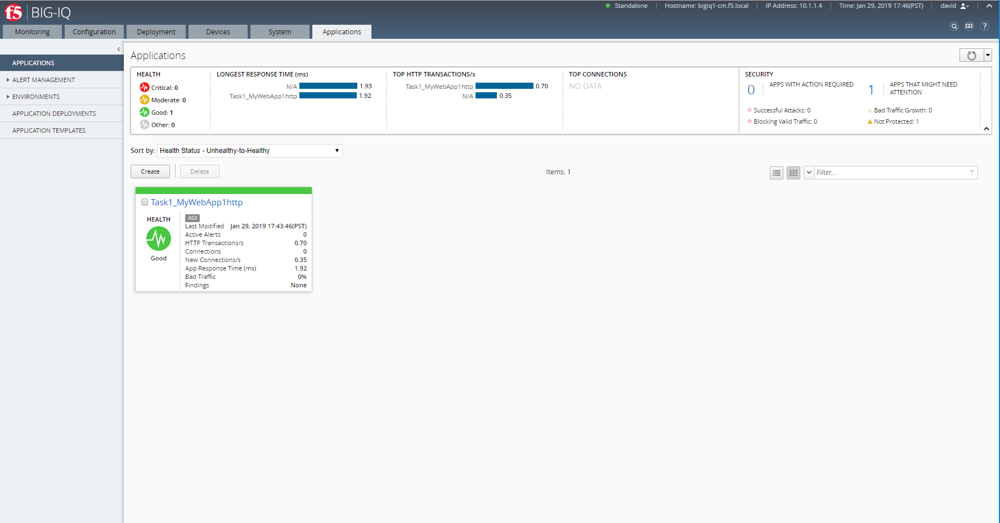
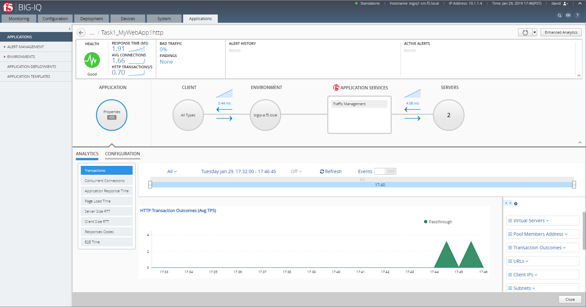
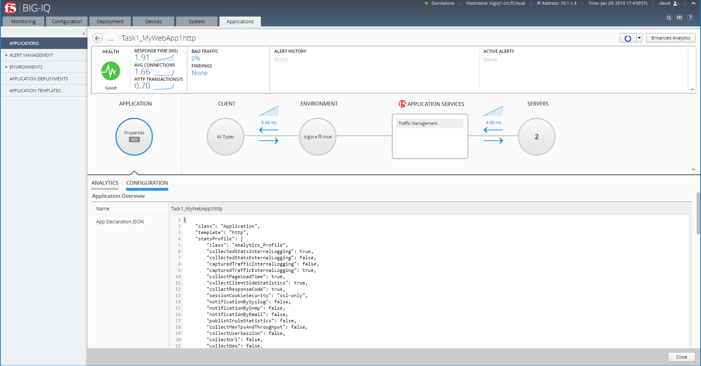
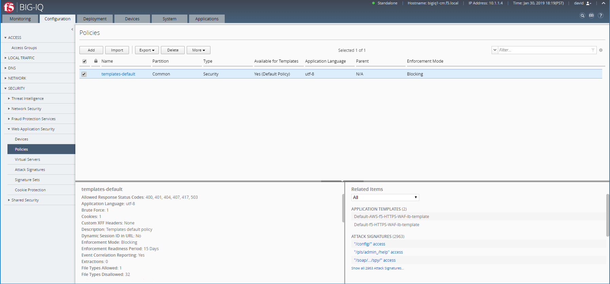
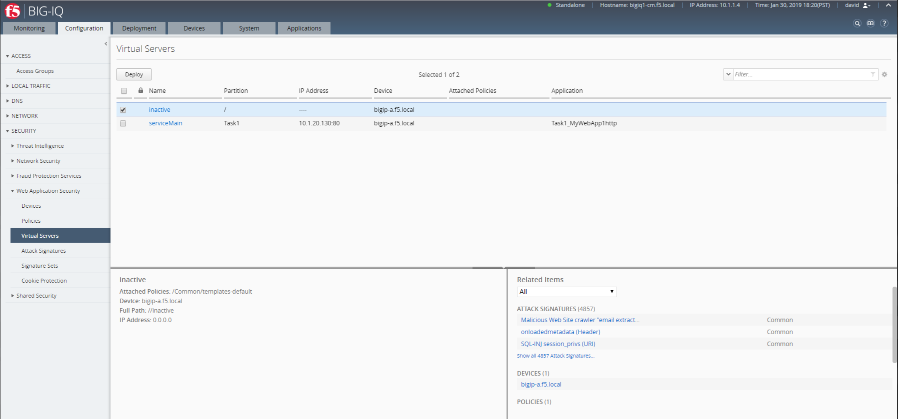
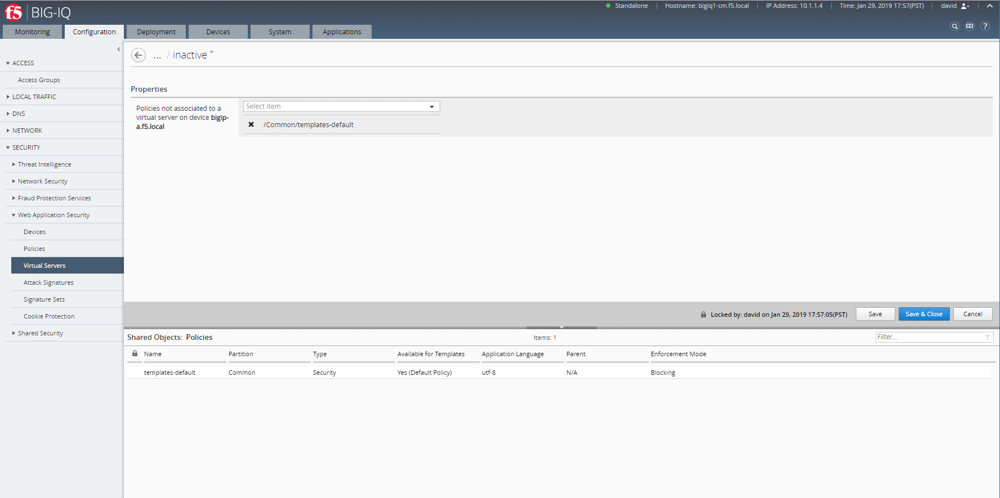
.. |lab-2-7| image:: images/lab-2-7.png
   :scale: 60%
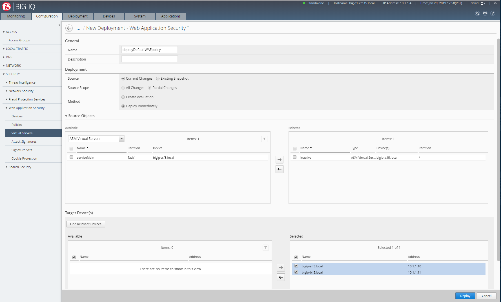
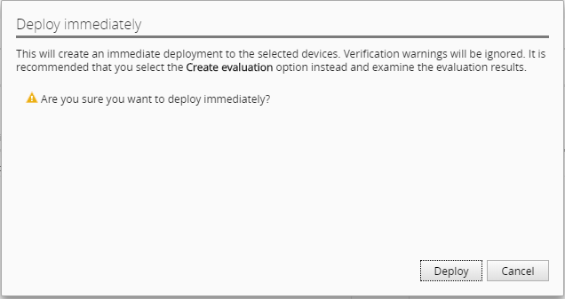
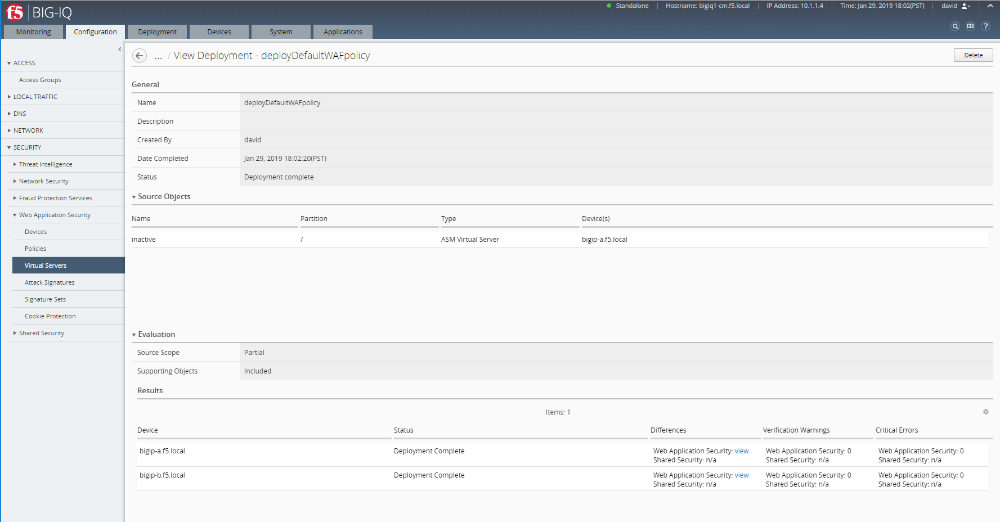
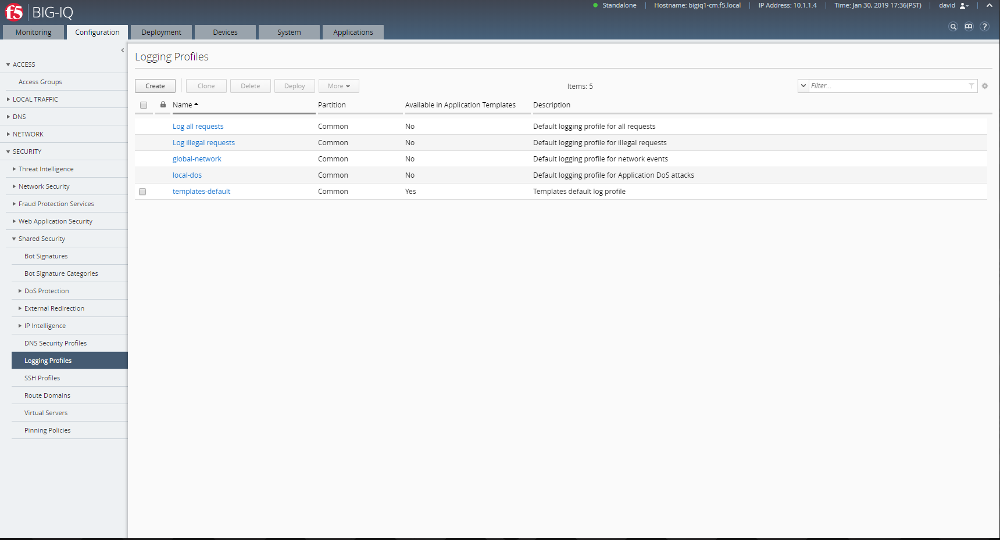
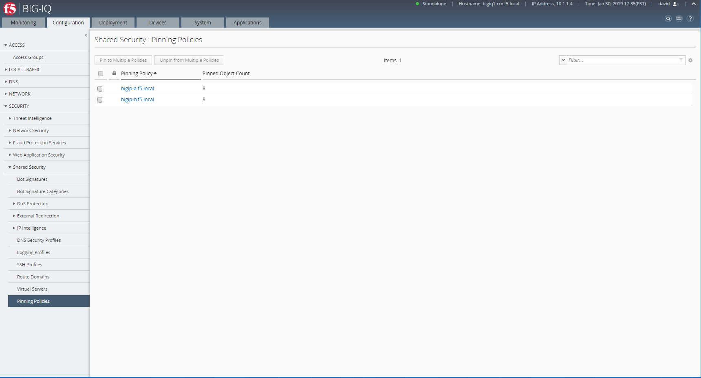
.. |lab-2-13| image:: images/lab-2-13.png
   :scale: 60%
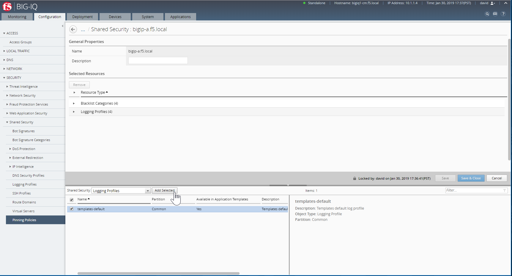
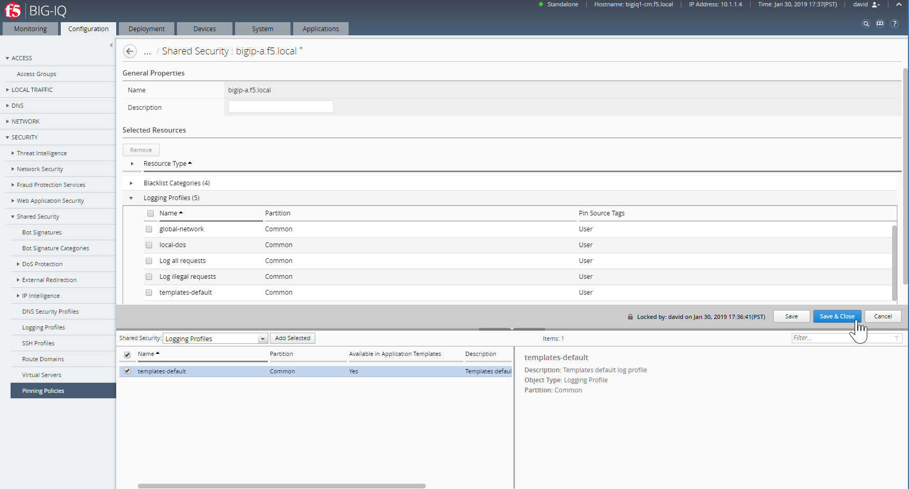
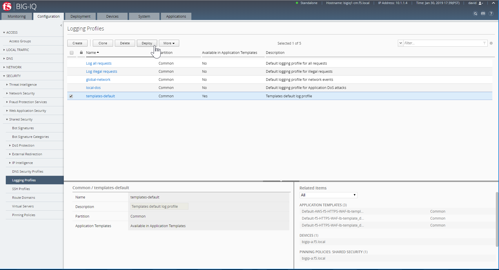
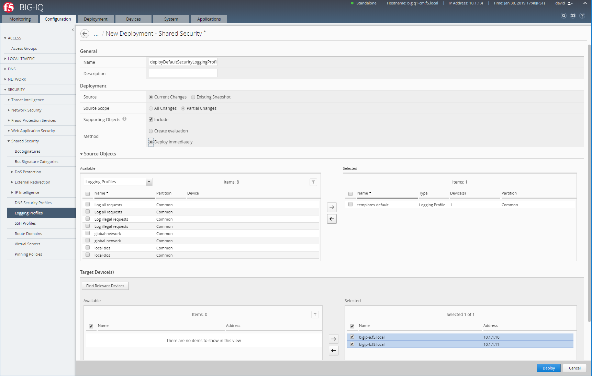
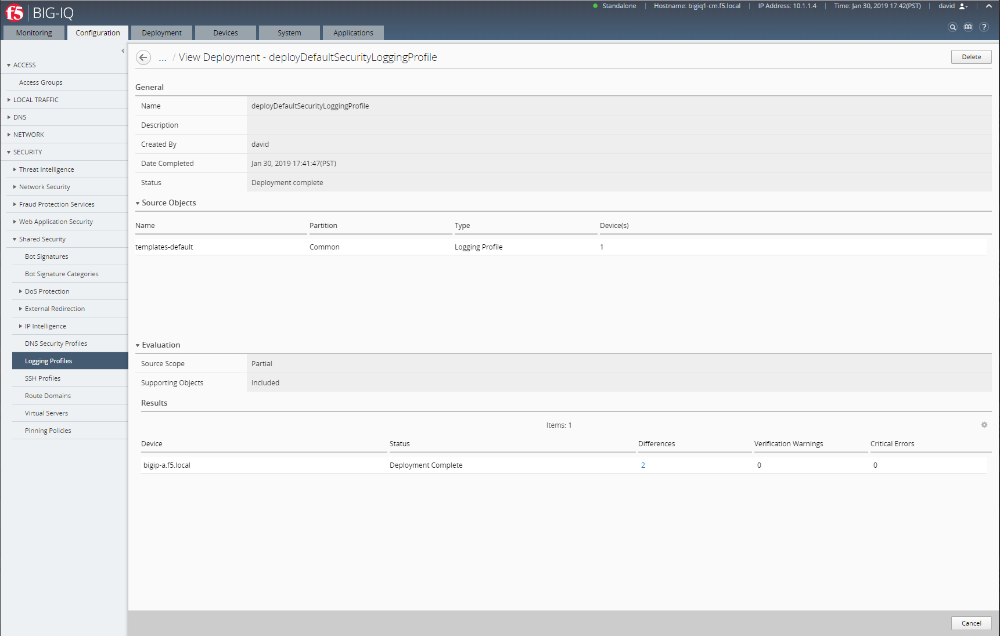