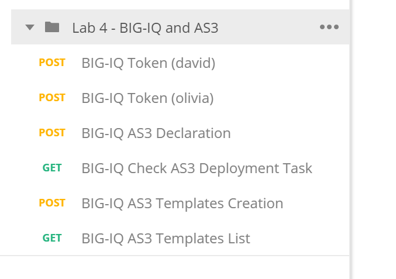

Lab 4.2: Modify Tenant/Application using AS3
--------------------------------------------

Using the declarative AS3 API, let's modfiy the HTTP application created during the previous **Lab 1 - Task 1** through BIG-IQ using an updated AS3 declaration.

In this lab, we will show 2 use cases.

- Task 5a will show an example of updating a tenant/application by re-posting the entire declaration using POST. In this case, user A and user B need to know the full content of the Tenant.
- Task 5b will show an example of updating a tenant/application by posting only what's new to an existing declaration using PATCH. In this case, user A and user B don't need to know the full content of the Tenant but 1 single tenant can be shared.

Task 5a - Add a HTTPS Application to existing HTTP AS3 Declaration (using POST)
~~~~~~~~~~~~~~~~~~~~~~~~~~~~~~~~~~~~~~~~~~~~~~~~~~~~~~~~~~~~~~~~~~~~~~~~~~~~~~~

This declaration will create add a HTTPS application to a exsisting HTTP application. In this task, we will re-submit the entire declaration.

1. Start with the previous AS3 Declaration from **lab 1 - Task 1**

.. code-block:: yaml
   :linenos:

   {
       "class": "AS3",
       "action": "deploy",
       "persist": true,
       "declaration": {
           "class": "ADC",
           "schemaVersion": "3.7.0",
           "id": "example-declaration-01",
           "label": "Task1",
           "remark": "Task 1 - HTTP Application Service",
           "target": {
               "hostname": "BOS-vBIGIP01.termmarc.com"
           },
           "Task1": {
               "class": "Tenant",
               "MyWebApp1http": {
                   "class": "Application",
                   "template": "http",
                   "statsProfile": {
                       "class": "Analytics_Profile",
                       "collectedStatsInternalLogging": true,
                       "collectedStatsExternalLogging": false,
                       "capturedTrafficInternalLogging": false,
                       "capturedTrafficExternalLogging": true,
                       "collectPageLoadTime": true,
                       "collectClientSideStatistics": true,
                       "collectResponseCode": true,
                       "sessionCookieSecurity": "ssl-only"
                   },
                   "serviceMain": {
                       "class": "Service_HTTP",
                       "virtualAddresses": [
                           "10.1.10.111"
                       ],
                       "pool": "web_pool",
                       "profileAnalytics": {
                           "use": "statsProfile"
                       }
                   },
                   "web_pool": {
                       "class": "Pool",
                       "monitors": [
                           "http"
                       ],
                       "members": [
                           {
                               "servicePort": 80,
                               "serverAddresses": [
                                   "10.1.20.110",
                                   "10.1.20.111"
                               ],
                               "shareNodes": true
                           }
                       ]
                   }
               }
           }
       }
   }

2. Add the below application service to the existing AS3 declaration in the JSON validator.

.. note:: Add a **","** at the end of the MyWebApp1 statement.
    If you want to "minimize" MyWebApp1 statement (like in the screenshot below), click on the tiny down arrow on the left of this line

|lab-2-1|

.. code-block:: yaml
   :linenos:

   "MyWebApp6https": {
           "class": "Application",
           "template": "https",
           "statsProfile": {
               "class": "Analytics_Profile",
               "collectedStatsInternalLogging": true,
               "collectedStatsExternalLogging": false,
               "capturedTrafficInternalLogging": false,
               "capturedTrafficExternalLogging": true,
               "collectPageLoadTime": true,
               "collectClientSideStatistics": true,
               "collectResponseCode": true,
               "sessionCookieSecurity": "ssl-only"
           },
           "serviceMain": {
               "class": "Service_HTTPS",
               "virtualAddresses": [
                   "10.1.10.129"
               ],
               "pool": "web_pool",
               "profileAnalytics": {
                   "use": "statsProfile"
               },
               "serverTLS": "webtls"
           },
           "web_pool": {
               "class": "Pool",
               "monitors": [
                   "http"
               ],
               "members": [
                   {
                       "servicePort": 80,
                       "serverAddresses": [
                           "10.1.20.128",
                           "10.1.20.129"
                       ],
                       "shareNodes": true
                   }
               ]
           },
           "webtls": {
               "class": "TLS_Server",
               "certificates": [
                   {
                       "certificate": "webcert"
                   }
               ]
           },
           "webcert": {
               "class": "Certificate",
               "certificate": {
                   "bigip": "/Common/default.crt"
               },
               "privateKey": {
                   "bigip": "/Common/default.key"
               }
           }
       }

.. note:: You can use any JSON formatter/Validator available. A specific AS3 plugin to validate the JSON against AS3 schema will be available soon.

3. Make sure the Declaration is valid!

4. Using Postman, use the **BIG-IQ AS3 Declaration** Postman call in order to create the service on the BIG-IP through BIG-IQ. Copy/Past the declaration into Postman:

   POST https://10.1.1.4/mgmt/shared/appsvcs/declare?async=true
   
   This will give you an ID which you can query using the **BIG-IQ Check AS3 Deployment Task**

5. Use the **BIG-IQ Check AS3 Deployment Task** calls to ensure that the AS3 deployment is successfull without errors: 

   GET https://10.1.1.4/mgmt/shared/appsvcs/task/<id>

6. Logon on BIG-IQ as **david**, go to Application tab and check the application is displayed and analytics are showing.

Task 5b - Add a HTTPS Application to existing HTTP AS3 Declaration (using PATCH)
~~~~~~~~~~~~~~~~~~~~~~~~~~~~~~~~~~~~~~~~~~~~~~~~~~~~~~~~~~~~~~~~~~~~~~~~~~~~~~~~

This declaration will create add a HTTP application to a exsisting Tenant. In this task, we will submit only the new application using the PATCH.

1. Add the below application service to the existing AS3 declaration in the validator.

.. code-block:: yaml
   :linenos:
   :emphasize-lines: 3

    {
        "class": "AS3",
        "action": "patch",
        "target": {
            "hostname": "BOS-vBIGIP01.termmarc.com"
        },
        "patchBody": [
            {
                "path": "/Task1/MyWebApp7http",
                "op": "add",
                "value": {
                    "class": "Application",
                    "template": "http",
                    "serviceMain": {
                        "class": "Service_HTTP",
                        "virtualAddresses": [
                            "10.1.10.131"
                        ],
                        "pool": "web_pool"
                    },
                    "web_pool": {
                        "class": "Pool",
                        "monitors": [
                            "http"
                        ],
                        "members": [
                            {
                                "servicePort": 80,
                                "serverAddresses": [
                                  "10.1.20.130",
                                  "10.1.20.131"
                                ],
                                "shareNodes": true
                            }
                        ]
                    }
                }
            }
        ]
    }

.. note:: You can use any JSON formatter/Validator available. A specific AS3 plugin to validate the JSON against AS3 schema will be available soon.

3. Make sure the Declaration is valid!

4. Using Postman, use the **BIG-IQ AS3 Declaration** Postman call in order to create the service on the BIG-IP through BIG-IQ. Copy/Past the declaration into Postman:

   POST https://10.1.1.4/mgmt/shared/appsvcs/declare?async=true
   
   This will give you an ID which you can query using the **BIG-IQ Check AS3 Deployment Task**

5. Use the **BIG-IQ Check AS3 Deployment Task** calls to ensure that the AS3 deployment is successfull without errors: 

   GET https://10.1.1.4/mgmt/shared/appsvcs/task/<id>

6. Logon on BIG-IQ as **david**, go to Application tab and check the application is displayed and analytics are showing.

.. |lab-1-5| image:: images/lab-1-5.png
   :scale: 40%

