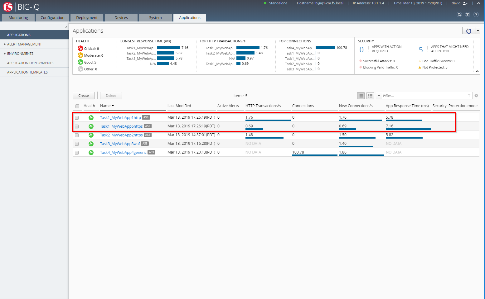

Lab 4.3: Modify Tenant/Application using AS3
--------------------------------------------

Using the declarative AS3 API, let's modfiy the HTTP application created during the previous **Lab 1 - Task 1**..

Task 5 - Add a HTTPS Application to existing HTTP AS3 Declaration (using POST)
~~~~~~~~~~~~~~~~~~~~~~~~~~~~~~~~~~~~~~~~~~~~~~~~~~~~~~~~~~~~~~~~~~~~~~~~~~~~~~~

This declaration will create add a HTTPS application to a existing HTTP application. In this task, we will re-submit the entire declaration.

#. Start with the previous AS3 Declaration from **lab 1 - Task 1**

   .. code-block:: yaml
      :linenos:

      {
         "class": "AS3",
         "action": "deploy",
         "persist": true,
         "declaration": {
               "class": "ADC",
               "schemaVersion": "3.7.0",
               "id": "example-declaration-01",
               "label": "Task1",
               "remark": "Task 1 - HTTP Application Service",
               "target": {
                  "hostname": "bigip-a.f5.local"
               },
               "Task1": {
                  "class": "Tenant",
                  "MyWebApp1http": {
                     "class": "Application",
                     "template": "http",
                     "statsProfile": {
                           "class": "Analytics_Profile",
                           "collectedStatsInternalLogging": true,
                           "collectPageLoadTime": true,
                           "collectClientSideStatistics": true,
                           "collectResponseCode": true
                     },
                     "serviceMain": {
                           "class": "Service_HTTP",
                           "virtualAddresses": [
                              "10.1.20.130"
                           ],
                           "pool": "web_pool",
                           "profileAnalytics": {
                              "use": "statsProfile"
                           }
                     },
                     "web_pool": {
                           "class": "Pool",
                           "monitors": [
                              "http"
                           ],
                           "members": [
                              {
                                 "servicePort": 80,
                                 "serverAddresses": [
                                       "10.1.10.100",
                                       "10.1.10.101"
                                 ],
                                 "shareNodes": true
                              }
                           ]
                     }
                  }
               }
         }
      }

#. Add the below application service to the existing AS3 declaration in the JSON validator. The validator is your IDE (e.g. Microsoft Visual Studio Code).

   .. note:: It is recommended to `validate your AS3 declaration`_ against the schema using Microsoft Visual Studio Code.

   .. _validate your AS3 declaration: https://clouddocs.f5.com/products/extensions/f5-appsvcs-extension/latest/userguide/validate.html

   .. NOTE:: Add a **","** at the end of the MyWebApp1 statement.
      If you want to "minimize" MyWebApp1 statement (like in the screenshot below), click on the tiny down arrow on the left of this line

   |lab-3-1|

   .. code-block:: yaml
      :linenos:

      "MyWebApp6https": {
            "class": "Application",
            "template": "https",
            "statsProfile": {
                  "class": "Analytics_Profile",
                  "collectedStatsInternalLogging": true,
                  "collectPageLoadTime": true,
                  "collectClientSideStatistics": true,
                  "collectResponseCode": true
            },
            "serviceMain": {
                  "class": "Service_HTTPS",
                  "virtualAddresses": [
                     "10.1.20.126"
                  ],
                  "pool": "web_pool",
                  "profileAnalytics": {
                     "use": "statsProfile"
                  },
                  "serverTLS": "webtls"
            },
            "web_pool": {
                  "class": "Pool",
                  "monitors": [
                     "http"
                  ],
                  "members": [
                     {
                        "servicePort": 80,
                        "serverAddresses": [
                              "10.1.10.100",
                              "10.1.10.101"
                        ],
                        "shareNodes": true
                     }
                  ]
            },
            "webtls": {
                  "class": "TLS_Server",
                  "certificates": [
                     {
                        "certificate": "webcert"
                     }
                  ]
            },
            "webcert": {
                  "class": "Certificate",
                  "certificate": {
                     "bigip": "/Common/default.crt"
                  },
                  "privateKey": {
                     "bigip": "/Common/default.key"
                  }
            }
         }

#. Using Postman, use the **BIG-IQ Token (david)** collections to authenticate you on the BIG-IQ and save the token.
   If your token expires, obtain a new token by resending the ``BIG-IQ Token (david)``.

   .. WARNING:: The token timeout is set to 5 min. If you get the 401 authorization error, request a new token.

#. Use the **BIG-IQ AS3 Declaration** Postman call in order to create the service on the BIG-IP through BIG-IQ.
   Copy/Past the declaration into Postman:

   POST https://10.1.1.4/mgmt/shared/appsvcs/declare?async=true
   
   This will give you an ID which you can query using the **BIG-IQ Check AS3 Deployment Task**

#. Use the **BIG-IQ Check AS3 Deployment Task** calls to ensure that the AS3 deployment is successfull without errors: 

   GET https://10.1.1.4/mgmt/shared/appsvcs/task/<id>

#. Logon on BIG-IQ as **david**, go to Application tab and check the application is displayed and analytics are showing.

|lab-3-2|

.. |lab-3-1| image:: images/lab-3-1.png
   :scale: 80%

