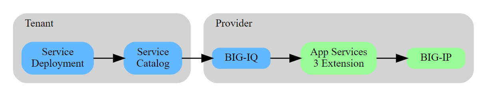

Module 4: BIG-IQ Application Templates & Deployment with AS3
============================================================

.. graphviz::

   digraph breadcrumb {
      rankdir="LR"
      ranksep=.4
      node [fontsize=10,style="rounded,filled",shape=box,color=gray72,margin="0.05,0.05",height=0.1]
      fontsize = 10
      labeljust="l"
      subgraph cluster_provider {
         style = "rounded,filled"
         color = lightgrey
         height = .75
         label = "Provider"
         bigip [label="BIG-IP",color="palegreen"]
         AS3 [label="App Services&#92;n3 Extension",color="palegreen"]
         BIG_IQ [label="BIG-IQ",color="steelblue1"]
      }
      subgraph cluster_tenant {
         style = "rounded,filled"
         color = lightgrey
         height = .75
         label = "Tenant"
         tower_catalog [label="Service&#92;nCatalog",color="steelblue1"]
         tower_deploy [label="Service&#92;nDeployment",color="steelblue1"]
      }
      tower_deploy -> tower_catalog -> BIG_IQ -> AS3 -> bigip
   }

Overview
--------

In this module we will explore how to use F5's **AS3** extension with **BIG-IQ 6.1**.

**Application Services 3 Extension** (referred to as AS3 Extension or more often simply AS3) is a flexible, 
low-overhead mechanism for managing application-specific configurations on a BIG-IP system.
AS3 uses a declarative model, meaning you provide a JSON declaration rather than a set of imperative commands.

The declaration represents the configuration which AS3 is responsible for creating on a BIG-IP system.
AS3 is well-defined according to the rules of JSON Schema, and declarations validate according to JSON Schema.
AS3 accepts declaration updates via REST (push), reference (pull), or CLI (flat file editing).

**BIG-IQ** is a a key component of F5 BIG-IP Cloud Edition™. This new solution
provides DevOps and application teams with self-service management of F5 application
services, along with per-app manageability and analytics. 

While working through this module we will be focusing on L4-L7 deployments
(Virtual Servers, Pools, etc).

Layer 4-7 Application Service Delivery
^^^^^^^^^^^^^^^^^^^^^^^^^^^^^^^^^^^^^^

L4-7 Application Service Delivery is accomplished by:

-  Providing **templates** within **BIG-IQ 6.1** as a Service Catalog. With **BIG-IQ 6.1**, you'll be able to create templates to consume 
   **AS3**.

-  Utilizing BIG-IQ's **Role Based Access Control (RBAC)** to divide
   workloads based on user functions.

The labs in the module will focus on the high level features in place to
achieve full L4-7 automation.

In this Module, we will provision **BIG-IQ 6.1** to deploy and modify the AS3
declarations.

The focus of Module 2 was to demonstrate application deployment directly to the BIG-IP. 
**BIG-IQ 6.1** will allow the administrator to restrict access an interface and API for users based 
on their current role within the organization.

For example, in Module 2, we pushed AS3 declarations, updated pool members, and
provided the user access to modify the full AS3 declaration. This approach would
provide each user the same administrative priviledges and may not scale within
organizations with separate user functions.

To solve this problem, **BIG-IQ 6.1** allows the administrator to create
**Templates** which can provide further **Abstraction** of the AS3 declarations.
The administrator can enforce specific Tenants or parameters to be used based on
the user running the template. This abstraction allows the templates to be
integrated directly into the relevant CI/CD toolchains and workflows.

.. toctree::
   :maxdepth: 1
   :glob:

   lab*

