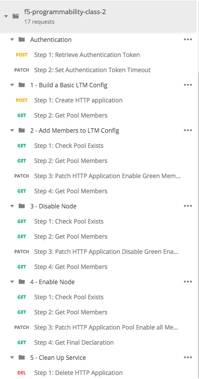
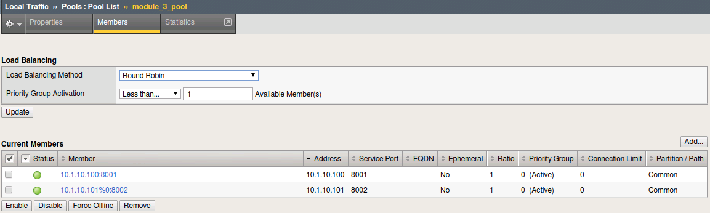

.. |labmodule| replace:: 3
.. |labnum| replace:: 2
.. |labdot| replace:: |labmodule|\ .\ |labnum|
.. |labund| replace:: |labmodule|\ _\ |labnum|
.. |labname| replace:: Lab\ |labdot|
.. |labnameund| replace:: Lab\ |labund|

Lab |labmodule|\.\ |labnum| - Execute f5-newman-wrapper for a **Build** Workflow
~~~~~~~~~~~~~~~~~~~~~~~~~~~~~~~~~~~~~~~~~~~~~~~~~~~~~~~~~~~~~~~~~~~~~~~~~~~~~~~~

During the build of the Super-NetOps Container 5 ``f5-newman-wrapper`` files were,
``git clone``'d into your lab, these files will execute against the collections
noted in the previous lab. This lab will cover the **Build** aspect, creating a
Virtual Server Framework (Service) containing all the pieces required for this
testing, and deployment.

.. NOTE:: This is a Postman Collection, and can also be imported into the Postman GUI client for viewing

For a visual reference of what f5-programmability-class-2.postman_collection.json looks like:

|lab-2-1|

.. NOTE:: You do not need to have all these operations individually broken out, it is shown this way to educate that Workflows can be as small (update a pool member) or as large (deploy a whole service) as needed

Task 1 - Examine f5-newman-build-1
^^^^^^^^^^^^^^^^^^^^^^^^^^^^^^^^^^

.. NOTE:: The contents of this folder contain files for this lab, and upcoming labs in this class

#. Navigate to the location containing the f5-newman-wrapper files ``/home/snops/f5-automation-labs/jenkins/f5-newman-build``
#. Let's examine the contents of the first f5-newman-wrapper file ``cat f5-newman-build-1``

   .. code-block:: console
      :linenos:

      {
     	   "name": "f5-newman-build-1",
     	   "description": "Execute a chained workflow that authenticates to a BIG-IP and builds configuration",
     	   "globalEnvVars": "/home/snops/f5-postman-workflows/framework/f5-postman-workflows.postman_globals.json",
     	   "globalOptions": {
     		    "insecure": true,
     		    "reporters": ["cli"]
     	   },
     	   "globalVars": {
     		    "bigip_mgmt": "10.1.1.10",
     		    "bigip_username": "admin",
     		    "bigip_password": "admin",
     		    "bigip_partition": "module_3",
     		    "bigip_pool_name": "module_3_pool",
     		    "bigip_pool_member": "10.1.10.101",
     		    "bigip_vs_name": "module_3_vs",
     		    "bigip_vs_destination": "10.1.20.129",
     		    "bigip_node_name": "10.1.10.101"
     	   },
     	   "workflow": [
            {
     		       "name": "Authenticate to BIG-IP",
     			     "options": {
     				      "collection": "/home/snops/f5-postman-workflows/collections/BIG_IP/BIGIP_API_Authentication.postman_collection.json",
     				      "folder": "1_Authenticate"
     			     }
     		    }, (REMOVE THIS TEXT AND ADD YOUR CODE BELOW)
         ]
      }
   
#. The above f5-newman-wrapper file only has the ``Authenticate to BIG-IP`` 
   Collection/Folder referenced, **we will need to add in another collection**.
   You are going to add this code snippet after the last ``},``. This shows the 
   method for chaining together multiple calls from multiple sources, shown in 
   a previous lab.  For editing files VIM/VI is installed on the container, if 
   you **do not know** how to use VIM/VI please let the instructor know, edit 
   the file with ``vi f5-newman-build-1``

   .. code-block:: json
      :linenos:

      {
        "name":"1 - Build a Basic LTM Config",
        "skip":false,
        "options": {
                "collection":"/home/snops/f5-automation-labs/postman_collections/f5-programmability-class-2.postman_collection.json",
                "folder":"1 - Build a Basic LTM Config"
        }
      }

#. Now that you have the full file you can see what it will look like with
   ``cat f5-newman-build-1``. The environment variables will float into both
   Collections, and the returned Global Variables will persist during the whole
   run.

   Example of a complete file:

   .. code-block:: json
      :linenos:

      {
         "name":"f5-newman-build-1",
         "description":"Execute a chained workflow that authenticates to a BIG-IP and builds configuration",
         "globalEnvVars":"/home/snops/f5-postman-workflows/framework/f5-postman-workflows.postman_globals.json",
         "globalOptions": {
                 "insecure":true,
                 "reporters":["cli"]
         },
         "globalVars": {
                 "bigip_mgmt": "10.1.1.10",
                 "bigip_username": "admin",
                 "bigip_password": "admin",
                 "bigip_partition": "module_3",
                 "bigip_pool_name": "module_3_pool",
                 "bigip_pool_member": "10.1.10.101",
                 "bigip_vs_name": "module_3_vs",
                 "bigip_vs_destination": "10.1.20.129",
                 "bigip_node_name": "10.1.10.101"
         },
         "workflow": [
                 {
                         "name":"Authenticate to BIG-IP",
                         "options": {
                                 "collection":"/home/snops/f5-postman-workflows/collections/BIG_IP/BIGIP_API_Authentication.postman_collection.json",
                                 "folder":"1_Authenticate"
                         }
                 },
                 {
                      "name":"1 - Build a Basic LTM Config",
                      "skip":false,
                      "options": {
                              "collection":"/home/snops/f5-automation-labs/postman_collections/f5-programmability-class-2.postman_collection.json",
                              "folder":"1 - Build a Basic LTM Config"
                    }
             }
         ]
       }

Task 2 - Execute the first f5-newman-wrapper file
^^^^^^^^^^^^^^^^^^^^^^^^^^^^^^^^^^^^^^^^^^^^^^^^^

#. Login to your BIG-IP A Lab Machine

   .. NOTE:: If you are using the F5 lab systems there are already shortcuts in your Chrome browser called ``BIG-IP A GUI``, if you receive a certificate warning accept and add exception (the BIG-IP has a self-signed cert which violates Chrome's security). BIG-IP A Login credentials are ``admin\admin``

#. ``f5-newman-build-1`` now contains the needed calls to build the Framework of an Application Service (Virtual Server, Pool and needed Profiles), **The AS3 declaration includes disabled Pool members**.

   Execute: ``f5-newman-wrapper f5-newman-build-1``

   Output should look like:

   .. code-block:: console
      :linenos:

      [root@f5-super-netops] [/home/snops/f5-automation-labs/jenkins/f5-newman-build] # f5-newman-wrapper f5-newman-build-1
      [f5-newman-build-1-2018-07-30-07-33-17] starting run
      [f5-newman-build-1-2018-07-30-07-33-17] [runCollection][Authenticate to BIG-IP] running...
      newman

      BIGIP_API_Authentication

      ❏ 1_Authenticate
      ↳ Authenticate and Obtain Token
        POST https://10.1.1.10/mgmt/shared/authn/login [200 OK, 1.62KB, 499ms]
        ✓  [POST Response Code]=200
        ✓  [Populate Variable] bigip_token=LENHO4RDRC23INWW64XDP6DSOE

      ↳ Verify Authentication Works
        GET https://10.1.1.10/mgmt/shared/authz/tokens/LENHO4RDRC23INWW64XDP6DSOE [200 OK, 1.44KB, 23ms]
        ✓  [GET Response Code]=200
        ✓  [Current Value] token=LENHO4RDRC23INWW64XDP6DSOE
        ✓  [Check Value] token == LENHO4RDRC23INWW64XDP6DSOE

      ↳ Set Authentication Token Timeout
        PATCH https://10.1.1.10/mgmt/shared/authz/tokens/LENHO4RDRC23INWW64XDP6DSOE [200 OK, 1.44KB, 59ms]
        ✓  [PATCH Response Code]=200
        ✓  [Current Value] timeout=1200
        ✓  [Check Value] timeout == 1200

      ┌─────────────────────────┬──────────┬──────────┐
      │                         │ executed │   failed │
      ├─────────────────────────┼──────────┼──────────┤
      │              iterations │        1 │        0 │
      ├─────────────────────────┼──────────┼──────────┤
      │                requests │        3 │        0 │
      ├─────────────────────────┼──────────┼──────────┤
      │            test-scripts │        3 │        0 │
      ├─────────────────────────┼──────────┼──────────┤
      │      prerequest-scripts │        1 │        0 │
      ├─────────────────────────┼──────────┼──────────┤
      │              assertions │        8 │        0 │
      ├─────────────────────────┴──────────┴──────────┤
      │ total run duration: 1113ms                    │
      ├───────────────────────────────────────────────┤
      │ total data received: 1.72KB (approx)          │
      ├───────────────────────────────────────────────┤
      │ average response time: 193ms                  │
      └───────────────────────────────────────────────┘
      [f5-newman-build-1-2018-07-30-07-33-17] [runCollection][1 - Build a Basic LTM Config] running...
      newman

      f5-programmability-class-2

      ❏ 1 - Build a Basic LTM Config
      ↳ Step 1: Create HTTP application
        POST https://10.1.1.10/mgmt/shared/appsvcs/declare [200 OK, 1.64KB, 9.8s]
        ✓  [POST Response Code]=200
        ✓  [Current Value] results.0.message=no change
        ✓  [Check Value] results.0.message regex /success|no change/

      ↳ Step 2: Get Pool Members
        GET https://10.1.1.10/mgmt/tm/ltm/pool/~module_3~module_3_vs~module_3_pool/members/ [200 OK, 1.1KB, 217ms]
        ✓  [GET Response Code]=200

      ┌─────────────────────────┬──────────┬──────────┐
      │                         │ executed │   failed │
      ├─────────────────────────┼──────────┼──────────┤
      │              iterations │        1 │        0 │
      ├─────────────────────────┼──────────┼──────────┤
      │                requests │        2 │        0 │
      ├─────────────────────────┼──────────┼──────────┤
      │            test-scripts │        4 │        0 │
      ├─────────────────────────┼──────────┼──────────┤
      │      prerequest-scripts │        2 │        0 │
      ├─────────────────────────┼──────────┼──────────┤
      │              assertions │        4 │        0 │
      ├─────────────────────────┴──────────┴──────────┤
      │ total run duration: 10.5s                     │
      ├───────────────────────────────────────────────┤
      │ total data received: 889B (approx)            │
      ├───────────────────────────────────────────────┤
      │ average response time: 5s                     │
      └───────────────────────────────────────────────┘
      [f5-newman-build-1-2018-07-30-07-33-17] run completed

   .. NOTE:: Notice the 200 OK responses, the number of requests etc., we're building in testing and logging, look back at ``BIGIP-A`` for the newly created Application Service Framework, it will be under user partition ``module_3``

#. On BIG-IP A, examine Virtual Server ``module_3_vs``:

   |lab-2-2|

#. On BIG-IP A, examine Pool ``module_3_pool``:

   |lab-2-3|

Task 3 - Execute the second f5-newman-wrapper file
^^^^^^^^^^^^^^^^^^^^^^^^^^^^^^^^^^^^^^^^^^^^^^^^^^

#. ``f5-newman-build-2`` contains calls to add pool members to the Application Service Framework created above; this is done independently of the build, to show Service staging as a possible use case.

   Execute: ``f5-newman-wrapper f5-newman-build-2``

   Output should look like:

   .. code-block:: console
      :linenos:

      [root@f5-super-netops] [/home/snops/f5-automation-labs/jenkins/f5-newman-build] # f5-newman-wrapper f5-newman-build-2
      [f5-newman-build-2-2018-07-30-07-46-56] starting run
      [f5-newman-build-2-2018-07-30-07-46-56] [runCollection][Authenticate to BIG-IP] running...
      newman

      BIGIP_API_Authentication

      ❏ 1_Authenticate
      ↳ Authenticate and Obtain Token
        POST https://10.1.1.10/mgmt/shared/authn/login [200 OK, 1.62KB, 315ms]
        ✓  [POST Response Code]=200
        ✓  [Populate Variable] bigip_token=UJ6REIU5HLQBNQJRW2GAL73QF3

      ↳ Verify Authentication Works
        GET https://10.1.1.10/mgmt/shared/authz/tokens/UJ6REIU5HLQBNQJRW2GAL73QF3 [200 OK, 1.44KB, 24ms]
        ✓  [GET Response Code]=200
        ✓  [Current Value] token=UJ6REIU5HLQBNQJRW2GAL73QF3
        ✓  [Check Value] token == UJ6REIU5HLQBNQJRW2GAL73QF3

      ↳ Set Authentication Token Timeout
        PATCH https://10.1.1.10/mgmt/shared/authz/tokens/UJ6REIU5HLQBNQJRW2GAL73QF3 [200 OK, 1.44KB, 41ms]
        ✓  [PATCH Response Code]=200
        ✓  [Current Value] timeout=1200
        ✓  [Check Value] timeout == 1200

      ┌─────────────────────────┬──────────┬──────────┐
      │                         │ executed │   failed │
      ├─────────────────────────┼──────────┼──────────┤
      │              iterations │        1 │        0 │
      ├─────────────────────────┼──────────┼──────────┤
      │                requests │        3 │        0 │
      ├─────────────────────────┼──────────┼──────────┤
      │            test-scripts │        3 │        0 │
      ├─────────────────────────┼──────────┼──────────┤
      │      prerequest-scripts │        1 │        0 │
      ├─────────────────────────┼──────────┼──────────┤
      │              assertions │        8 │        0 │
      ├─────────────────────────┴──────────┴──────────┤
      │ total run duration: 881ms                     │
      ├───────────────────────────────────────────────┤
      │ total data received: 1.72KB (approx)          │
      ├───────────────────────────────────────────────┤
      │ average response time: 126ms                  │
      └───────────────────────────────────────────────┘
      [f5-newman-build-2-2018-07-30-07-46-56] [runCollection][2 - Add Members to LTM Config] running...
      newman

      f5-programmability-class-2

      ❏ 2 - Add Members to LTM Config
      ↳ Step 1: Check Pool Exists
        GET https://10.1.1.10/mgmt/tm/ltm/pool/~module_3~module_3_vs~module_3_pool [200 OK, 1.87KB, 80ms]
        ✓  [GET Response Code]=200

      ↳ Step 2: Get Pool Members
        GET https://10.1.1.10/mgmt/tm/ltm/pool/~module_3~module_3_vs~module_3_pool/members/ [200 OK, 1.1KB, 78ms]
        ✓  [GET Response Code]=200

      ↳ Step 3: Patch HTTP Application Enable Green Members
        PATCH https://10.1.1.10/mgmt/shared/appsvcs/declare [200 OK, 1.65KB, 22.8s]
        ✓  [PATCH Response Code]=200
        ✓  [Current Value] results.0.message=success
        ✓  [Check Value] results.0.message regex /success|no change/

      ↳ Step 4: Get Pool Members
        GET https://10.1.1.10/mgmt/tm/ltm/pool/~module_3~module_3_vs~module_3_pool/members/ [200 OK, 2.27KB, 129ms]
        ✓  [GET Response Code]=200

      ┌─────────────────────────┬──────────┬──────────┐
      │                         │ executed │   failed │
      ├─────────────────────────┼──────────┼──────────┤
      │              iterations │        1 │        0 │
      ├─────────────────────────┼──────────┼──────────┤
      │                requests │        4 │        0 │
      ├─────────────────────────┼──────────┼──────────┤
      │            test-scripts │        8 │        0 │
      ├─────────────────────────┼──────────┼──────────┤
      │      prerequest-scripts │        4 │        0 │
      ├─────────────────────────┼──────────┼──────────┤
      │              assertions │        6 │        0 │
      ├─────────────────────────┴──────────┴──────────┤
      │ total run duration: 23.9s                     │
      ├───────────────────────────────────────────────┤
      │ total data received: 3.11KB (approx)          │
      ├───────────────────────────────────────────────┤
      │ average response time: 5.8s                   │
      └───────────────────────────────────────────────┘
      [f5-newman-build-2-2018-07-30-07-46-56] run completed

#. On BIG-IP A examine Virtual Server ``module_3_vs``, the Virtual Server should be healthy and Green:

   |module-3-1|

#. On BIG-IP A examine Pool ``module_3_pool``, these will represent our ``Green`` deployment memebers:

   |module-3-2|

