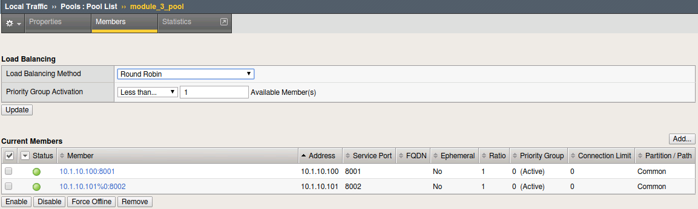

.. |labmodule| replace:: 3
.. |labnum| replace:: 3
.. |labdot| replace:: |labmodule|\ .\ |labnum|
.. |labund| replace:: |labmodule|\ _\ |labnum|
.. |labname| replace:: Lab\ |labdot|
.. |labnameund| replace:: Lab\ |labund|

Lab |labmodule|\.\ |labnum| - Execute f5-newman-wrapper for an **Operations** Workflow
~~~~~~~~~~~~~~~~~~~~~~~~~~~~~~~~~~~~~~~~~~~~~~~~~~~~~~~~~~~~~~~~~~~~~~~~~~~~~~~~~~~~~~

In the last lab we walked through creating an Application Service Framework, and then updating
the Service Framework in a separate call. This lab has 2 f5-newman-files also, one used to
user-down a pool member, and another to user-up the same member. These could be used
as individual calls from another toolkit (which we'll see later) or run independently
as a single commands.

Task 1 - Execute f5-newman-build-3
^^^^^^^^^^^^^^^^^^^^^^^^^^^^^^^^^^

#. Navigate to the location containing the f5-newman-wrapper files ``/home/snops/f5-automation-labs/jenkins/f5-newman-operation``
#. On BIGIP-A, examine the pool ``module_3_pool``, you should see 2 active (Green) pool members:

   |lab-3-2|

#. ``f5-newman-build-3`` contains calls to change the nodes for our service
   (to our ``Blue`` service ports) AS3 declarations use a ``false`` mechanism
   for pool members, keeping them in the delclaration but removing them from
   being used as a target

   Execute: ``f5-newman-wrapper f5-newman-build-3``

   Output should look like:

   .. code-block:: console
      :linenos:

      [root@f5-super-netops] [/home/snops/f5-automation-labs/jenkins/f5-newman-operation] # f5-newman-wrapper f5-newman-build-3
      [f5-newman-build-3-2018-07-30-08-08-11] starting run
      [f5-newman-build-3-2018-07-30-08-08-11] [runCollection][Authenticate to BIG-IP] running...
      newman

      BIGIP_API_Authentication

      ❏ 1_Authenticate
      ↳ Authenticate and Obtain Token
        POST https://10.1.1.10/mgmt/shared/authn/login [200 OK, 1.62KB, 559ms]
        ✓  [POST Response Code]=200
        ✓  [Populate Variable] bigip_token=NRLGYNMNR5Z5WVLHAMHZYQBXGN

      ↳ Verify Authentication Works
        GET https://10.1.1.10/mgmt/shared/authz/tokens/NRLGYNMNR5Z5WVLHAMHZYQBXGN [200 OK, 1.44KB, 22ms]
        ✓  [GET Response Code]=200
        ✓  [Current Value] token=NRLGYNMNR5Z5WVLHAMHZYQBXGN
        ✓  [Check Value] token == NRLGYNMNR5Z5WVLHAMHZYQBXGN

      ↳ Set Authentication Token Timeout
        PATCH https://10.1.1.10/mgmt/shared/authz/tokens/NRLGYNMNR5Z5WVLHAMHZYQBXGN [200 OK, 1.44KB, 79ms]
        ✓  [PATCH Response Code]=200
        ✓  [Current Value] timeout=1200
        ✓  [Check Value] timeout == 1200

      ┌─────────────────────────┬──────────┬──────────┐
      │                         │ executed │   failed │
      ├─────────────────────────┼──────────┼──────────┤
      │              iterations │        1 │        0 │
      ├─────────────────────────┼──────────┼──────────┤
      │                requests │        3 │        0 │
      ├─────────────────────────┼──────────┼──────────┤
      │            test-scripts │        3 │        0 │
      ├─────────────────────────┼──────────┼──────────┤
      │      prerequest-scripts │        1 │        0 │
      ├─────────────────────────┼──────────┼──────────┤
      │              assertions │        8 │        0 │
      ├─────────────────────────┴──────────┴──────────┤
      │ total run duration: 1181ms                    │
      ├───────────────────────────────────────────────┤
      │ total data received: 1.72KB (approx)          │
      ├───────────────────────────────────────────────┤
      │ average response time: 220ms                  │
      └───────────────────────────────────────────────┘
      [f5-newman-build-3-2018-07-30-08-08-11] [runCollection][3 - Disable Node] running...
      newman

      f5-programmability-class-2

      ❏ 3 - Disable Node
      ↳ Step 1: Check Pool Exists
        GET https://10.1.1.10/mgmt/tm/ltm/pool/~module_3~module_3_vs~module_3_pool [200 OK, 1.87KB, 55ms]
        ✓  [GET Response Code]=200

      ↳ Step 2: Get Pool Members
        GET https://10.1.1.10/mgmt/tm/ltm/pool/~module_3~module_3_vs~module_3_pool/members/ [200 OK, 2.27KB, 101ms]
        ✓  [GET Response Code]=200

      ↳ Step 3: Patch HTTP Application Disable Green Enable Blue Members
        PATCH https://10.1.1.10/mgmt/shared/appsvcs/declare [200 OK, 1.76KB, 11.2s]
        ✓  [PATCH Response Code]=200
        ✓  [Current Value] results.0.message=success
        ✓  [Check Value] results.0.message regex /success|no change/

      ↳ Step 4: Get Pool Members
        GET https://10.1.1.10/mgmt/tm/ltm/pool/~module_3~module_3_vs~module_3_pool/members [200 OK, 2.27KB, 134ms]
        ✓  [GET Response Code]=200

      ┌─────────────────────────┬──────────┬──────────┐
      │                         │ executed │   failed │
      ├─────────────────────────┼──────────┼──────────┤
      │              iterations │        1 │        0 │
      ├─────────────────────────┼──────────┼──────────┤
      │                requests │        4 │        0 │
      ├─────────────────────────┼──────────┼──────────┤
      │            test-scripts │        8 │        0 │
      ├─────────────────────────┼──────────┼──────────┤
      │      prerequest-scripts │        4 │        0 │
      ├─────────────────────────┼──────────┼──────────┤
      │              assertions │        6 │        0 │
      ├─────────────────────────┴──────────┴──────────┤
      │ total run duration: 12.4s                     │
      ├───────────────────────────────────────────────┤
      │ total data received: 4.4KB (approx)           │
      ├───────────────────────────────────────────────┤
      │ average response time: 2.9s                   │
      └───────────────────────────────────────────────┘
      [f5-newman-build-3-2018-07-30-08-08-11] run completed

   .. NOTE:: Notice the 200 OK responses, as it completed successfully

#. Log back into BIG-IP A examine the pool ``module_3_pool`` status page you should see on red diamond node and another node green and online:

   |lab-3-3|

   We're doing some testing on our ``Blue`` service ports, now we can see we have a bad backend server!

Task 2 - Execute f5-newman-build-4
^^^^^^^^^^^^^^^^^^^^^^^^^^^^^^^^^^

#. On BIG-IP A examine the pool ``module_3_pool``, you should show only 1 Active and Green:

   |lab-3-3|

#. ``f5-newman-build-4`` contains the calls to set our all our backend service pool members to a ``true`` state in the AS3 Declaration

   Execute: ``f5-newman-wrapper f5-newman-build-4``

   Output should look like:

   .. code-block:: console
       :linenos:

       [root@f5-super-netops] [/home/snops/f5-automation-labs/jenkins/f5-newman-operation] # f5-newman-wrapper f5-newman-build-4
       [f5-newman-build-4-2018-07-30-08-03-19] starting run
       [f5-newman-build-4-2018-07-30-08-03-19] [runCollection][Authenticate to BIG-IP] running...
       newman

       BIGIP_API_Authentication

       ❏ 1_Authenticate
       ↳ Authenticate and Obtain Token
         POST https://10.1.1.10/mgmt/shared/authn/login [200 OK, 1.62KB, 424ms]
         ✓  [POST Response Code]=200
         ✓  [Populate Variable] bigip_token=PULWUPFKHJ7LVSHJGAG4SAUAAH

       ↳ Verify Authentication Works
         GET https://10.1.1.10/mgmt/shared/authz/tokens/PULWUPFKHJ7LVSHJGAG4SAUAAH [200 OK, 1.44KB, 19ms]
         ✓  [GET Response Code]=200
         ✓  [Current Value] token=PULWUPFKHJ7LVSHJGAG4SAUAAH
         ✓  [Check Value] token == PULWUPFKHJ7LVSHJGAG4SAUAAH

       ↳ Set Authentication Token Timeout
         PATCH https://10.1.1.10/mgmt/shared/authz/tokens/PULWUPFKHJ7LVSHJGAG4SAUAAH [200 OK, 1.44KB, 42ms]
         ✓  [PATCH Response Code]=200
         ✓  [Current Value] timeout=1200
         ✓  [Check Value] timeout == 1200

       ┌─────────────────────────┬──────────┬──────────┐
       │                         │ executed │   failed │
       ├─────────────────────────┼──────────┼──────────┤
       │              iterations │        1 │        0 │
       ├─────────────────────────┼──────────┼──────────┤
       │                requests │        3 │        0 │
       ├─────────────────────────┼──────────┼──────────┤
       │            test-scripts │        3 │        0 │
       ├─────────────────────────┼──────────┼──────────┤
       │      prerequest-scripts │        1 │        0 │
       ├─────────────────────────┼──────────┼──────────┤
       │              assertions │        8 │        0 │
       ├─────────────────────────┴──────────┴──────────┤
       │ total run duration: 1026ms                    │
       ├───────────────────────────────────────────────┤
       │ total data received: 1.72KB (approx)          │
       ├───────────────────────────────────────────────┤
       │ average response time: 161ms                  │
       └───────────────────────────────────────────────┘
       [f5-newman-build-4-2018-07-30-08-03-19] [runCollection][4 - Enable Node] running...
       newman

       f5-programmability-class-2

       ❏ 4 - Enable Node
       ↳ Step 1: Check Pool Exists
         GET https://10.1.1.10/mgmt/tm/ltm/pool/~module_3~module_3_vs~module_3_pool [200 OK, 1.87KB, 68ms]
         ✓  [GET Response Code]=200

       ↳ Step 2: Get Pool Members
         GET https://10.1.1.10/mgmt/tm/ltm/pool/~module_3~module_3_vs~module_3_pool/members/ [200 OK, 2.27KB, 85ms]
         ✓  [GET Response Code]=200

       ↳ Step 3: Patch HTTP Application Pool Enable all Members
         PATCH https://10.1.1.10/mgmt/shared/appsvcs/declare [200 OK, 1.75KB, 11.3s]
         ✓  [PATCH Response Code]=200
         ✓  [Current Value] results.0.message=success
         ✓  [Check Value] results.0.message regex /success|no change/

       ↳ Step 4: Get Final Declaration
         GET https://10.1.1.10/mgmt/shared/appsvcs/declare/module_3 [200 OK, 1.63KB, 221ms]
         ✓  [GET Response Code]=200

       ┌─────────────────────────┬──────────┬──────────┐
       │                         │ executed │   failed │
       ├─────────────────────────┼──────────┼──────────┤
       │              iterations │        1 │        0 │
       ├─────────────────────────┼──────────┼──────────┤
       │                requests │        4 │        0 │
       ├─────────────────────────┼──────────┼──────────┤
       │            test-scripts │        8 │        0 │
       ├─────────────────────────┼──────────┼──────────┤
       │      prerequest-scripts │        4 │        0 │
       ├─────────────────────────┼──────────┼──────────┤
       │              assertions │        6 │        0 │
       ├─────────────────────────┴──────────┴──────────┤
       │ total run duration: 12.4s                     │
       ├───────────────────────────────────────────────┤
       │ total data received: 3.75KB (approx)          │
       ├───────────────────────────────────────────────┤
       │ average response time: 2.9s                   │
       └───────────────────────────────────────────────┘
       [f5-newman-build-4-2018-07-30-08-03-19] run completed

   .. NOTE:: Notice the 200 OK responses, as it completed successfully

#. On BIG-IP A examine Pool ``module_3_pool`` we now have all our nodes in the system, we left the ``red`` node in place for valid health monitoring and tracking:

   |lab-3-4|

.. |lab-3-1| image:: images/lab-3-1.png
   :scale: 70%

.. |lab-3-4| image:: images/lab-3-4.png
   :scale: 70%
