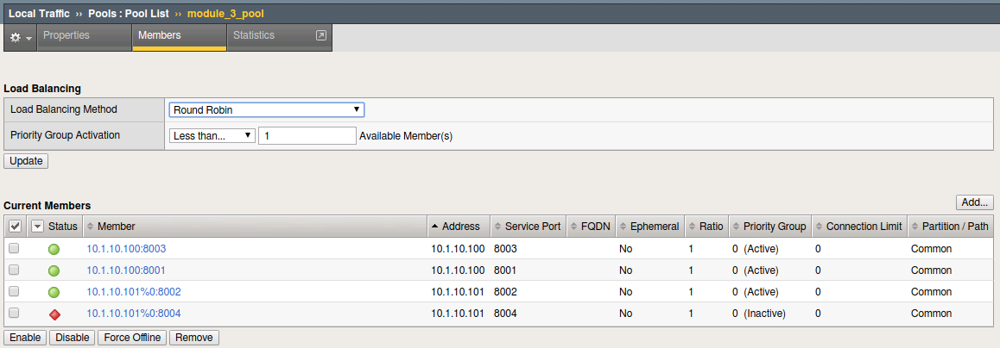

.. |labmodule| replace:: 3
.. |labnum| replace:: 3
.. |labdot| replace:: |labmodule|\ .\ |labnum|
.. |labund| replace:: |labmodule|\ _\ |labnum|
.. |labname| replace:: Lab\ |labdot|
.. |labnameund| replace:: Lab\ |labund|

Lab |labmodule|\.\ |labnum| - Execute an f5-newman-wrapper for **Teardown**
~~~~~~~~~~~~~~~~~~~~~~~~~~~~~~~~~~~~~~~~~~~~~~~~~~~~~~~~~~~~~~~~~~~~~~~~~~~~~

To get ready for the next module, we're going to execute one last f5-newman-wrapper
directly. This file will delete the framework and service we created in the
last few labs. We've used a few f5-newman-wrapper files to create our service,
and show some mutation, but for the deletion we will only use 1. As AS3 is
declaration engine is a single call ``can`` be used to create a service and a
single call can be used to remove it.

Task 1 - Execute f5-newman-build-5
^^^^^^^^^^^^^^^^^^^^^^^^^^^^^^^^^^

#. Navigate to the location containing the f5-newman-wrapper files ``cd /home/snops/f5-automation-labs/jenkins/f5-newman-build``
#. On BIG-IP A examine the virtual server ``module_3_vs``, it should be active and Green:

   |lab-3-1|

#. On BIGIP-A examine the pool ``module_3_pool``, you should show 3 active members Green:

   |lab-3-4|

#. ``f5-newman-build-5`` contains the call to delete all items we've created in the last few modules

   Execute: ``f5-newman-wrapper f5-newman-build-5``

   Output should look like:

   .. code-block:: console
      :linenos:

      [root@f5-super-netops] [/home/snops/f5-automation-labs/jenkins/f5-newman-build] # f5-newman-wrapper f5-newman-build-5
      [f5-newman-build-5-2018-07-30-08-06-14] starting run
      [f5-newman-build-5-2018-07-30-08-06-14] [runCollection][Authenticate to BIG-IP] running...
      newman

      BIGIP_API_Authentication

      ❏ 1_Authenticate
      ↳ Authenticate and Obtain Token
        POST https://10.1.1.10/mgmt/shared/authn/login [200 OK, 1.62KB, 367ms]
        ✓  [POST Response Code]=200
        ✓  [Populate Variable] bigip_token=5EKXOKALEB2E7TALKKANCK6GUD

      ↳ Verify Authentication Works
        GET https://10.1.1.10/mgmt/shared/authz/tokens/5EKXOKALEB2E7TALKKANCK6GUD [200 OK, 1.44KB, 24ms]
        ✓  [GET Response Code]=200
        ✓  [Current Value] token=5EKXOKALEB2E7TALKKANCK6GUD
        ✓  [Check Value] token == 5EKXOKALEB2E7TALKKANCK6GUD

      ↳ Set Authentication Token Timeout
        PATCH https://10.1.1.10/mgmt/shared/authz/tokens/5EKXOKALEB2E7TALKKANCK6GUD [200 OK, 1.44KB, 83ms]
        ✓  [PATCH Response Code]=200
        ✓  [Current Value] timeout=1200
        ✓  [Check Value] timeout == 1200

      ┌─────────────────────────┬──────────┬──────────┐
      │                         │ executed │   failed │
      ├─────────────────────────┼──────────┼──────────┤
      │              iterations │        1 │        0 │
      ├─────────────────────────┼──────────┼──────────┤
      │                requests │        3 │        0 │
      ├─────────────────────────┼──────────┼──────────┤
      │            test-scripts │        3 │        0 │
      ├─────────────────────────┼──────────┼──────────┤
      │      prerequest-scripts │        1 │        0 │
      ├─────────────────────────┼──────────┼──────────┤
      │              assertions │        8 │        0 │
      ├─────────────────────────┴──────────┴──────────┤
      │ total run duration: 1062ms                    │
      ├───────────────────────────────────────────────┤
      │ total data received: 1.72KB (approx)          │
      ├───────────────────────────────────────────────┤
      │ average response time: 158ms                  │
      └───────────────────────────────────────────────┘
      [f5-newman-build-5-2018-07-30-08-06-14] [runCollection][5 - Clean Up Service] running...
      newman

      f5-programmability-class-2

      ❏ 5 - Clean Up Service
      ↳ Step 1: Delete HTTP Application
        DELETE https://10.1.1.10/mgmt/shared/appsvcs/declare/ [200 OK, 1.2KB, 12s]
        ✓  [DELETE Response Code]=200
        ✓  [Current Value] results.0.message=success
        ✓  [Check Value] results.0.message regex /success|no change/

      ┌─────────────────────────┬──────────┬──────────┐
      │                         │ executed │   failed │
      ├─────────────────────────┼──────────┼──────────┤
      │              iterations │        1 │        0 │
      ├─────────────────────────┼──────────┼──────────┤
      │                requests │        1 │        0 │
      ├─────────────────────────┼──────────┼──────────┤
      │            test-scripts │        2 │        0 │
      ├─────────────────────────┼──────────┼──────────┤
      │      prerequest-scripts │        1 │        0 │
      ├─────────────────────────┼──────────┼──────────┤
      │              assertions │        3 │        0 │
      ├─────────────────────────┴──────────┴──────────┤
      │ total run duration: 12.3s                     │
      ├───────────────────────────────────────────────┤
      │ total data received: 273B (approx)            │
      ├───────────────────────────────────────────────┤
      │ average response time: 12s                    │
      └───────────────────────────────────────────────┘
      [f5-newman-build-5-2018-07-30-08-06-14] run completed

   .. NOTE:: Notice the 200 OK responses, as it completed successfully

#. On BIG-IP A the Partition, Virtual ``module_3_vs`` and Pool ``module_3_pool`` are deleted

.. |lab-3-1| image:: images/lab-3-1.png
   :scale: 70%

