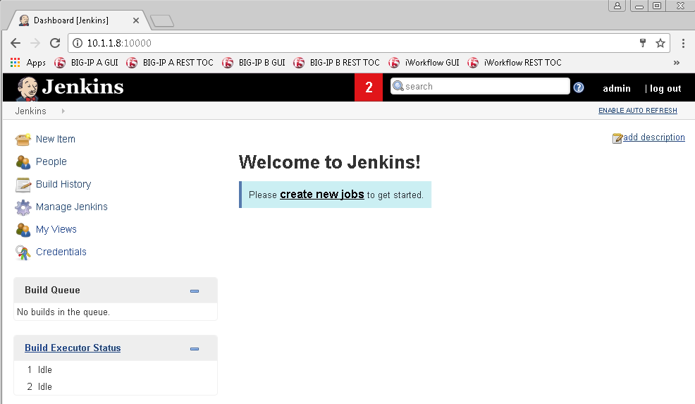
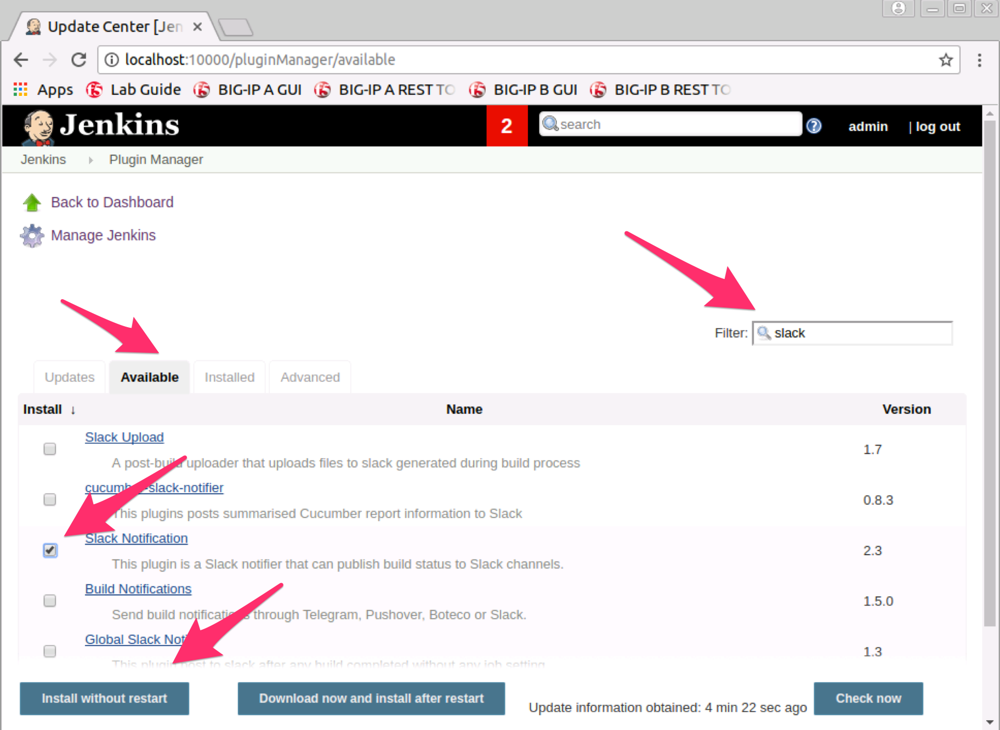
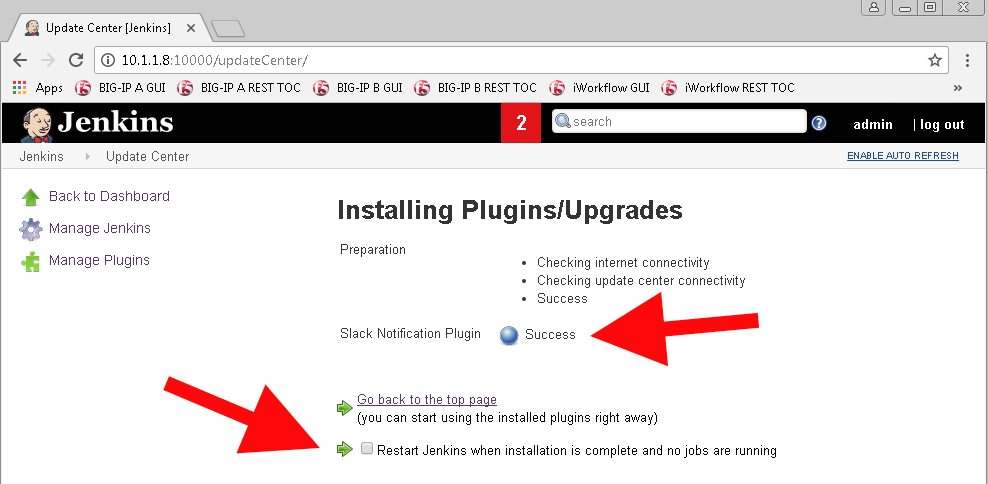

.. |labmodule| replace:: 4
.. |labnum| replace:: 1
.. |labdot| replace:: |labmodule|\ .\ |labnum|
.. |labund| replace:: |labmodule|\ _\ |labnum|
.. |labname| replace:: Lab\ |labdot|
.. |labnameund| replace:: Lab\ |labund|

Lab |labmodule|\.\ |labnum| - File Locations and Jenkins setup
~~~~~~~~~~~~~~~~~~~~~~~~~~~~~~~~~~~~~~~~~~~~~~~~~~~~~~~~~~~~~~~

We've been executing all our commands locally from Automated scripts; we are
now going to take the different toolkits and tie them together to form a **Pipeline**.
Pipelines will vary in deployments and even within solutions. Our lab
will show you just one way one could be utilized.

Task 1 - Locating the Jenkins files and how they are setup
^^^^^^^^^^^^^^^^^^^^^^^^^^^^^^^^^^^^^^^^^^^^^^^^^^^^^^^^^^

#. Lets make sure the Jekins files were mapped correctly.

   Execute: ``cd /home/snops/f5-automation-labs/jenkins/`` to access our folder containing the Jenkins Pipeline Files

#. The Jenkins files are located alongside the f5-newman-wrapper files we've used in the previous labs, setup this way was for ease of learning. You may place tools in different structures in your environment.

   File Locations:

   .. code::

       |- /f5-automation-labs
          |- /jenkins
          |  |  /f5-newman-build
          |  |      Jenkinsfile1-2
          |  |      Jenkinsfile5
          |  |  /f5-newman-operation
          |  |      Jenkinsfile3
          |  |      Jenkinsfile4

#. Lets review the first Jenkins file, from /home/snops/f5-automation-labs/jenkins/f5-newman-build, execute ``cat Jenkinsfile1-2``

   File output:

   .. code-block:: groovy
       :linenos:

       node {
          stage('Testing') {
             //Run the tests
             //sh "python -m /home/snops/f5-automation-labs/jenkins/f5-newman-build/f5-newman-build-1"
             //sh "python -m /home/snops/f5-automation-labs/jenkins/f5-newman-build/f5-newman-build-2"
          }
          stage('Frameword-Deployment') {
              //Run SNOPS Container Newman Package Virtual and Pool
             sh "f5-newman-wrapper /home/snops/f5-automation-labs/jenkins/f5-newman-build/f5-newman-build-1"
             //chatops slack message that run has completed
             slackSend(
                channel: '#jenkins_builds',
                color: 'good',
                message: 'Super-NetOps Engineer is about to deploy an F5 Service Framework, Approval Needed!',
                teamDomain: 'f5agilitydevops',
                token: 'vLMQmBq2tiyiCcZoNlbmAi0Z'
                )
          }
          stage('Approval') {
             //Gate the process and require approval
             input 'Proceed?'
             //chatops slack message that run has completed
             slackSend(
                 channel: '#jenkins_builds',
                 color: 'good',
                 message: 'Super-NetOps Engineer just approved a new F5 Service Framework, thats some serious Continuous Delivery!',
                 teamDomain: 'f5agilitydevops',
                 token: 'vLMQmBq2tiyiCcZoNlbmAi0Z'
                 )
          }
          stage('Add-Sevice-Node') {
              //Run SNOPS Container Newman Package add Node to Pool
             sh "f5-newman-wrapper /home/snops/f5-automation-labs/jenkins/f5-newman-build/f5-newman-build-2"
             //chatops slack message that run has completed
             slackSend(
                channel: '#jenkins_builds',
                color: 'good',
                message: 'Super-NetOps Engineer just added a Node to a Service, Production is Online!',
                teamDomain: 'f5agilitydevops',
                token: 'vLMQmBq2tiyiCcZoNlbmAi0Z'
                )
          }
       }

   - This is a Jenkins Pipeline file, which we will be inputing into a Pipeline deployment via our Jenkins Toolkit.

   - The file should be human readable even without Jenkins experience, a ``stage`` can be thought of as a step in the Pipeline (or a work-center in manufacturing terms); right after the stage is its name, followed by some commands. Since the super-netops-container is running this Jenkins installation locally, we can use local mappings to file structure.

   - In more common deployments the Jenkins file would be stored in a SCM (like Github) and called during an Event (Build/Pull Request) or a Polling Timer, or even some other kind of scripting launch.

   - Testing in Pipeline before executing code with tools like ``linter`` or python scripts can make sure formatting is valid, reducing errors from happening during builds.

Our installation also has some Slack calls. Which we will setup next.

Task 2 - Accessing Jenkins and Installing the Slack-Notifier Plug-in
^^^^^^^^^^^^^^^^^^^^^^^^^^^^^^^^^^^^^^^^^^^^^^^^^^^^^^^^^^^^^^^^^^^^

Slack is a ChatOps toolkit, think of Skype, Teams, Messenger, or IIRC! Except Slack also has the ability to take in
bots. slackbots are used to interact with services, they might query for something when asked, or
give you information when they notice something. In our case our Jenkins Pipeline file will use Slack
to notify all of us when an action happens, collaborative teamwork.

.. NOTE:: In the Jenkins Files, the ``message`` piece is sent to the Slack channel, if you would like to modify your messages for our lab **change the text!**

#. Access Jenkins via Chrome, open a new tab to  ``http://localhost:10000``, the user credentials are ``admin\default``.

   |lab-1-1|

#. Once you are logged into Jenkins it should look like below

   |lab-1-2|

#. Click on Manage Jenkins and select ``Go to plugin manager``

   |lab-1-3|

#. From the Plugin Manager page, select ``Available`` then filter on ``slack``, once the filter is complete choose ``Slack Notification`` and execute ``Install without Restart``

   |lab-1-4|

#. Once the Slack Notification Plugin has changed to ``Success``, tick the radio button for ``Restart Jenkins when installation is complete and no jobs are running``

   |lab-1-5|

#. Slack can take a few minutes to install in the background (give it 30 seconds), once the ``Restarting Jenkins`` globe is grey and the status is ``Running`` go back to Jenkins Home

   |lab-1-6|

#. Executing a restart of Jenkins will stop your session, you will need to log back into the system

   |lab-1-1|

.. |lab-1-1| image:: images/lab-1-1.png
   :scale: 100%

.. |lab-1-3| image:: images/lab-1-3.png
   :scale: 70%

.. |lab-1-6| image:: images/lab-1-6.png
   :scale: 70%
