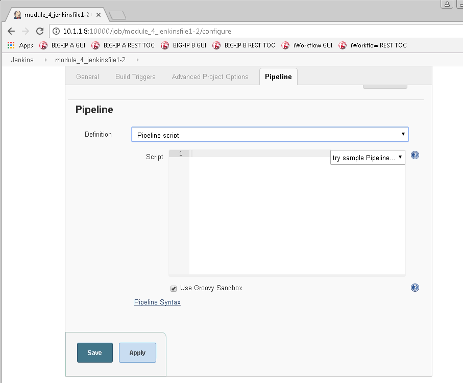
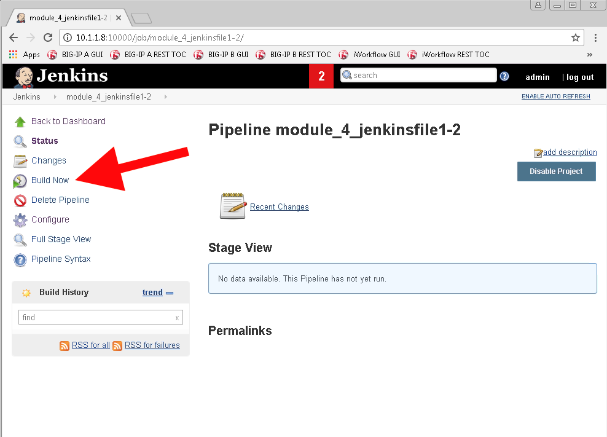
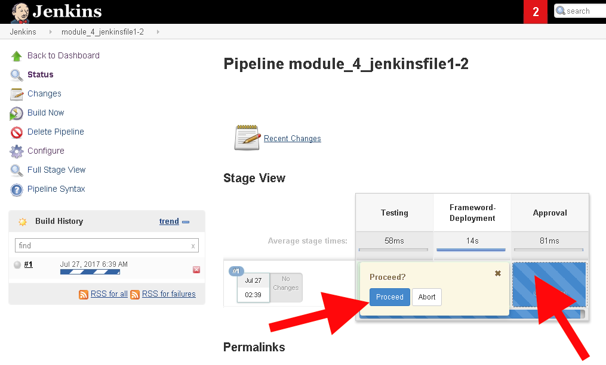
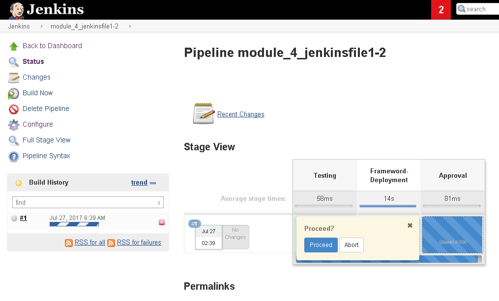
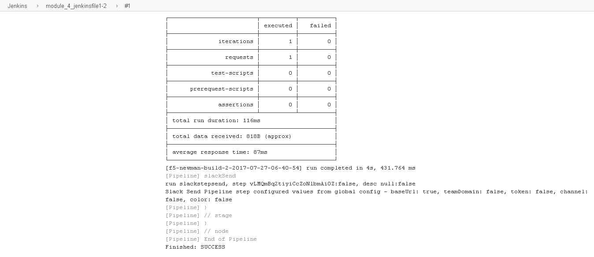

.. |labmodule| replace:: 4
.. |labnum| replace:: 2
.. |labdot| replace:: |labmodule|\ .\ |labnum|
.. |labund| replace:: |labmodule|\ _\ |labnum|
.. |labname| replace:: Lab\ |labdot|
.. |labnameund| replace:: Lab\ |labund|

Lab |labmodule|\.\ |labnum| - Executing Jenkins Jobs for Creation or Modify
~~~~~~~~~~~~~~~~~~~~~~~~~~~~~~~~~~~~~~~~~~~~~~~~~~~~~~~~~~~~~~~~~~~~~~~~~~~

Now that we have Jenkins running, and the dependent Slack Plugin installed
we can utilize our Jenkins Pipeline Scripts successfully.

Task 1 - Building the Application Service Framework via Jenkins
^^^^^^^^^^^^^^^^^^^^^^^^^^^^^^^^^^^^^^^^^^^^^^^^^^^^^^^^^^^^^^^

This step is executing the f5-newman-wrapper files. Instead of having to run the two different
builds (Application Service Framework and Pool member add) individually we'll us a pause.
Jenkins has a pause functionality which pausing the deployment looking for an approval to
continue. After the approving step, the node to be added, still using 2 f5-newman-wrapper
files but in conjunction with a single solution (Jenkins). Jenkins will continue to update
the class via Slack as people are progressing. Jenkins does also keep a running console for
logging, which we will also review.

#. From the Jenkins Dashboard click on ``create new jobs``

   |lab-2-1|

#. We are going to create our first Pipeline Job. Name the item ``module_4_jenkinsfile1-2``, choose the ``Pipeline`` project style and select ``OK``

   |lab-2-2|

#. We are going to be using the raw ``Jenkinsfile1-2`` right in the ``Pipeline Script`` option at the end of the config page. Scroll to the bottom of the page but **please look at the other options** which can deploy a Pipeline. The different options in here are for an SCM (like GitHub), the ``Polling`` or ``Commit`` methods enable Continuous Deployment, as Jenkins will deploy the change on an event basis. Tie this with automatic testing to make sure you're not breaking the build!

   |lab-2-3|

#. We need to enter the contents of the ``Jenkinsfile1-2`` into the ``Script`` section under Pipeline. After the contents are added click the ``Save`` Option.

.. code-block:: groovy
   :linenos:

    node {
       stage('Testing') {
          //Run the tests
          //sh "python -m /home/snops/f5-automation-labs/jenkins/f5-newman-build/f5-newman-build-1"
          //sh "python -m /home/snops/f5-automation-labs/jenkins/f5-newman-build/f5-newman-build-2"
       }
       stage('Frameword-Deployment') {
           //Run SNOPS Container Newman Package Virtual and Pool
          sh "f5-newman-wrapper /home/snops/f5-automation-labs/jenkins/f5-newman-build/f5-newman-build-1"
          //chatops slack message that run has completed
          slackSend(
             channel: '#jenkins_builds',
             color: 'good',
             message: 'Super-NetOps Engineer is about to deploy an F5 Service Framework, Approval Needed!',
             teamDomain: 'f5agilitydevops',
             token: 'vLMQmBq2tiyiCcZoNlbmAi0Z'
             )
       }
       stage('Approval') {
          //Gate the process and require approval
          input 'Proceed?'
          //chatops slack message that run has completed
          slackSend(
              channel: '#jenkins_builds',
              color: 'good',
              message: 'Super-NetOps Engineer just approved a new F5 Service Framework, thats some serious Continuous Delivery!',
              teamDomain: 'f5agilitydevops',
              token: 'vLMQmBq2tiyiCcZoNlbmAi0Z'
              )
       }
       stage('Add-Sevice-Node') {
           //Run SNOPS Container Newman Package add Node to Pool
          sh "f5-newman-wrapper /home/snops/f5-automation-labs/jenkins/f5-newman-build/f5-newman-build-2"
          //chatops slack message that run has completed
          slackSend(
             channel: '#jenkins_builds',
             color: 'good',
             message: 'Super-NetOps Engineer just added a Node to a Service, Production is Online!',
             teamDomain: 'f5agilitydevops',
             token: 'vLMQmBq2tiyiCcZoNlbmAi0Z'
             )
       }
    }

Contents in Pipeline:

|lab-2-4|

#. Once the Job is saved, you will be taken to the stage view page, from here we are going to execute our Pipeline build, choose the ``Build Now`` option.

   |lab-2-5|

#. The Build is now running, and the stages are being executed in order. However, on our third stage we have a **pause** and an approval **needed**. Also at the same time Slack has began to notify us that a new service is being deployed, and someone needs to approve it.

   |lab-2-6|
   Highlight over the third Stage to prompt for the Approval
   |lab-2-7|

   |lab-2-8|

#. Approve the change in Jenkins to allow the build to finish. Once this is done, the approval and finished Slack notification will be sent.

   |lab-2-9|

   |lab-2-10|

#. At the end of the Build event (success or failure) there is a console output from Jenkins. Select the blue globe on the left to see the outputs

   |lab-2-11|

#. The Console Output file not only contains the Jenkins output from the Build, but also the f5-newman-wrapper toolkit logs for easy troubleshooting

   |lab-2-12|

#. Check Slack for the completion of everything!

   |lab-2-13|

#. Verify on the BIG-IP that the pool ``module_3_vs`` has been created and the services are Green

   |lab-2-15|

Task 2 - Jenkinsfile3 and Jenkinsfile4
^^^^^^^^^^^^^^^^^^^^^^^^^^^^^^^^^^^^^^^^^^^^^^^^^^^^^^^^^^^^^^^^^^^^

These two Jenkins files were completed to show the ability of creating smaller deployments. In our case we will use the f5-newman-wrapper toolkit to again change the user selected state of a pool member. The different Pipelines notifications also have different Slack Color depictions, helping to quickly identify issues to team members.

#. Return to the Jenkins Dashboard and select ``New Item``

   |module-4-1|

#. Repeat steps 2 & 3 of the last module, creating 2 new Jenkins jobs, one for each desired node state.

#. Create and Execute ``module_4_jenkinsfile_3`` for a down node

   **Pipeline Job Name:** ``module_4_jenkinsfile_3``

   .. code-block:: groovy
      :linenos:

      node {
        stage('Testing') {
           //Run the tests
           //sh "python -m /home/snops/f5-automation-labs/jenkins/f5-newman-operation/f5-newman-build-3"
        }
        stage('Disable-Node') {
            //Run SNOPS Container Newman Package Virtual and Pool
           sh "f5-newman-wrapper /home/snops/f5-automation-labs/jenkins/f5-newman-operation/f5-newman-build-3"
           //chatops slack message that run has completed
           slackSend(
              channel: '#jenkins_builds',
              color: 'bad',
              message: 'Super-NetOps Engineer just disabled a Service Node!',
              teamDomain: 'f5agilitydevops',
              token: 'vLMQmBq2tiyiCcZoNlbmAi0Z'
              )
        }
      }

#. Verify on the BIG-IP that the pool ``module_3_pool`` has a down node

#. Create and Execute ``module_4_jenkinsfile_4`` for an up node

   **Pipeline Job Name:** ``module_4_jenkinsfile_4``

   .. code-block:: groovy
      :linenos:

      node {
        stage('Testing') {
           //Run the tests
           //sh "python -m /home/snops/f5-automation-labs/jenkins/f5-newman-operation/f5-newman-build-4"
        }
        stage('Enable-Node') {
            //Run SNOPS Container Newman Package Virtual and Pool
           sh "f5-newman-wrapper /home/snops/f5-automation-labs/jenkins/f5-newman-operation/f5-newman-build-4"
           //chatops slack message that run has completed
           slackSend(
              channel: '#jenkins_builds',
              color: 'good',
              message: 'Super-NetOps Engineer just enabled a Service Node!',
              teamDomain: 'f5agilitydevops',
              token: 'vLMQmBq2tiyiCcZoNlbmAi0Z'
              )
        }
      }

#. Verify on the BIG-IP that the pool ``module_3_pool`` has an up node

.. |lab-2-1| image:: images/lab-2-1.png
   :scale: 70%
.. |lab-2-2| image:: images/lab-2-2.png
   :scale: 70%

.. |lab-2-4| image:: images/lab-2-4.png
   :scale: 70%

.. |lab-2-6| image:: images/lab-2-6.png
   :scale: 70%
.. |lab-2-7| image:: images/lab-2-7.png
   :scale: 70%
.. |lab-2-8| image:: images/lab-2-8.png
   :scale: 100%

.. |lab-2-11| image:: images/lab-2-11.png
   :scale: 70%

.. |lab-2-13| image:: images/lab-2-13.png
   :scale: 100%
.. |module-4-1| image:: images/module-4-1.png
   :scale: 70%

