.. |labmodule| replace:: 4
.. |labnum| replace:: 1
.. |labdot| replace:: |labmodule|\ .\ |labnum|
.. |labund| replace:: |labmodule|\ _\ |labnum|
.. |labname| replace:: Lab\ |labdot|
.. |labnameund| replace:: Lab\ |labund|

Lab |labmodule|\.\ |labnum|\: Provisioning ASM
==============================================

Overview
--------

Setting up the demo framework (follow steps up to 'run your first solution'):
------------------------------------------------------------------------------------

https://gitswarm.f5net.com/f5-reference-solutions/f5-rs-docs/blob/master/README.rst

waf and dosl7 canary deployments:
------------------------------------------------------------------------------------

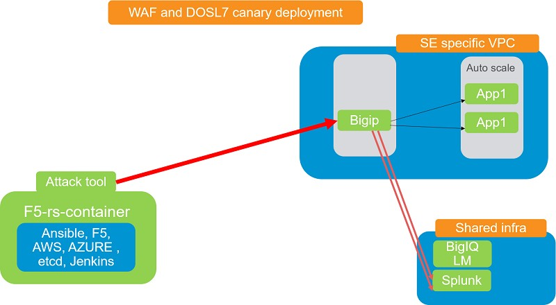

on jenkins main page, click on the folder - "advanced brute force and bot protection canary deployment"

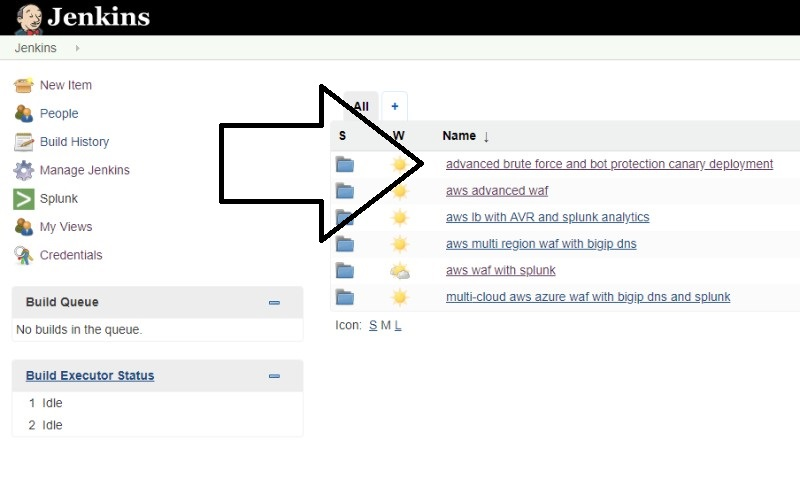

Click on the "aws waf stack 01" tab

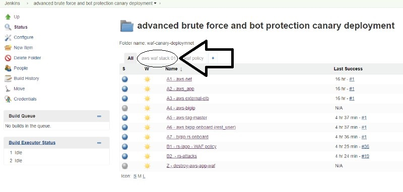

click on "run" to start the solution pipeline:

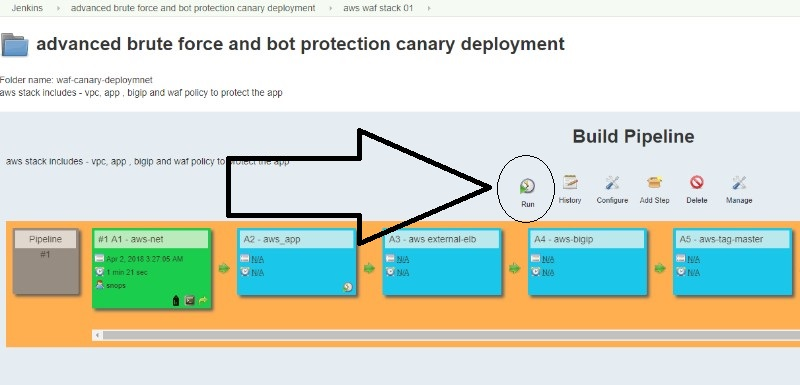

choose the region in which you want to deploy the stack and click "build":

Wait until the stack is ready (takes about 10-15 minutes). you should see all of the jobs in green. 

if one of the jobs failed, try to run in again, if it still deosn't work send me a note yossi@f5.com. 

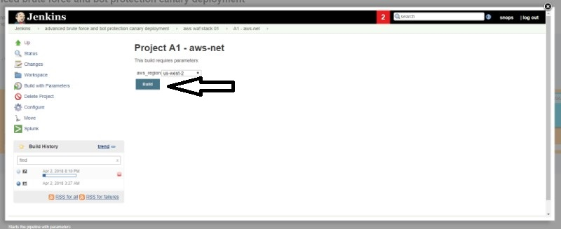
   
   
BIGIP access:
~~~~~~~~~~~~~~

click on "console output" in the "aws tag master" job 

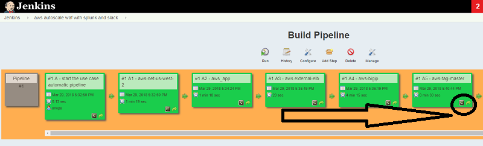

look for "bigip management" in the output

user: admin , password: Verysupersecurepassword1$

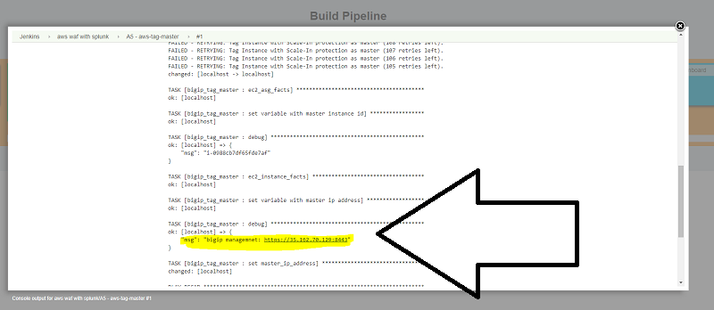

Application access:
~~~~~~~~~~~~~~~~~~~

click on "console output" in the "rs attacks" job , look for the https link to the app and verify that the attack was rejected by ASM 

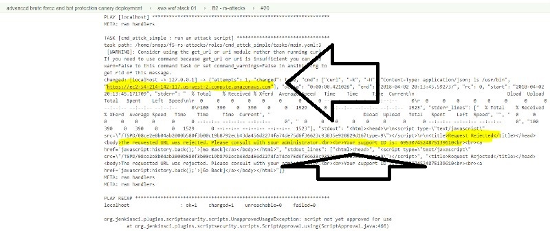

App securirty lifecycle -Canary deployment of waf and DOSL7 :
~~~~~~~~~~~~~~~~~~~

Here you will change the application security policy using jenkins, this ilustrates a process in which the sec admin creates some templates for the app teams to consume

The deployment team uses their tools to create a canary deployment. meaning, they will start with a small percentage of the traffic that represens the customer base pretty well

In our case we are deploying a security policy that enables proactive bot defense and advanced bruteforce (13.1) to the app, both of those features are using JS injections, 

it is hard to test those features in a 'test' environment because you require a lot of different devices / browsers / scenarios. 

using this deployment method enables rapid adoption of advanced security features without the fear of impacting production. the concept is similar to the release of a new feature 

in the app itself. 

the security policy actually becomes a 'feature' in the application stack and follows the same deployment model. 

Go back to the "advanced brute force and bot protection canary deployment" folder, click on the "waf policy" tab:

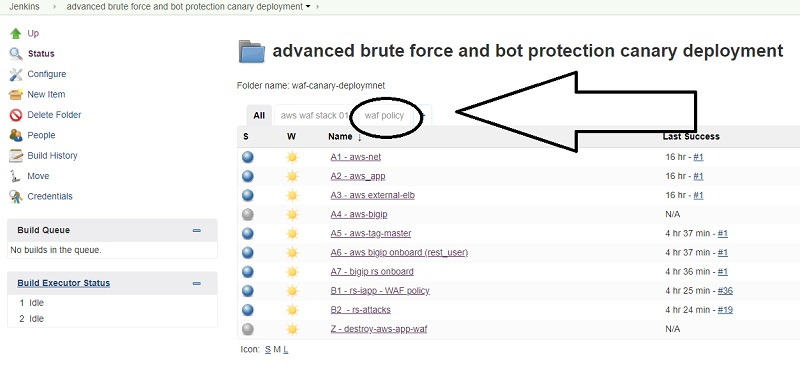

Click on "run":

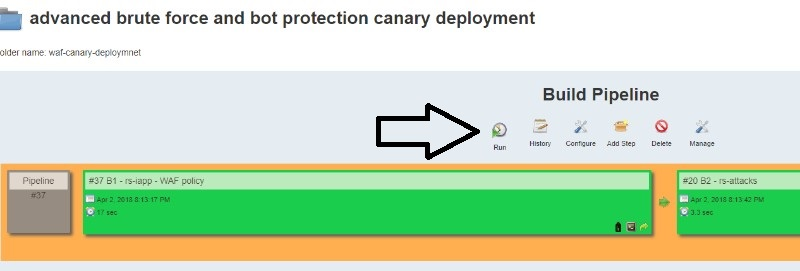

Change the settings for the 'canary' deployment:

asm_policy_name_canary: linux-high-bf

dosl7_profile_name_canary: rs_dosl7_profile_canary

proactive_bot_canary: always

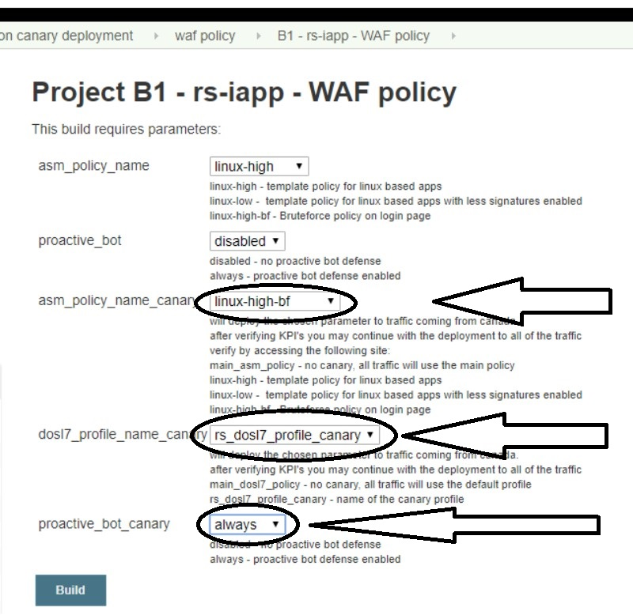

wait until the deployment is finished and start test the new configuration:

Test proactive bot defense and advanced bruteforce (normal traffic) :
~~~~~~~~~~~~~~~~~~~~~~~~~~~~~~~~~~~~~~~~~~~~~~~~~~

first we'll verify that the current policy doesn't protect from bruteforce and doesn't use proactive bot defense, 

we will use a couple of chrome extentions to help with that:

* geoiphdr 
* User-Agent Switcher for Chrome
* Clear Cookie and Reload

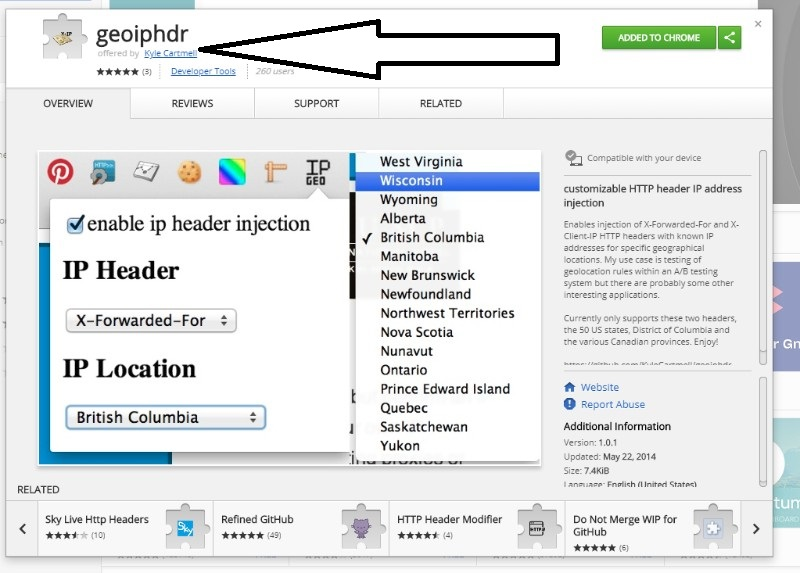

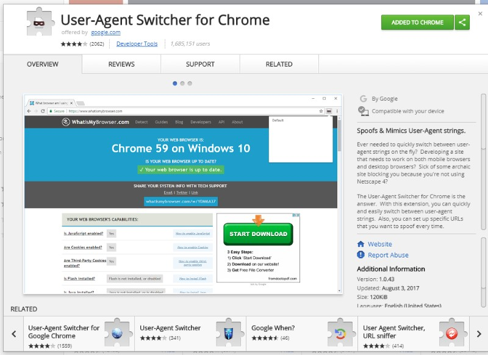

* Open Chrome browser and open the app (take the link from the console output of 'rs_attacks' job) 
* refresh the page 10 times using the 'clear cookie and reload'button in chrome 
* try to enter fake credentials 6 times in app-url/user/login 
* verify you aren't getting blocked 
* click on the 'user agent spoofer' button in chrome, choose 'internet explorer 9' and hit 'clear cookie and reload'
* verify you aren'y presented with a captcha

Test proactive bot defense and advanced bruteforce (canary traffic - only from canada) :
~~~~~~~~~~~~~~~~~~~~~~~~~~~~~~~~~~~~~~~~~~~~~~~~~~

we will use a couple of chrome extentions to help with that:

* in chrome set the x-forwarder-for header to a canada location 

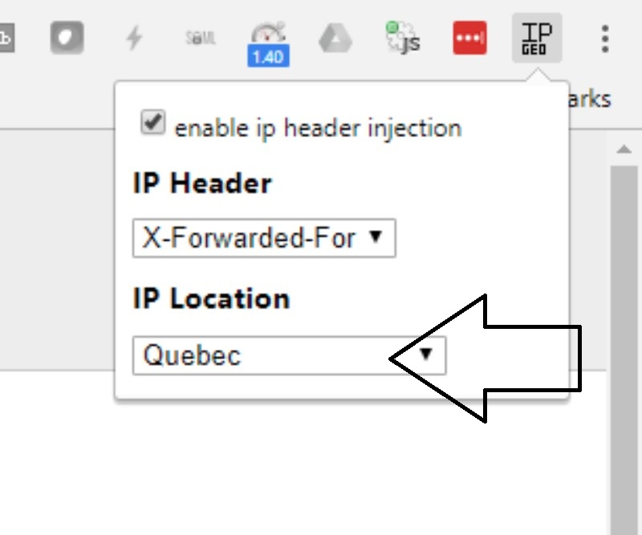
   
* Open Chrome browser and open the app (take the link from the console output of 'rs_attacks' job) 
* refresh the page 10 times using the 'clear cookie and reload'button in chrome 
* try to enter fake credentials 6 times in app-url/user/login 
* verify you are presented with a captcha after 5 failures 
* keep entering fake credentials, after the 3rd time entering fake credentials and solving the captcha you should be presented with a 'honeypot' page. 

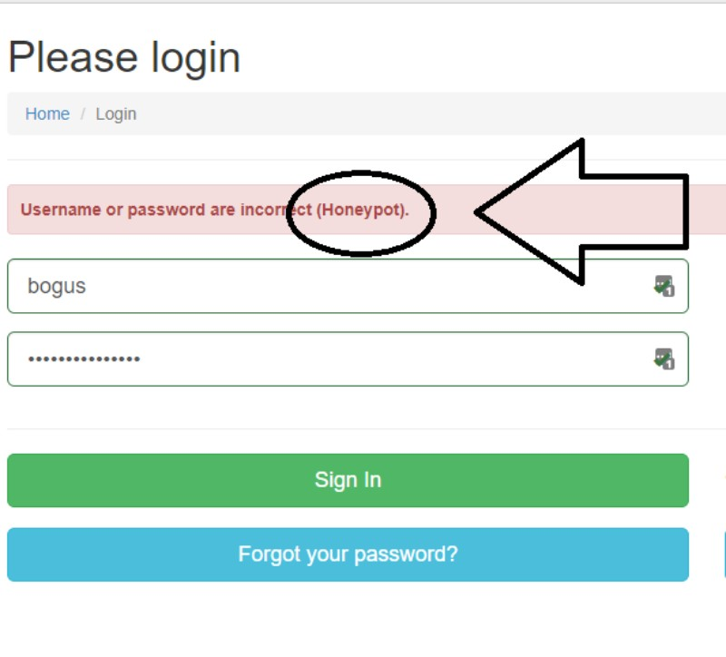

* click on the 'user agent spoofer' button in chrome, choose 'internet explorer 9' and hit 'clear cookie and reload'
* verify you are being presented with a captcha 

* check bigip logs and stuff.. 

logs and analytics:
~~~~~~~~~~~~~~~~~~~

logs and analytic are sent to splunk.

http://34.218.14.105:8000 

user:admin password: Zxcde3sw2

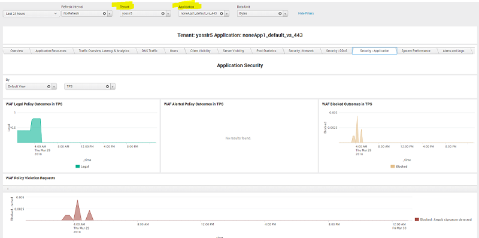

Get updates on slack:
------------------------------------------------------------------------------------

updates from the builds are getting sent to slack, you can view them in the followin workspace/channel:
https://f5-rs.slack.com/messages/C9WLUB89F/

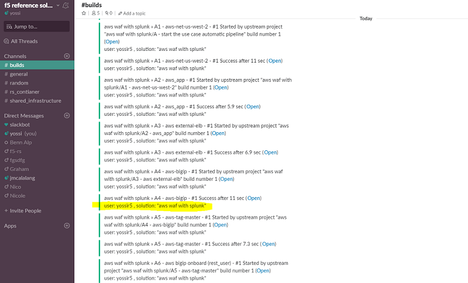

Don't forget to destory when finished:

build	"Z - destroy-aws-app-waf"

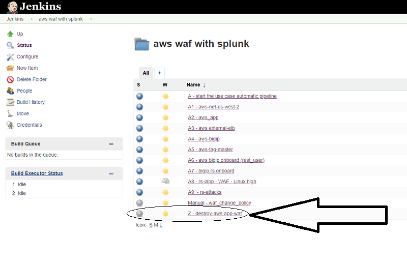

.. |run_rs_container| raw:: html

   <a href="https://hub.docker.com/r/yossiros/f5-rs-container/" target="_blank">Docker hub page</a>

.. |install_ansible| raw:: html

   <a href="http://docs.ansible.com/ansible/latest/intro_installation.html" target="_blank">http://docs.ansible.com/ansible/latest/intro_installation.html</a>

.. |rs_video| raw:: html

   <a href="https://gitswarm.f5net.com/f5-reference-solutions/f5-rs-docs/blob/master/images/rs-video.mp4" target="_blank">quickstart video</a>
