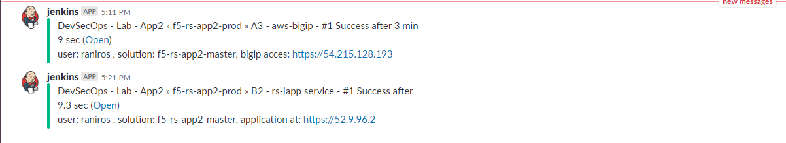

.. |labmodule| replace:: 3
.. |labnum| replace:: 1
.. |labdot| replace:: |labmodule|\ .\ |labnum|
.. |labund| replace:: |labmodule|\ _\ |labnum|
.. |labname| replace:: Lab\ |labdot|
.. |labnameund| replace:: Lab\ |labund|

Lab |labmodule|\.\ |labnum|\: Deploy app to dev environment (Dave)
==================================================================

Background:
~~~~~~~~~~~

Security team has created some security policies templates, those were built based on the F5 templates with some modifications to the specific enterprise.
In this lab we don't cover the 'how to' of the security templates, instead we focus on the operational side and the workflows.

The Tasks are split between the two roles:
 - SecOps
 - Dave - A persona from the 'end to end' team; a team that's responsible for the application code and running it in production.

Lab scenario:
~~~~~~~~~~~~~

**New Application** - App3 is being developed, the app is an e-commerce site.
Our code is ready to go into 'dev' environment, for our lab there are only two environments - dev and prod (reflected by BIG-IP's).
Dave should deploy the new code into a dev environment that is exactly the same as the production environment. After the Application
is deployed we need to run some testing; fuctional and security.

.. Note:: Pipeline is broken to dev and prod for lab simplicity,
   it is broken up to two for a better lab flow.

.. Note:: OUT OF SCOPE - A major part of the app build process is out of scope for this lab,
   building the app code and publishing it as a container to the registry. this process is done using DOCKERHUB.

Task 1.1 - Review Dave's repo
~~~~~~~~~~~~~~~~~~~~~~~~~~~~~

- **Make sure you've completed the setup section from the beginning of this module.**

1.1.1 View git branches within the application repo:
****************************************************

On the container CLI type the following command to view git branches:

.. code-block:: terminal

   cd /home/snops/f5-rs-app3
    git branch

The app repository has two branches, ``dev`` and ``master``. We are now working on the ``dev`` branch.

.. Note:: The lab contains two environments, dev and prod.
   The dev environment deploys the code on the dev branch,
   the prod environment deploys the code on the master branch.

1.1.2 View files in the application repo:
*****************************************

On the container CLI type the following commands to view the files in the repo:

.. code-block:: terminal

   ls

- Application code exist under the 'all-in-one-hackazon' folder.
- Infrastructure code is maintained in the 'iac_parameters.yaml' file.

1.1.3 explore the infrastructure as code parameters file:
*********************************************************

.. code-block:: terminal

   more iac_parameters.yaml

The infrastructure environment is deployed using Ansible playbooks that were built by devops/netops.
Those playbooks are being controlled by jenkins which takes the iac_parameters.yaml file and uses it as parameters for the playbooks.

- This enables Dave to control the deployment of the security policies from his repo, as we will see.

Task 1.2 - Deploy dev Environment
~~~~~~~~~~~~~~~~~~~~~~~~~~~~~~~~~

.. Note:: Jenkins can be configured to run the dev pipeline based on code change in dave's app repo (git commits).
   In this lab we are manually starting the Full stack pipeline in Jenkins to visualize the process.

1.2.1 Open Jenkins:
*******************

- From the Window jumphost open Chrome and browse to the  ``Jenkins`` bookmark

  :guilabel:`username:` ``snops`` , :guilabel:`password:` ``default``

.. Note:: When you open jenkins you should will see some jobs that have started running automatically, jobs that contain: 'Push a WAF policy',
          this happens because jenkins monitors the repo and start the jobs (Polling/git commits). *you can cancel the jobs or let them fail*.

1.2.2 Start the "Full stack pipeline":
**************************************
* In jenkins open the "Agility devSecOps - f5-rs-app3-dev" folder, the lab jobs are all in this folder
  we will start by deploying a dev environment, you will start a pipeline that creates a few jobs around our application service

  |jenkins010|

* click on the 'f5-rs-app3-dev' folder, here you can see all of the relevant jenkins jobs for the dev environment.

  |jenkins020|

* click on 'Service deployment pipeline' , that's the pipeline view for this same folder.

  |jenkins030|

* click on 'run' to start the dev environment pipeline.

  |jenkins040|

Task 1.3 - Review the deployed environment
~~~~~~~~~~~~~~~~~~~~~~~~~~~~~~~~~~~~~~~~~~

.. Note:: Jenkins doesn't automatically refresh the page, either manually refresh to see the progress, or click on the 'ENABLE AUTO REFRESH' on the upper right side.

1.3.1 Review jobs output:
*************************

* You can review the output of each job while its running, click on the small :guilabel:`console output` icon as shown in the screenshot:

  |jenkins053|

1.3.2 Let the jobs run until the pipeline finishes:
***************************************************

* Wait until all of the jobs have finished (turned green and the app-test one is red ).

  |jenkins055|

1.3.3 Login to the BIG-IP:
**************************

- From the Windows Jumphost open the bookmark in Chrome for `BIG-IP A GUI`
- username: :guilabel:`admin`
- password: :guilabel:`admin`

Explore the objects that were created

- A new Virtual Server and associated objects
- A new imported ASM policy for owasptop10

.. Note:: All BIG-IP objects are created in a new partition, rs_App3, so to view you will need to change to this partition in the upper right hand corner of BIG-IP GUI.

1.3.4 Access the App:
**************************

- Open a tab in Chrome and browse to http://10.1.10.6

  |hackazone010|

1.3.5 Summary - Jobs roles:
***************************

B1 - push a WAF policy:
+++++++++++++++++++++++
- Deploys the 'application specific' profiles, for example: DOSL7, waf policy
- Jenkins runs a shell command that kicks off an ansible playbook with parameters from the application repo. (which waf policy to use, dosl7 parameters)
- Ansible playbook takes the parameters and uses them to deploy a configuration to the BIG-IP using the F5 supported ansible modules and API's.

B2 - RS-AS3 service:
++++++++++++++++++++
- Deploys the 'service definition' uses AS3 Declaration
- Jenkins runs a shell command that kicks off an ansible playbook with parameters from the application repo.
- Ansible playbook takes the parameters and uses them to deploy a configuration to the BIG-IP using the F5 supported ansible modules and API's.
- AS3 turns the service definition into objects on the BIG-IP

B3 - app-test:
++++++++++++++
- Send HTTP requests to the application to test it
- Jenkins runs a shell command that kicks off an ansible playbook with parameters
- Ansible playbook takes the parameters and uses them to run HTTP requests to our APP.

B4  - rs-attacks:
+++++++++++++++++
- Test app vulnerabilities
- Jenkins runs a shell command that kicks off an ansible playbook with parameters
- Ansible playbook takes the parameters and uses them to run HTTP requests to our APP.

Task 1.4 - Go over the test results
~~~~~~~~~~~~~~~~~~~~~~~~~~~~~~~~~~~~

1.4.1 View the test results:
****************************

* The deployment process failed because not all of the application tests completed successfully.
  Click on the console output of ``app-test`` to review the job

  |jenkins053|

1.4.2 Identify the WAF blocked page response:
*********************************************

Scroll to the bottom of the console page, you should see a response with :guilabel:`Request Rejected`, and the failure reason as :guilabel:`Unexpected response returned`

- This is an indication that ASM has blocked the request; in our case it is a false positive.

  |jenkins056|

.. Note:: In this lab, SecOps uses the same WAF policy template for many apps.
   We don't want to create a 'snowflake' WAF policy, so with this failure Dave will escalate to SecOps.
   That ensures that the setting will be reviewed and if needed the policy template will get updated.

.. |jenkins010| image:: images/jenkins010.PNG

.. |jenkins020| image:: images/jenkins020.PNG

.. |jenkins030| image:: images/jenkins030.PNG

.. |jenkins040| image:: images/jenkins040.PNG

.. |jenkins050| image:: images/jenkins050.PNG

.. |jenkins055| image:: images/jenkins055.PNG

.. |jenkins053| image:: images/jenkins053.PNG

.. |jenkins056| image:: images/jenkins056.PNG

.. |hackazone010| image:: images/hackazone010.PNG
