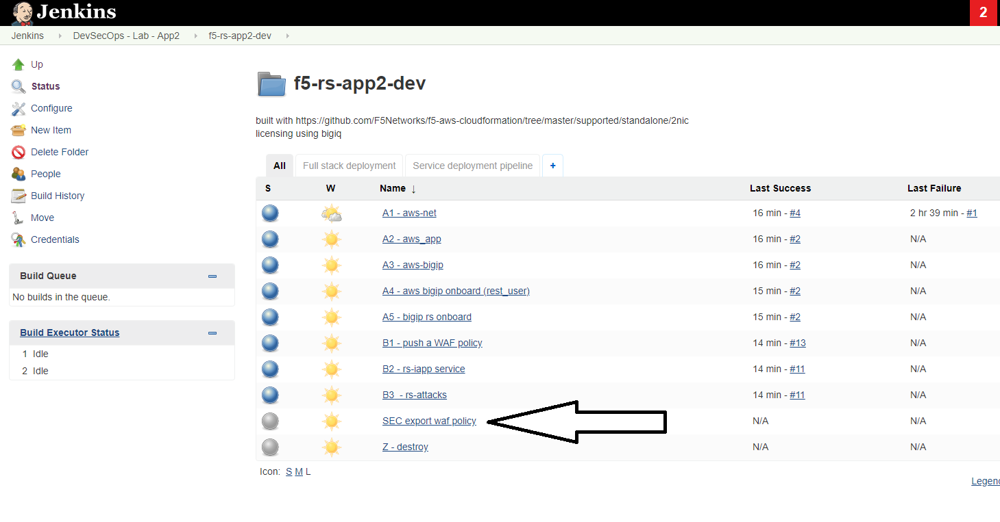
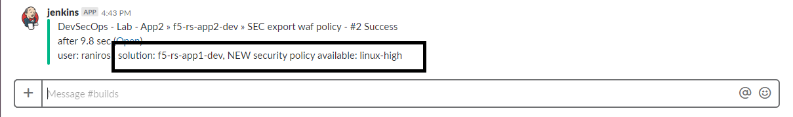

.. |labmodule| replace:: 3
.. |labnum| replace:: 2
.. |labdot| replace:: |labmodule|\ .\ |labnum|
.. |labund| replace:: |labmodule|\ _\ |labnum|
.. |labname| replace:: Lab\ |labdot|
.. |labnameund| replace:: Lab\ |labund|

Lab |labmodule|\.\ |labnum|\: Tune/fix security policy (Sec0ps)
===============================================================

Background:
~~~~~~~~~~~

Our application tests came back and some have failed, the results came back with the WAF blocking page.

Task 2.1 - Lets find which requests were blocked and resolve false-positive
~~~~~~~~~~~~~~~~~~~~~~~~~~~~~~~~~~~~~~~~~~~~~~~~~~~~~~~~~~~~~~~~~~~~~~~~~~~

2.1.1 Clear the false positive:
*******************************
- Open Chrome and login to ``BIG-IP A``
- Go to "Security > Application Security > Policy Building > Traffic Learning"
- Make sure you are editing the "owasptop10" policy
- Click on the Traffic Learning Recommendation **HTTP protocol compliance failed**

Examine the request, this is a false positive. The app uses a different language in the header and it is legitimate traffic,
you can also see that the request comes from a trusted IP

- Accept the suggestion (If you can not accept the suggestion make sure you are in the "Common" partition)

  |Bigip-030|

2.1.2 Apply the policy :
**************************

- Apply the policy

.. Note:: You are applying the policy to dev, SecOps shouldn't change the policy
   running in production outside of the CI/CD process **unless** there is a
   true emergency

Task 2.2 - Save the WAF policy to the templates Source Control (managed by SecOps)
~~~~~~~~~~~~~~~~~~~~~~~~~~~~~~~~~~~~~~~~~~~~~~~~~~~~~~~~~~~~~~~~~~~~~~~~~~~~~~~~~~

SecOps has updated the policy with a setting that makes sense to update on the general template.
We will now export the policy from the BIGIP A to the waf-policies repo (managed by SecOps)

2.2.1 Pull WAF policy from the BIG-IP A :
*****************************************

- Go back to jenkins, under the "f5-rs-app3-dev" there is a job that will export the policy and save it to the git repo - :guilabel:`SEC export waf policy`

	|jenkins075|

- Click on this job and choose :guilabel:`Build with Parameters` from the left menu

	|jenkins080|

- You can leave the defaults, it asks for two parameters. the first parameter is the name of the policy on the BIG-IP A and the other is the new policy to be created in the git repo

.. Note:: Why are we saving the template with a different version?
   All changes should be tracked, more than that we should allow app teams to 'control their own destiny',
   allowing them to choose the right time and place to update the waf policy in their environment.
   By versioning the policies we ensure Source Control and allow control over which template gets deployed

- Click on ``Build``

2.2.2 Check slack channel notification :
****************************************

- Check the shared slack channel, you should see a message specific to you about the new security policy that's ready.
  This illustrates how ChatOps can help communicate between different teams.

  |Slack-030|

- The security admin role ends here, it's now up to Dave to run the pipeline again.

.. |Bigip-030| image:: images/Bigip-030.PNG

.. |jenkins080| image:: images/jenkins080.PNG

