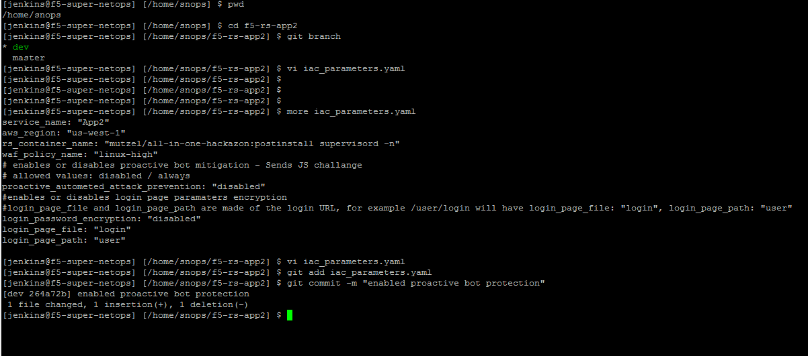

.. |labmodule| replace:: 3
.. |labnum| replace:: 3
.. |labdot| replace:: |labmodule|\ .\ |labnum|
.. |labund| replace:: |labmodule|\ _\ |labnum|
.. |labname| replace:: Lab\ |labdot|
.. |labnameund| replace:: Lab\ |labund|

Lab |labmodule|\.\ |labnum|\: Deploy with a new WAF policy (Dave)
=================================================================

Background:
~~~~~~~~~~~~~

SecOps found a false positive on the WAF policy template, they fixed it and created a new version of that policy.

Task 3.1 - Update the WAF policy deployed in dev
~~~~~~~~~~~~~~~~~~~~~~~~~~~~~~~~~~~~~~~~~~~~~~~~

We (Dave) got the message on a new WAF template, we now need to redeploy the new template to the dev environment.
To do so we will edit the 'Infrastructure as Code' parameters file in Dave's app2 repository.

3.1.1 Update git with your information:
***************************************

We're going to configure some information with Dave's repository, this will allow
jenkins to understand what is going on in Source Control. Information we provide
to our local git repository is local to our environment information can be
arbitrary.

* From the container copy and paste:

.. code-block:: terminal

   git config --global user.email "John@example.com"
    git config --global user.name "John Doe"

3.1.2 Verify you're editing the dev branch:
*******************************************

- Go to the application git folder (command below)
- Check the branches and which is the active branch (command below)
- You should be in the 'dev' branch, the files you see belong to the dev branch

.. code-block:: terminal

   cd /home/snops/f5-rs-app3
    git branch

3.1.3 Update the Infrastructure as Code parameters file:
********************************************************

We need to edit the iac_parameters.yaml file to point our deployment to the new WAF policy (owasptop10-v01).
Once we modify the file we then need to add the file to git and commit.

 - copy and paste ``vi iac_parameters.yaml``
   - change : waf_policy_name: ``owasptop10``
   - to: waf_policy_name: ``owasptop10-v01``

* From the container copy and paste:

.. code-block:: terminal

   git add iac_parameters.yaml
    git commit -m "changed asm policy"

|dev-cmd-010|

3.1.4 Service Deployment Update:
********************************

* Concepts:
  - We now have an active dev environment, the app, network and BIG-IP shouldn't change. The only change is to the SERVICE deployed on the BIG-IP.
  - We have a dedicated pipeline view for the Service deployment.
  - Jenkins is set up to monitor the application repo, when a 'commit' is identified jenkins will start an automatic pipeline to deploy the service. Jenkins takes the parameters from the file and uses them to start the ansible playbooks that will push the changes to the BIG-IP.
  - With Commit Hooks/Polling through jenkins we can update the WAF policy on the BIGIP.

* Go back to jenkins and open the ``f5-rs-app3-dev`` folder. Choose the ``Service deployment pipeline`` tab, it takes up to
  a minute for jenkins to start the pipeline. **You should see that the tasks start to run and the pipeline finishes successfully (all tasks are now green).**

- Don't forget you might need to refresh the page

3.1.5 View changes on the BIGIP:
********************************

- Log on to the ``BIG-IP A`` again
- Check which WAF policies are now installed and which policy is attached to the 'serviceMain'
- Check ``Traffic Learning`` for the security policy and verify you no longer see the **HTTP protocol compliance failed**

This concludes the tests in the 'dev' environment.
We are now ready to push the changes to production.

