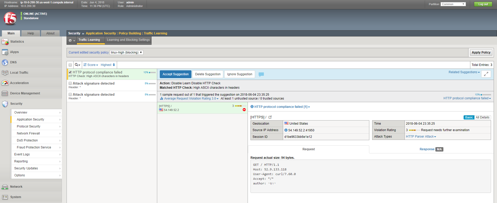
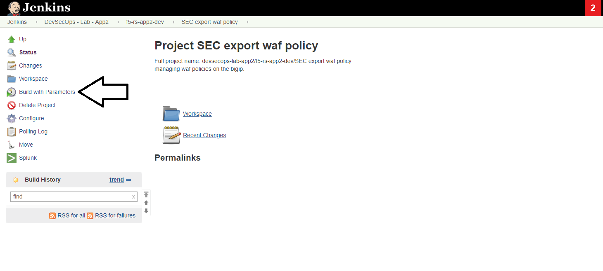

Lab 2 (Secops): Tune/fix security policy
----------------------------

Background: 
~~~~~~~~~~~~~

the application team tests came back and some of the tests have failed. the test result came back with the WAF blocking page.  
 
 
Task 1 - Find which requests were blocked and resolve false-positive 
~~~~~~~~~~~~~~~~~~~~~~~~~~~~~~~~~~~~~~~~~~~~~~~~~~~~~

log on to the 'DEV' bigip. 
go to 'traffic learning', make sure you are editing the 'linux-high' policy. 
check the requests that triggered suggestions. 

you should see a suggestion on 'High ASCII characters in headers' , examine the request. this is a false positive. the app uses a different language in the header and it is legitimate traffic. 
accept the suggestion.

	|Bigip-040|

check the other suggestions, you'll see some signatures that were triggered. those are actual threats that are part of the automated security testing and we can ignore the suggestions. 

apply the policy. we will now export the policy to the git repo and start the automated build again to check that we are ready to promote it to production. 

* you are applying the policy to DEV, secops shouldn't change the policy running in production (unless there is an emergency)

Task 2 - export the security policy to the waf policies templates repo.
~~~~~~~~~~~~~~~~~~~~~~~~~~~~~~~~~~~~~~~~~~~~~~~~~~~~~

go back to jenkins, under the 'f5-rs-app2-dev' there is a job that will export the policy and save it to the git repo - 'SEC export waf policy'

	|jenkins075|
   
click on this job and choose 'Build with Parameters' from the left menu. 

	|jenkins080|
	
you can leave the defaults, it asks for two parameters. the first parameter is the name of the policy on the bigip and the other is the new policy name in the git repo.  

click on 'build' 

check the slack channel - you should see a message about the new security policy that's ready. 
this illustrates how chatops can help communicate between different teams. 

	|Slack-030|

the security admin role ends here. it's now up to the appowner to run the pipeline again. 

   

   
.. |jenkins075| image:: images/jenkins075.PNG 
   

   
.. |Slack-030| image:: images/Slack-030.PNG
   
