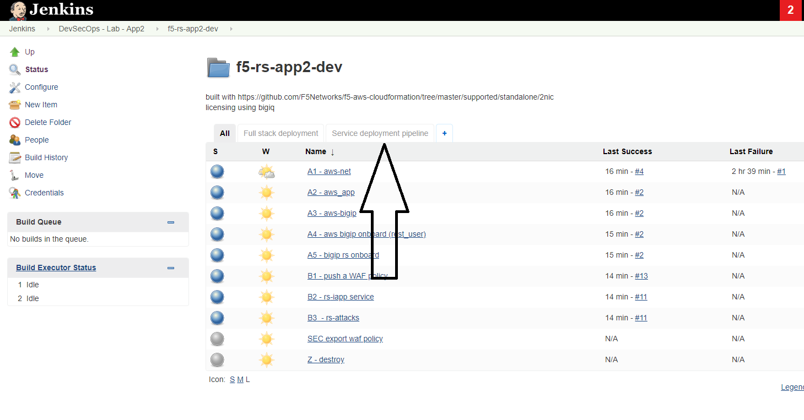
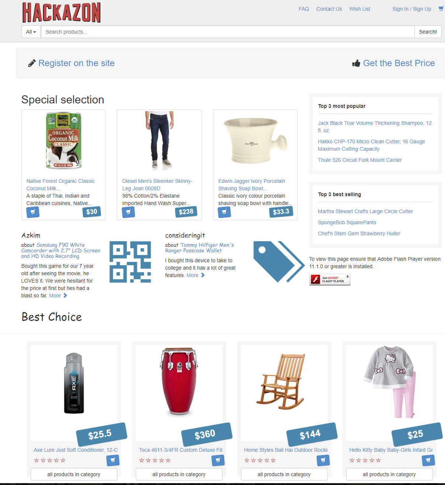

Lab 1: (Dave) protect the app from automated attacks 
----------------------------------

Background: 
~~~~~~~~~~~~~

after the app was launched we started identifying an abnormal activity, some specific products were added to the cart until the stock was out but were never purchased. in addition we identified an abuse of our coupons that every new member gets. 

in an effort to mitigate those unwanted requests the secops engineer suggests the use of 'proactive bot defense', he configures a template DOSL7 profile with some values as defaults. 
 
he then exposes the option of enabling / disabling proactive bot defense from the 'iac_paramaters' file. 

it is up to Dave now to deploy the new feature in dev and promote to PROD when it makes sense for him. 
 
Task 1 - Enable proactive bot defense in the DEV environment 
~~~~~~~~~~~~~~~~~~~~~~~~~~~~~~~~~~~~~~~~~~~~~~~~~~~~~~~~~~~~~~

ssh into the contianer, make sure you are connected as user 'jenkins' 
go to the application git folder. check which branches are there and what is the active branch. (git branch) 
you should be on the 'dev' branch. the files you see belong to the dev branch. 

.. code-block:: terminal

   cd /home/snops/f5-rs-app2
   git checkout dev
   git branch

edit the iac_parameters.yaml file to enable proactive bot defense, 
change the setting from:

proactive_autometed_attack_prevention: "disabled"

to:

proactive_autometed_attack_prevention: "always"

add the file to git and commit 

.. code-block:: terminal

   vi iac_parameters.yaml 
   git add iac_parameters.yaml
   git commit -m "enabled proactive bot defense"
   
   
go back to jenkins and open the 'f5-rs-app2-dev ' folder. choose the 'waf policy' tab , jenkins is set up to monitor the application repo. when a 'commit' is identified jenkins will start an automatic pipeline to deploy the service. it takes up to a minute for jenkins to start the pipeline. 

jenkins takes the parametes from the git repo and uses them to deploy/update the service. 

Log on to splunk , navigate to your app and look under the 'security - dos' tab for proactive mitigation. 

Task 2 - (Secops) Verify botdefense configuration and logs on the bigip 
~~~~~~~~~~~~~~~~~~~~~~~~~~~~~~~~~~~~~~~~~~~~~~~~~~~~~~~~~~~~~~

while all of the logs are sent to splunk where they can be viewed by Dave, part of the lab is to verify the change on the bigip. 
log on to the dev bigip again, check the setting on the dos profile named rs_dosl7, verify that proactive bot defense is now enabled.

	|pbd-bigip-010|
   
on the bigip, check the bot request log, verify that requests are being challanged

	|pbd-bigip-010|

this concludes the tests in the 'dev' environment. we are now ready to push the changes to production. 

Task 3 - Enable proactive bot defense in the PROD environment 
~~~~~~~~~~~~~~~~~~~~~~~~~~~~~~~~~~~~~~~~~~~~~~~~~~~~~~~~~~~~~~

we will 'merge' the app2 dev branch with the master branch so that the production deployment will use the correct policy. 
on the /home/snops/f5-rs-app2 folder:

.. code-block:: terminal
 
   git checkout master
   git merge -m "enabled proactive bot defense"

the merge will trigger a job in jenkins that's configured to monitor this repo - 'Push waf policy', open the f5-rs-app2-prd folder and navigate to the 'service deployment pipeline' , you should see the jobs running in up to a minute.  

open the PRODUCTION bigip, check that the DOSL7 profile named rs_dosl7 has the 'proactive bot defense' enabled. 

check that requests are getting challanged in the bot event log. 

Task 4 - Enable application layer encryption 
~~~~~~~~~~~~~~~~~~~~~~~~~~~~~~~~~~~~~~~~~~~~~~~~~~~~~~~~~~~~~~

Application is up and running, sales on the site have seen a big growth. our support center started getting complaints from customers 
that their account is abused and they are charged with purcheses they never did. 
after further investigation it turns out that the user's credentials were stolen by a malware on the client side. 

secops engineer suggests to turn on f5's application encryption on the login page, he configured a template profile with some settings that make sense for the enterprise. exposing the login page paramters (URI), and a choice to enable/disable. 

it is up to Dave now to deploy the new feature in DEV and promote to PROD when it makes sense for him. 

ssh into the contianer, make sure you are connected as user 'jenkins' 
go to the application git folder. check which branches are there and what is the active branch. (git branch) 
you should be on the 'dev' branch. the files you see belong to the dev branch. 

.. code-block:: terminal

   cd /home/snops/f5-rs-app2
   git checkout dev
   git branch
   
 
edit the iac_parameters.yaml file to enable login password encryption, 
change the setting from:

login_password_encryption: "disabled"

to:

login_password_encryption: "enabled"

add the file to git and commit 

.. code-block:: terminal

   vi iac_parameters.yaml 
   git add iac_parameters.yaml
   git commit -m "enabled login password encryption"
   
   
go back to jenkins and open the 'f5-rs-app2-dev ' folder. choose the 'waf policy' tab , jenkins is set up to monitor the application repo. when a 'commit' is identified jenkins will start an automatic pipeline to deploy the service. it takes up to a minute for jenkins to start the pipeline. 

jenkins takes the parametes from the git repo and uses them to deploy/update the service. 

log on to the dev bigip again, check the setting on the FPS profile.

.. note::
    Insert picture here!

	|ale-bigip-010|
   

this concludes the tests in the 'dev' environment. we are now ready to push the changes to production. 
we will 'merge' the app2 dev branch with the master branch so that the production deployment will use the correct policy. 
on the /home/snops/f5-rs-app2 folder:

.. code-block:: terminal
 
   git checkout master
   git merge -m "enabled login password encryption"

the merge will trigger a job in jenkins that's configured to monitor this repo - 'Push waf policy', open the f5-rs-app2-prd folder and navigate to the 'service deployment pipeline' , you should see the jobs running in up to a minute.  

open the PRODUCTION bigip, check that the FPS profile named rs_fps has the 'login_password_encryption' enabled. 
   
   
.. |pbd-bigip-010| image:: images/pbd-bigip-010.PNG 
   
.. ||pbd-bigip-020|| image:: images/|pbd-bigip-020|.PNG 
   
.. |ale-bigip-010| image:: images/ale-bigip-010.PNG
   
.. |jenkins040| image:: images/jenkins040.PNG
   
.. |jenkins050| image:: images/jenkins050.PNG
   
.. |jenkins060| image:: images/jenkins060.PNG
   

   

