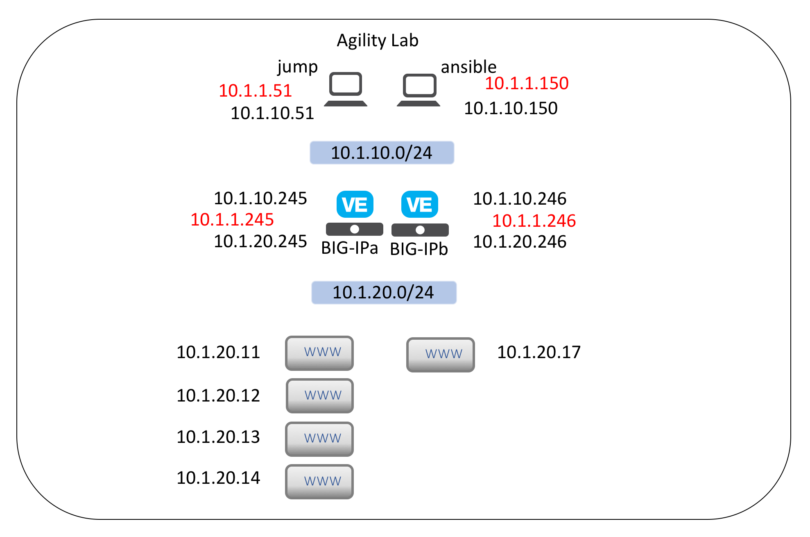

Getting Started
---------------

The purpose of this guide is to provide a sampling of hands-on exercises to 
better understand deployment of BIG-IP using Ansible.

Lab Topology
~~~~~~~~~~~~

Each student will have a BIG-IP VE environment with IP addressing as below:

Connect to lab
~~~~~~~~~~~~~~

**Accessing the lab environment.**

#. Open a browser and go to http://training.f5agility.com.  Enter your Class# 
   and Student# as provided by your instructor.

#. Look for the xubuntu-jumpbox-vxx.  You will use the xubuntu jumpbox for all 
   the labs. (see below)

   .. image:: images/image001.png
      :height: 300px

#. You can click on **RDP** to RDP to the Xubuntu jumpbox or you can select the
   **CONSOLE** link and access the jumpbox via your browser.  **The CONSOLE**
   ** link requires you turn off pop-up blockers.**

   .. image:: images/image002.png
      :height: 300px

.. list-table::
    :widths: 20 40 40
    :header-rows: 1

    * - **Component**
      - **VLAN/IP Address(es)**
      - **Credentials**
    * - Jump Host
      - - **Management:** 10.1.1.51
        - **External:** 10.1.10.51
      - - ``f5student``/``f5DEMOs4u``
    * - Ansible Host
      - - **Management:** 10.1.1.150
        - **External:** 10.1.10.150
        - **Internal:** 10.1.20.150
      - - ``root``/``password``
    * - BIG-IP01
      - - **Management:** 10.1.1.245
        - **External:** 10.1.10.245
        - **Internal:** 10.1.20.245
      - - ``admin``/``admin``
    * - Lamp Host
      - - **Management:** 10.1.1.252
        - **External:** 10.1.10.252
        - **Internal:** 10.1.20.252
      - - ``root``/``default``

**Connect to BIG-IP admin gui**

#. From Jumpbox, open BIG-IP Admin GUI

   - Open Chrome browser found on launchpad at bottom of screen
   - Click on ``bigip01`` on favorites bar
   - Login with username: ``admin`` and password: ``admin``

**Connecting to ansible host.**

#. From Jumpbox, SSH to Ansible host.

   - Open Terminal Emulator Window found on launchpad at bottom of screen
   - Type ``ssh root@10.1.1.150``
   - Type ``yes`` when asked "Are you sure..."

#. Change directory to **/root/ansible/mod1**.

   - Type ``cd ansible/mod1``
