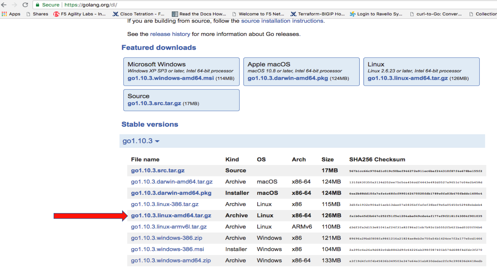

Lab – Download the GO tar file 
-----------------------------------
In this task you will open a web browser and navigate to the https://golang.org/dl/
site.

Follow these steps to complete this task:

#. On the Client/Jumpbox VM, open your web browser
#. Navigate to https://golang.org/dl/

Task – Download the Go Package as shown
~~~~~~~~~~~~~~~~~~~~~~~~~~~~~~~~~~~~~~~

Follow these steps to complete this task:

#. Click on the Linux ``go1.10.3.linux-amd64.tar.gz`` file.

#. Open terminal on the Client/Jumpbox VM

#. Execute the following command on Jumpbox terminal::

    cd Download

    sudo tar -C /usr/local -xzf go1.10.3.linux-amd64.tar.gz
   
   .. IMPORTANT:: Enter **f5DEMOs4u** when prompted for f5student's password

#. Include GO executable in the Path::

    export PATH=$PATH:/usr/local/go/bin

#. Test GO pacakage by executing::
  
     go version
 
  .. IMPORTANT:: You should see the following

    ``go version go1.10.3 linux/amd64``

.. NOTE:: You don't need GO programming skills.
