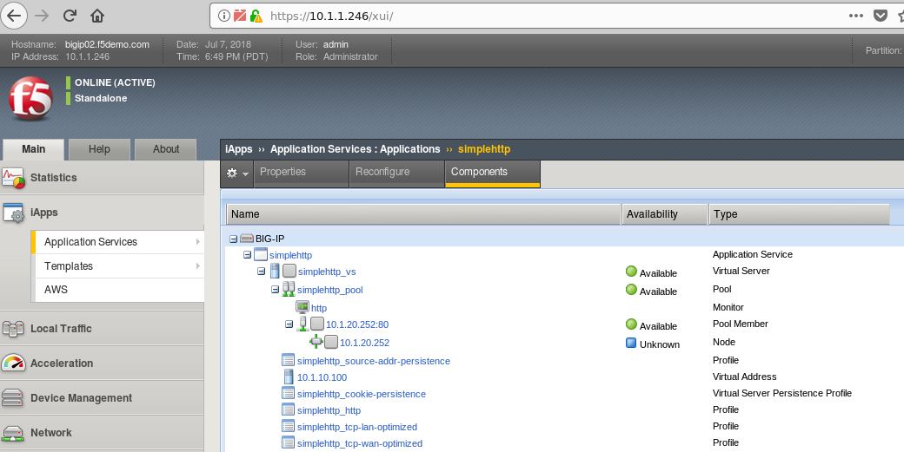
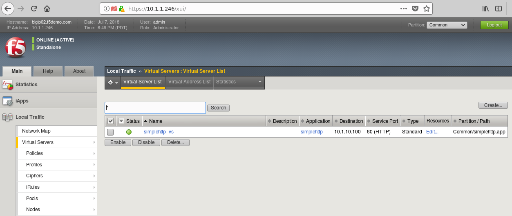

Verify Configuration on BIG-IP
--------------------------------------------

Please follow the instructions provided by the instructor to start your
lab and access your jump host.

#. Open browser on jump box
#. Access BIG-IP using http://10.1.1.246  admin/admin
#. Click on Application Services to verify the **simplehttp** iApp has been configured

#. Click on Local Traffic and verify Virtual Server exists

.. NOTE::
	 All work for this lab will be performed exclusively from the Windows
	 jumphost. No installation or interaction with your local system is
	 required.

