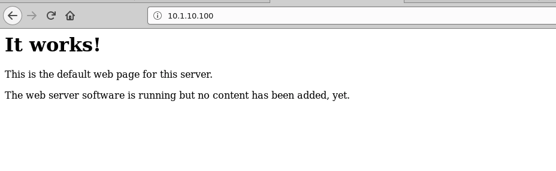

Test Client is able to access Server App.
--------------------------------------------

Please follow the instructions provided by the instructor to start your
lab and access your jump host.

#. Open browser on jump box

#. Access Server using  http://10.1.10.100  (web server)

.. NOTE::
	 All work for this lab will be performed exclusively from the Windows
	 jumphost. No installation or interaction with your local system is
	 required.

