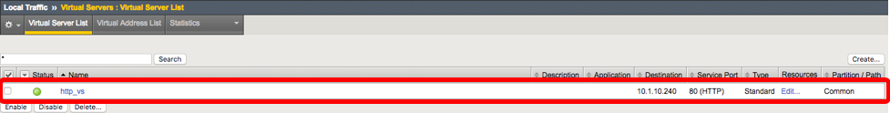

Lab 1 – Create simple VIP, and verify HTTP 
------------------------------------------

Task 1 – Create simple VIP
~~~~~~~~~~~~~~~~~~~~~~~~~~
Following is a sample Puppet manifest file (``site.pp``) for configuring an 
HTTP application on the BIG-IP platform:

.. code:: console

   node bigip1 {

   f5_vlan { '/Common/internal_vlan':
   	    ensure                 => 'present',
   	    auto_last_hop          => 'enabled',
   	    cmp_hash               => 'src-ip',
   	    description            => 'This is VLAN 10',
   	    fail_safe              => 'enabled',
   	    fail_safe_action       => 'restart-all',
   	    fail_safe_timeout      => '90',
   	    mtu                    => '1500',
   	    sflow_polling_interval => '3000',
   	    sflow_sampling_rate    => '4000',
   	    source_check           => 'enabled',
   	    vlan_tag               => "100",
   	    interfaces             => [{name => '1.2', tagged => false}]
   }

   f5_vlan { '/Common/external_vlan':
		ensure                 => 'present',
		auto_last_hop          => 'enabled',
		cmp_hash               => 'src-ip',
		description            => 'This is VLAN 11',
		fail_safe              => 'enabled',
		fail_safe_action       => 'restart-all',
		fail_safe_timeout      => '90',
		mtu                    => '1500',
		sflow_polling_interval => '3000',
		sflow_sampling_rate    => '4000',
		source_check           => 'enabled',
		vlan_tag               => "101",
		interfaces             => [{name => '1.1', tagged => false}]
   }

   f5_selfip { '/Common/internal_self_ip':
		ensure                 => 'present',
		address                => '10.1.20.111/24',
		vlan                   => '/Common/internal_vlan',
		traffic_group          => '/Common/traffic-group-local-only',
		inherit_traffic_group  => 'false',
   }

   f5_selfip { '/Common/external_self_ip':
		ensure                 => 'present',
		address                => '10.1.10.111/24',
		vlan                   => '/Common/external_vlan',
		traffic_group          => '/Common/traffic-group-local-only',
		inherit_traffic_group  => 'false',
   }

   f5_node { '/Common/web_server_1':
	   ensure                          => 'present',
	   address                         => '10.1.20.11',
	   description                     => 'Web Server Node 1',
	   availability_requirement        => 'all',
	   health_monitors                 => ['/Common/icmp'],
   }

   f5_node { '/Common/web_server_2':
	   ensure                          => 'present',
	   address                         => '10.1.20.12',
	   description                     => 'Web Server Node 2',
	   availability_requirement        => 'all',
	   health_monitors                 => ['/Common/icmp'],
   }

   f5_node { '/Common/web_server_3':
	   ensure                          => 'present',
	   address                         => '10.1.20.13',
	   description                     => 'Web Server Node 3',
	   availability_requirement        => 'all',
	   health_monitors                 => ['/Common/icmp'],
   }

   f5_pool { '/Common/web_pool':
	   ensure                          => 'present',
	   members                         => [
	        { name => '/Common/web_server_1', port => '80', },
	        { name => '/Common/web_server_2', port => '80', },
	        { name => '/Common/web_server_3', port => '80', },
	   ],
	   availability_requirement        => 'all',
	   health_monitors                 => ['/Common/http_head_f5'],
	   require                         => [
	        F5_node['/Common/web_server_1'],
	        F5_node['/Common/web_server_2'],
	        F5_node['/Common/web_server_3'],
	   ],
   }

   f5_virtualserver { '/Common/http_vs':
	   ensure                          => 'present',
	   provider                        => 'standard',
	   default_pool                    => '/Common/web_pool',
	   destination_address             => '10.1.10.240',
	   destination_mask                => '255.255.255.255',
	   http_profile                    => '/Common/http',
	   service_port                    => '80',
	   protocol                        => 'tcp',
	   source                          => '0.0.0.0/0',
	   source_address_translation      => 'automap',
	   require                         => F5_pool['/Common/web_pool'],
   }

   }

This example features three tasks: 

#. You must first establish your web servers. The F5 module called “f5_node” 
   adds three web servers: web_server_1, web_server_2, and web_server_3, each 
   with the minimum number of parameters possible and a health monitor that 
   pings each server directly to make sure it is still responsive.

#. Next, establish the pool of servers. The ``f5_pool`` module creates a pool 
   named ``web_pool`` and also adds the node members created above as the pool 
   members. 

#. The ``f5_virtualserver`` module creates a virtual server ``http-vs`` with an 
   http profile, and the ``web_pool`` created above.

Note that we also have to set up the proper internal and external VLAN's and 
self IP's needed for the web servers.

Before running puppet device (command for Puppet Network Device), there are no
virtual servers, pools, or nodes configured on the BIG-IP device. Running 
the ``puppet device -v --user=root`` command will have the device proxy node 
generate a certificate and apply your classifications to the F5 device.

.. code:: console

   $ sudo puppet device -v --user=root --trace
   Info: starting applying configuration to bigip1 at https://10.1.1.246:443
   Info: Retrieving pluginfacts
   Info: Retrieving plugin
   Info: Caching catalog for bigip1
   Info: Applying configuration version '1530309558'
   Notice: /Stage[main]/Main/Node[bigip1]/F5_vlan[/Common/internal_vlan]/ensure: created
   Notice: /Stage[main]/Main/Node[bigip1]/F5_vlan[/Common/external_vlan]/ensure: created
   Notice: /Stage[main]/Main/Node[bigip1]/F5_selfip[/Common/internal_self_ip]/ensure: created
   Notice: /Stage[main]/Main/Node[bigip1]/F5_selfip[/Common/external_self_ip]/ensure: created
   Notice: /Stage[main]/Main/Node[bigip1]/F5_node[/Common/web_server_1]/ensure: created
   Notice: /Stage[main]/Main/Node[bigip1]/F5_node[/Common/web_server_2]/ensure: created
   Notice: /Stage[main]/Main/Node[bigip1]/F5_node[/Common/web_server_3]/ensure: created
   Notice: /Stage[main]/Main/Node[bigip1]/F5_pool[/Common/web_pool]/ensure: created
   Notice: /Stage[main]/Main/Node[bigip1]/F5_virtualserver[/Common/http_vs]/ensure: created
   Info: Node[bigip1]: Unscheduling all events on Node[bigip1]
   Notice: Applied catalog in 1.38 seconds

Task 2 – Verify configuration
~~~~~~~~~~~~~~~~~~~~~~~~~~~~~
Puppet has now created a new, fully configured virtual server (Figure 1). This 
server is load balancing HTTP applications across a newly created pool 
(Figure 2). The pool includes three newly created web servers (Figure 3).

Figure 1:

Figure 2:

.. image:: images/module2_lab1_picture2.png

Figure 3:

.. image:: images/module2_lab1_picture3.png

Task 3 – Delete configuration
~~~~~~~~~~~~~~~~~~~~~~~~~~~~~

Next, modify your ``site.pp`` to remove all the configuration:

.. code:: console

   node bigip1 {
   f5_virtualserver { '/Common/http_vs':
      ensure                  => 'absent',
      provider                => 'standard',
      protocol                => 'tcp',
   }

   f5_pool { '/Common/web_pool':
      ensure                  => 'absent',
   }

   f5_node { '/Common/web_server_1':
      ensure                  => 'absent',
      }

   f5_node { '/Common/web_server_2':
      ensure                  => 'absent',
   }

   f5_node { '/Common/web_server_3':
      ensure                  => 'absent',
   }

   f5_selfip { '/Common/internal_self_ip':
      ensure                 => 'absent',
   }

   f5_selfip { '/Common/external_self_ip':
       ensure                 => 'absent',
   }

   f5_vlan { '/Common/internal_vlan':
       ensure                 => 'absent',
   }

   f5_vlan { '/Common/external_vlan':
       ensure                 => 'absent',
   }

   }

.. code:: console

   $ sudo puppet device -v --user=root --trace
   Info: starting applying configuration to bigip1 at https://10.1.1.246:443
   Info: Retrieving pluginfacts
   Info: Retrieving plugin
   Info: Caching catalog for bigip1
   Info: Applying configuration version '1530311849'
   Notice: /Stage[main]/Main/Node[bigip1]/F5_virtualserver[/Common/http_vs]/ensure: removed
   Notice: /Stage[main]/Main/Node[bigip1]/F5_pool[/Common/web_pool]/ensure: removed
   Notice: /Stage[main]/Main/Node[bigip1]/F5_node[/Common/web_server_1]/ensure: removed
   Notice: /Stage[main]/Main/Node[bigip1]/F5_node[/Common/web_server_2]/ensure: removed
   Notice: /Stage[main]/Main/Node[bigip1]/F5_node[/Common/web_server_3]/ensure: removed
   Notice: /Stage[main]/Main/Node[bigip1]/F5_selfip[/Common/internal_self_ip]/ensure: removed
   Notice: /Stage[main]/Main/Node[bigip1]/F5_selfip[/Common/external_self_ip]/ensure: removed
   Notice: /Stage[main]/Main/Node[bigip1]/F5_vlan[/Common/internal_vlan]/ensure: removed
   Notice: /Stage[main]/Main/Node[bigip1]/F5_vlan[/Common/external_vlan]/ensure: removed
   Info: Node[bigip1]: Unscheduling all events on Node[bigip1]
   Notice: Applied catalog in 2.93 seconds