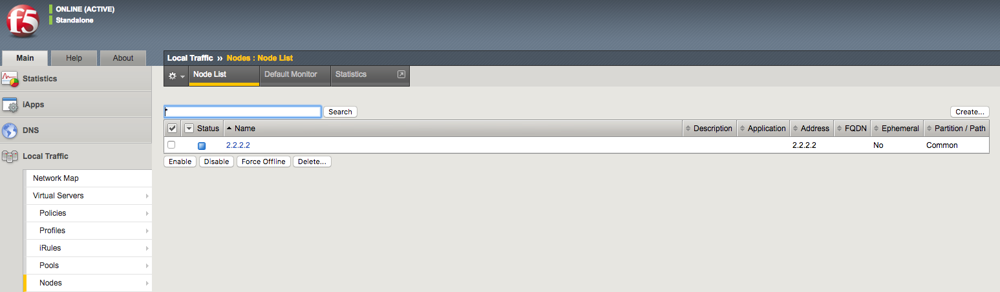

Lab 1 – Puppet automation with f5_command
-----------------------------------------

Following is a sample Puppet manifest file (``site.pp``) to run a TMSH command:

.. code:: console

   node bigip1 {

   f5_command { '/Common/tmsh':
	  tmsh  => "tmsh create ltm node 2.2.2.2",
   }

   }

Running the ``puppet device -v --user=root`` command will have the TMSH command
apply to the F5 device.

.. code:: console

   $ sudo puppet device -v --user=root --trace
   Info: starting applying configuration to bigip1 at https://10.1.1.246:443
   Info: Retrieving pluginfacts
   Info: Retrieving plugin
   Info: Caching catalog for bigip1
   Info: Applying configuration version '1530316553'
   Notice: /Stage[main]/Main/Node[bigip1]/F5_command[/Common/tmsh]/ensure: created
   Info: Node[bigip1]: Unscheduling all events on Node[bigip1]
   Notice: Applied catalog in 0.56 seconds

Go to BIG-IP GUI to verify that the server node has been successfully created.

